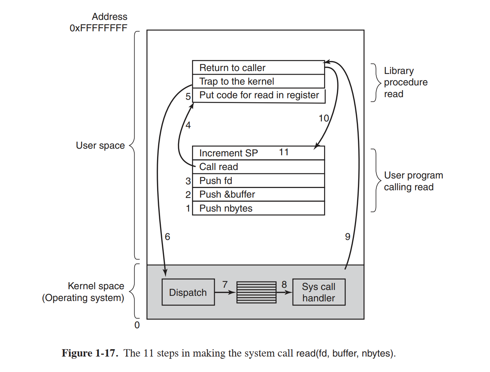
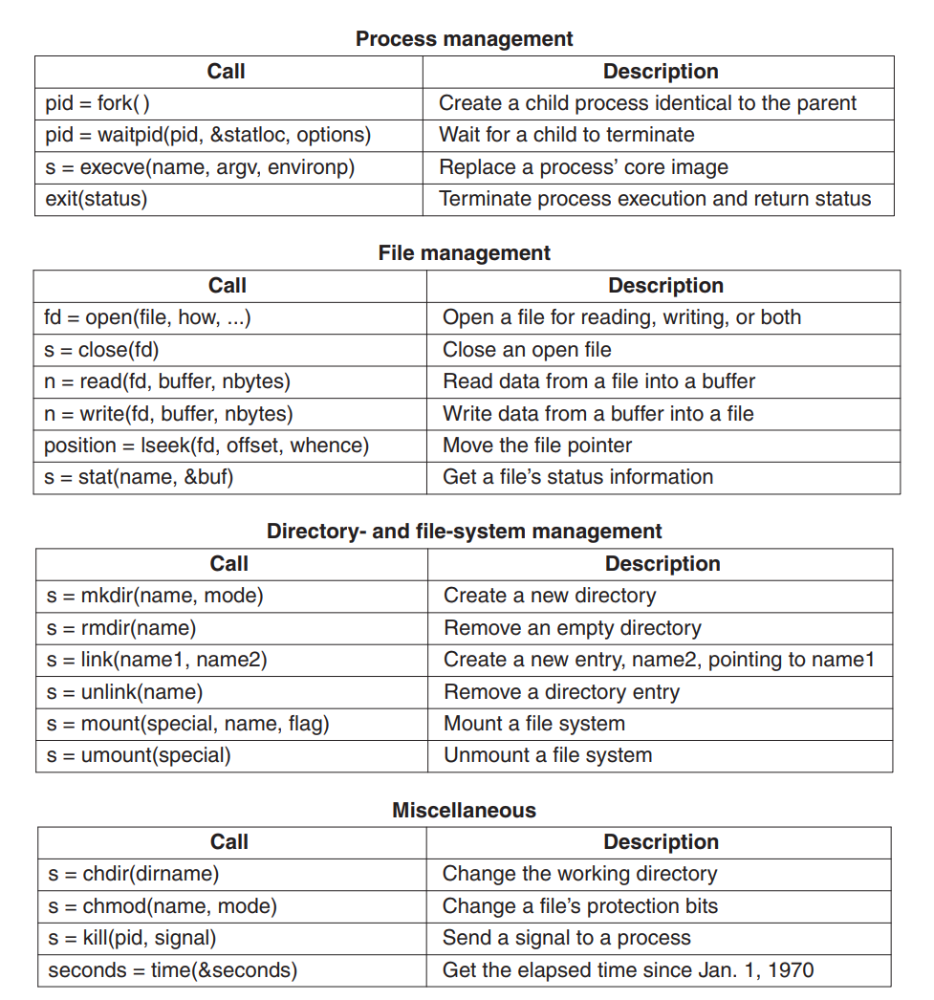
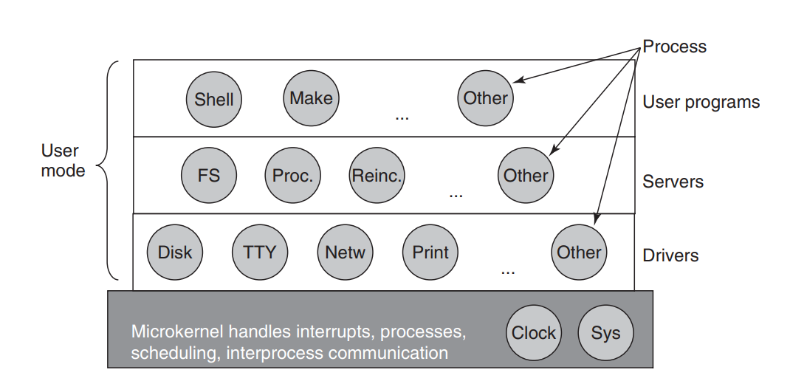

## Chapter 1 - Introduction

### Operating System Concepts

#### Process

> A process is basically a program in execution. Associated with each process is its address space, a list of memory locations from 0 to some maximum, which the process can read and write. The address space contains the executable program, the program’s data, and its stack. Also associated with each process is a set of resources, commonly including registers (including the program counter and stack pointer), a list of open files, outstanding alarms, lists of related processes, and all the other information needed to run the program.

Processes are not single beings - on modern operating systems there are hundreds or thousands of processes that are run at once (or at least user sees it that way). However it's obvious that there must be some kind of global list of all processes in the system. This list is called **process table**. 

Processes can create new processes which are (thank you, Captain Obvious) called **child processes**. Also - every 
process holds information about the user that started it. First initialisation process is run by **superuser** (UNIX) or **administratora** (Windows).

#### Address space

It was mentioned above that **address space** is part of total available memory that can be assigned to the process. Taking under consideration that operating system itself needs memory to work, even when we think about OS that is able to run only one process at the time, **address space** would be smaller than total available memory. However - that was a case in the beginnings of OSes. Along the way (and in order to make OS more useful) a concept of **virtual memory** was invented - situation where part of process data is kept in the memory and part of this on the hard disc. The specifics will be given in later chapters.

#### Files

>As noted before, a major function of the operating system is to hide the peculiarities of the disks and other I/O devices and present the programmer with a
nice, clean abstract model of device-independent files. System calls are obviously needed to create files, remove files, read files, and write files. Before a file can be read, it must be located on the disk and opened, and after being read it should be closed, so calls are provided to do these things.

In order to organise files and present them in concise way a concept of **folders** or **directory** exist - as a way to group files together. Folders in OS usually create a tree-like hierarchy. Concepts for files:
* path name
* root directory
* working directory
* file descriptor
* root file system
* special file (block/character) in UNIX OS
* pipe

#### IO, Protection, The Shell and Ontogeny recapitulates Phylogeny

### System calls

**System call** is one of the sole purpose of OS existence. They are there to enable user-space programs (written in C or other high level languages) to actually use computer hardware. When eg. reading of a file is done by the program, what it actually does is to pass control to the OS, which eventually directly reads from block device (usually a disc) and then returns the contents of specific block to the program running in user-space. Of course system calls varies between OS families, however they are often very similar.

There is no need to list system calls here as the list is long and depends on the system. As an example for POSIX-compliant system there are linux MAN pages - <a href="https://man7.org/linux/man-pages/man2/syscalls.2.html">System calls</a>

On **Windows** situation is different - system calls and library calls are decoupled as much as possible. The middle layer between them is **Win32 API** which serves as a translator and facade between programs and system. It's way more flexible then - newer versions of the system can change system calls and that should not affect existing programs at all. As long as they comply with the API everything is fine.

There are hundreds of **Win32 API** calls and not all of them are directly linked to the system calls! A handful of them is done in user-space.

### 1.7 Operating systems structure

#### Monolithic systems

> By far the most common organization, in the monolithic approach the entire operating system runs as a single program in kernel mode. The operating system is
written as a collection of procedures, linked together into a single large executable binary program. When this technique is used, each procedure in the system is free to call any other one, if the latter provides some useful computation that the former needs. Being able to call any procedure you want is very efficient, but having thousands of procedures that can call each other without restriction may also lead to a system that is unwieldy and difficult to understand. Also, a crash in any of these procedures will take down the entire operating system.

#### Layered systems

Archeology.

#### Microkernels

The idea is not to have one large kernel where one bug can crash the whole system. Instead, there is a lot of 
processes running in user-mode, where  **microkernel** handles only the most crucial parts of the system (IPC/memory allocation/etc). They are mostly used in critical systems like rockets/satellites/etc in order to provide flawless operation whatever happens. Also an example of such system is **MINIX 3**

#### Client-server/virtualization/exokernels 

Nothing too important to write.

#### All other subchapters 

Nothing too important to write.

