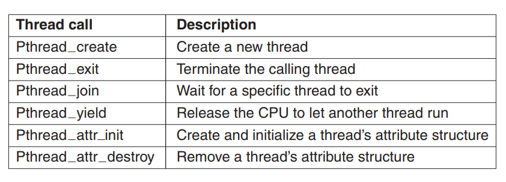
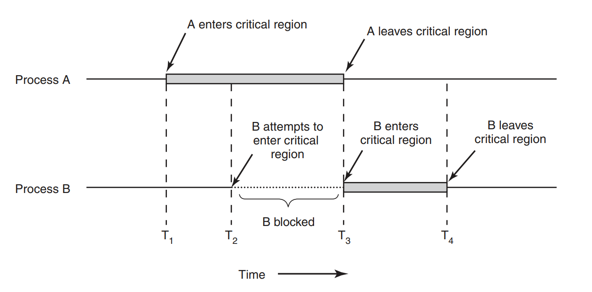
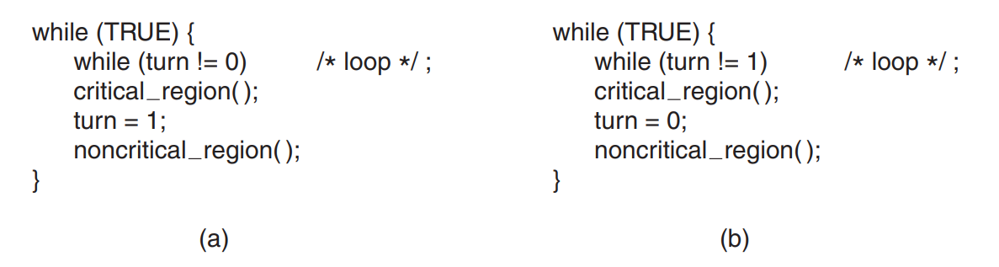
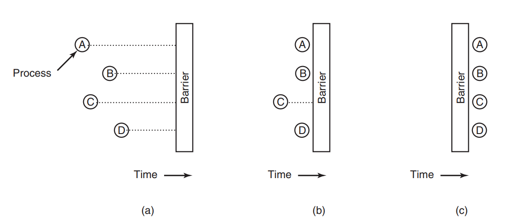
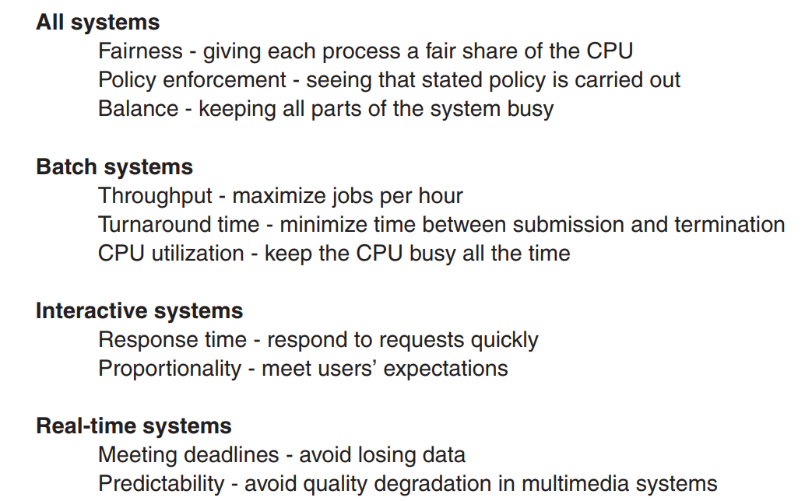

## Chapter 2 - Processes and threads

### Processes

**Process** is actual abstraction over running program. That's it. 

> A process is just an instance of an executing program, including the current values of the program counter, registers, and variables. Conceptually, each process has its own virtual CPU. In reality, of course, the real CPU
switches back and forth from process to process, but to understand the system, it is
much easier to think about a collection of processes running in (pseudo) parallel
than to try to keep track of how the CPU switches from program to program. This
rapid switching back and forth is called multiprogramming [...]

In this chapter author assumed that the CPU runs only one process at a time. However, this is not true in modern 
CPUs with multiple cores - to simplify the book there is whole chapter later on multithreading.


Creating processes in UNIX-like system is based on *fork** system call that creates child process which is exactly the same like the parent (in term of parameters/data) and also **executes the same process like the parent**. Then calls another system call **execve** which results in changing memory addresses that process is using.

> For example, when a user types a command, say, sort, to the shell, the
shell forks off a child process and the child executes sort. The reason for this two-step process is to allow the
> child to manipulate its file descriptors after the fork but
before the *execve* in order to accomplish redirection of standard input, standard
output, and standard error

In Windows an **WinApi32** is called which creates and also changes memory and data for the child process. As the author says - there is circa 100 system calls in **WinApi32** to handle processes.


Of course if there is possibility to create processes there must be a way to destroy (terminate) them. There are two voluntary and two involuntary ways to do that:
* process just ends its job
* process hits an error during execution and exits
* fatal error - which couldn't be handled by the process itself (eg. memory failure)
* termination by other process (killem all!)


As stated above parent process can create a lot of children. Therefore, even with this simple relation (parent-child)
we have a hierarchy. The more processes are created, the more robust it gets. The first process in UNIX-like systems is called **init**, which then starts a whole new species ;) when OS starts. Windows does not follow this concept - all processes are equal.

As long as process runs it can be in one of the following states:
* running (duh)
* ready - could be running but CPU gave processing power to some other process
* blocked - process is waiting for some other process to finish working (eg. waiting for file to be read)


> To implement the process model, the operating system maintains a table (an
array of structures), called the process table, with one entry per process. (Some
authors call these entries process control blocks.) This entry contains important
information about the process’ state, including its program counter, stack pointer,
memory allocation, the status of its open files, its accounting and scheduling information, and everything else about the process that must be saved when the process
is switched from running to ready or blocked state so that it can be restarted later
as if it had never been stopped.


### Threads

Usually processes do not share memory between themselves. That's a problem because shifting between memory pages is
expensive. Also as it was stated above processes are often waiting for other processes to finish or for CPU to give
them power. The same often occurs in single process - it could be waiting for IO but in the same time calculating
something else. What is more - **threads** are way lighter to create and destroy as they do not require calls to the
underlying OS. Therefore, a need for **threads** arose - which are process-like things that share the same memory.

#### POSIX threads

> To make it possible to write portable threaded programs, IEEE has defined a
standard for threads in IEEE standard 1003.1c. The threads package it defines is
called Pthreads. Most UNIX systems support it.

Here comes the list of them.




All **pthreads** has a set of properties (like stack size/scheduling parameters/etc) and of course identifier and set
 of registers. IMHO conceptually they work exactly the same like classical threads.


Threads can be implemented in user space or in the kernel. From the kernel perspective the first approach is 'better' 
because it just still operates on user processes only. All the thread-related doing is library/compiler/virtual machine
job. In order to do that a **thread table** (similar to process table) is needed to keep track of all the threads. This
is handy because this table lives in within the process memory and all operations on it are therefore way faster
(in comparison to eg. making system calls). What is more important - scheduling of threads can be customised by every
process. Then utilisation of threads by process is way more effective as every process knows best how to make best use
of them.

There are disadvantages however. The biggest of them are blocking system calls. We use threads to actually avoid
 blocking so that's a problem. Using non-blocking system calls is ineffective because that requires changes to the
  kernel. The author presents an idea of non-blocking wrappers in the library around system calls. It's job is to check if the
following system call will block. If yes - thread passes the invocation to the next one.

Second problem are **page faults** (will be described more in Chapter 3). It's sufficient to say at this moment that sometimes
threads hit the area of memory that is actually not in a memory. Therefore, blocking IO operation (reading from disc)
must be
performed which blocks the thread. Kernel knows nothing about threads hence block whole process and all the threads within
it (even ones that could be running). 

A third problem is actually for a thread, to give up the CPU to the other threads. As long as the thread does not do 
this voluntarily (or stops) the scheduler is not given a chance to pass control to other threads. 

The latest argument is best presented as a quote:

> Another, and really the most devastating, argument against user-level threads is
that programmers generally want threads precisely in applications where the
threads block often, as, for example, in a multithreaded Web server. These threads
are constantly making system calls. Once a trap has occurred to the kernel to carry
out the system call, it is hardly any more work for the kernel to switch threads if
the old one has blocked, and having the kernel do this eliminates the need for constantly making select system calls that check to see if read system calls are safe.
For applications that are essentially entirely CPU bound and rarely block, what is
the point of having threads at all?

To finish above I also recommend You read <a href="https://stackoverflow.com/questions/63825137/thread-in-user-space-schedulling-dilemma">my question on SO concerning above pros/cons</a>. 


Everything that was written above can be used to imagine **kernel threads**. In such a situation, it's the 
**kernel** who is responsible for keeping all-around-thread-table, scheduling them. Of course there is a much greater
cost for that as all calls for threads excecution/forking/suspending must be performed in a form of **system call**. 
However, we got a possibility to go to the other thread when the one exceuting right now is in **blocked** state.
With user-space threads that is not an option. Unfortunately there are also other problems - like when process having 
many threads forks. What then? How many threads should be created? Also author mentions second big problem - **signals** that 
come to the processes. Processes not threads! As long as kernel is not aware of threads it just passes them to the processes.
However, when there are kernel-threads - how does the OS know which thread should handle it? 


There were concepts to combine two types of threading. However, author does not elaborate much on that - the 
description says that there are **kernel threads** but **user-space** application can create **user threads** on top of
one **kernel thread**. However, that is all in this subchapter. I've found <a href="https://stackoverflow.
com/questions/4249124/hybrid-thread-model-mn-implementation">quick and simple SO question</a> about it that I think sums
it up as - *we do not do this anymore.*


This was another idea to mix **kernel space threads** with **user space threads**. In short - **kernel** is aware of
something like threads. But it resolves the problem with assigning the **process** some kind of **virtual CPUs**. 
Then the whole process of scheduling threads in **user space** is specific program job using aforementioned **virutal CPUs**.
In that way communication and switching between kernel space and user space is greatly reduced. When kernel recognizes that
user thread is blocked (eg. used blocking system call) then it sends something called **upcall** to the process' scheduler with 
that information. Then scheduler can pass the execution to another thread. The whole process then is better 
described by a quote:

> Once activated, the run-time system can reschedule its threads, typically by
marking the current thread as blocked and taking another thread from the ready
list, setting up its registers, and restarting it. Later, when the kernel learns that the
original thread can run again (e.g., the pipe it was trying to read from now contains
data, or the page it faulted over has been brought in from disk), it makes another
upcall to the run-time system to inform it. The run-time system can either restart
the blocked thread immediately or put it on the ready list to be run later.
When a hardware interrupt occurs while a user thread is running, the interrupted CPU switches into kernel mode. If the interrupt is caused by an event not of
interest to the interrupted process, such as completion of another process’ I/O,
when the interrupt handler has finished, it puts the interrupted thread back in the
state it was in before the interrupt. If, however, the process is interested in the interrupt, such as the arrival of a page needed by one of the process’ threads, the interrupted thread is not restarted. Instead, it is suspended, and the run-time system is
started on that virtual CPU, with the state of the interrupted thread on the stack. It
is then up to the run-time system to decide which thread to schedule on that CPU:
the interrupted one, the newly ready one, or some third choice.

Although it seems great taking a look at <a href="https://en.wikipedia.org/wiki/Scheduler_activations">Wiki page (still  a stub)</a> - says even more than enough about usage of such model.

**Pop-up threads** is a concept used especially in distributed systems that are based on processing incoming network 
calls. In such 
a situation we got a **process** that listens to the incoming requests, and when such requets comes, a new thread is 
being created to handle it (hence **pop-up**). Author states that it is better to have them in **kernel space** as usually
such threads need sooner or later, an access to the IO calls. 


### Interprocess communications (IPC)

It is very common to see something like that in shell usage tutorials:

```ps -ef | grep java | grep tomcat```

Which is actually (looking from low-level perspective) passing data between processes. Millions of users are doing that
every day without paying special attention. It works? It works. So why dig deeper? Usually there is no need - but with notes
from operating systems book that's some kind of point to go deeper. 

This subchapter tries to explain three concepts ot **IPC**:
* passing information from one process to another
* avoid race conditions between processes (one ball, two players)
* sequencing of execution (in the above example we need **ps** command to finish before **grep** is called).


First, we discuss the concept of a **critical region** - it is a part of code that accesses shared 
memory/file/data. In order to dismiss
the chance of race conditions we should ensure that only one **critical region entry** is possible at a time - which
is called **mutual exclusion**. Below image says more than words:





There is a couple of methods to assure **mutual exclusion**.

* **Disabling interrupts** - It's as simple as that - when trying to access **critical region** a thread just disables interrupts, which results in no distractions when updating. However two problem arise - what happens if process does not enable interrupts again? System is dead then. Second thing is that disabling interrupts can occur only for one CPU. What happens if OS is running on multi-core machine? Bummer. However it is not wise to allow processes to disable interrupts - using that technique by **kernel** itself is not a bad idea.

* **Lock variables** - It's actually not a solution because it suffers from the same problems , e.g. **race 
  conditions**. There always can be process switch after checking of **lock variable**.

* **Strict alternation** - this solution is based on **busy waiting** that means and infinite loop being executed 
  checking for an indicator variable state. However it is not a valid solution as it is possible for one process to 
  be blocked by second process not being in their critical region. Below code example presents the solution.



* **Peterson's solution** - it is a nice algorithm that combines **lock variables** and avoids **busy waiting**. It
  introduces some kind of *pre-method* that prevents process to enter its **critical region**. Below You can see code example.

```c
#define FALSE 0
#define TRUE 1
#define N 2 /* number of processes */


int turn;              /* whose turn is it? */
int interested[N];     /* all values initially 0 (FALSE) */

void enter_region(int process);                            /* process is 0 or 1 */
{
    int other;                                             /* number of the other process */
    other = 1 − process;                                   /* the opposite of process */
    interested[process] = TRUE;                            /* show that you are interested */
    turn = process;                                        /* set flag */
    while (turn == process && interested[other] == TRUE)   /* null statement */ ;
}

void leave_region(int process)                             /* process: who is leaving */
{
    interested[process] = FALSE;                           /* indicate departure from critical region */
}
```

* **TSL instruction (test and set lock)** - this one actually needs hardware to support that instruction. This is how it works:

```assembly
TSL RX,LOCK
```

Its work is simple - this instruction copies the value of shared memory part to the **RX** register and setting the 
shared memory address (identified by word *lock*) to non-zero value. What it actually achieves (it's an atomic 
operation btw.) is
that even in multi-core OS there is no way that other CPU can now access the memory now. It is not blocking 
interrupts, but the whole **memory bus**. Below are code examples.


```assembly
enter region:
MOVE REGISTER,#1         | put a 1 in the register
XCHG REGISTER,LOCK       | swap the contents of the register and lock variable
CMP REGISTER,#0          | was lock zero?
JNE enter region         | if it was non zero, lock was set, so loop
RET                      | return to caller; critical region entered

leave region:
MOVE LOCK,#0             | store a 0 in lock
RET                      | return to caller
```


Modern **x86 Intel** processors are using different instruction - **XCHG** that exchanges the contents of two
 locations atomically. 


Above solutions are the solution of **race conditions** problems, however there is still a problem - they require
**busy waiting**. Also, there is another problem that is better described with quote.

> Consider a computer with two processes, H, with high priority, and L, with
low priority. The scheduling rules are such that H is run whenever it is in ready
state. At a certain moment, with L in its critical region, H becomes ready to run
(e.g., an I/O operation completes). H now begins busy waiting, but since L is never scheduled while H is running, L never gets the chance to leave its critical region, so
H loops forever. This situation is sometimes referred to as the **priority inversion problem**.

The solution to this is using **blocking** instead of **busy waiting** pairing *sleeping* and *waking up* system calls. 
Author then goes explaining **consumer-producer** problem with the code below (and later adding **wakeup waiting bit**)
but goes to the same conclusion - still there are race conditions.


```c
#define N 100    /* number of slots in the buffer */
int count = 0;   /* number of items in the buffer */

void producer(void)
{
    int item;

    while (TRUE) {                          /* repeat forever */
        item = produce_item( );             /* generate next item */
        if (count == N) sleep( );           /* if buffer is full, go to sleep */
        inser t item(item);                 /* put item in buffer */
        count = count + 1;                  /* increment count of items in buffer */
        if (count == 1) wakeup(consumer);   /* was buffer empty? */
    }
}

void consumer(void)
{
    int item;

    while (TRUE) {                            /* repeat forever */
        if (count == 0) sleep( );             /* if buffer is empty, got to sleep */
        item = remove_item( );                /* take item out of buffer */
        count = count − 1;                    /* decrement count of items in buffer */
        if (count == N − 1) wakeup(producer); /* was buffer full? */
        consume_item(item);                   /* print item */
    }
}
```

The idea to deal with the above (called **semaphore**) came from **Dijkstra** in 1965. It's best to put a direct quote 
here:

> Dijkstra proposed having two operations on **semaphores**, now usually called
  **down** and **up** (generalizations of **sleep** and **wakeup**, respectively). The **down** operation on a semaphore
> checks to see if the value is greater than 0. If so, it decrements the value (i.e., uses up one stored wakeup) and just continues. If the value is
  0, the process is put to sleep without completing the **down** for the moment. Checking the value, changing it, and
> possibly going to sleep, are all done as a single,
  **indivisible atomic action**. It is guaranteed that once a semaphore operation has
  started, no other process can access the semaphore until the operation has completed or blocked. This atomicity is absolutely essential to solving synchronization
  problems and avoiding race conditions. Atomic actions, in which a group of related
  operations are either all performed without interruption or not performed at all, are
  extremely important in many other areas of computer science as well.
>
> The up operation increments the value of the semaphore addressed. If one or
  more processes were sleeping on that semaphore, unable to complete an earlier
  **down** operation, one of them is chosen by the system (e.g., at random) and is allowed to complete its down. Thus
>, after an up on a semaphore with processes
  sleeping on it, the semaphore will still be 0, but there will be one fewer process
  sleeping on it. The operation of incrementing the semaphore and waking up one
  process is also indivisible. No process ever blocks doing an **up**, just as no process
  ever blocks doing a **wakeup** in the earlier model.


Therefore, if we are able to use **atomic** operation - and as such we can treat **TSL** or **XCHG** instruction - we
 are covered. Below code shows how it can be done - with **up** and **down** being atomic operations.
 
 ```c
#define N 100               /* number of slots in the buffer */
typedef int semaphore;      /* semaphores are a special kind of int */
semaphore mutex = 1;        /* controls access to critical region */
semaphore empty = N;        /* counts empty buffer slots */
semaphore full = 0;         /* counts full buffer slots */

void producer(void)
{
    int item;
    while (TRUE) {                /* TRUE is the constant 1 */
        item = produce_item( );   /* generate something to put in buffer */
        down(&empty);             /* decrement empty count */
        down(&mutex);             /* enter critical region */
        insert_item(item);        /* put new item in buffer */
        up(&mutex);               /* leave critical region */
        up(&full);                /* increment count of full slots */
    }
}

void consumer(void)
{
    int item;
    while (TRUE) {               /* infinite loop */
        down(&full);             /* decrement full count */
        down(&mutex);            /* enter critical region */
        item = remove_item( );   /* take item from buffer */
        up(&mutex);              /* leave critical region */
        up(&empty);              /* increment count of empty slots */
        consume_item(item);      /* do something with the item */
    }
}
```


Variable that is used as a **semaphore** but in its **binary way** (true/false) is often called a **mutex**. As they
 are pretty simple they can be implemented in **user-space**. 
 
```assembly 
mutex lock:
TSL REGISTER,MUTEX     | copy mutex to register and set mutex to 1
MP REGISTER,#0         | was mutex zero?
JZE ok                 | if it was zero, mutex was unlocked, so return
CALL thread yield      | mutex is busy; schedule another thread
JMP mutex lock         | try again
ok: RET                | return to caller; critical region entered


mutex unlock:
MOVE MUTEX,#0          | store a 0 in mutex
RET                    | return to caller
```

As an addition to the above - in order for **semaphores** or **mutexes** to work we have to assume that **processes** (with **threads** that's not a problem as they share the same memory)
must in some way share at least a small portion memory which holds the **mutex**. Author points out that there are
 two solutions. First one is that **semaphores** are implemented in the kernel and using them is based on performing
  **sys calls**. Second one is OS functionality (with UNIX and Windows doing that) that enables processes to share
   some parts of memory. 
   

With already described way to avoid **race conditions** there comes another idea. It's ok to have **semaphores** to
 make sure we have shared resource in consistent state. However pretty often it is just an overkill for processes
  that communicate but with really low probability of clashing. It's like using a gun to kill a fly. Therefore a
   concept of **futex** was born - *fast user space mutex*. As usual it's best explained by direct quote:
   
> A futex consists of two parts: a kernel service
  and a user library. The kernel service provides a ‘‘wait queue’’ that allows multiple
  processes to wait on a lock. They will not run, unless the kernel explicitly unblocks them. For a process to be put on the wait queue requires an (expensive)
  system call and should be avoided. In the absence of contention, therefore, the
  futex works completely in user space. Specifically, the processes share a common
  lock variable—a fancy name for an aligned 32-bit integer that serves as the lock.
  Suppose the lock is initially 1—which we assume to mean that the lock is free. A
  thread grabs the lock by performing an atomic ‘‘decrement and test’’ (atomic functions in Linux consist of inline assembly wrapped in C functions and are defined in
  header files). Next, the thread inspects the result to see whether or not the lock
  was free. If it was not in the locked state, all is well and our thread has successfully grabbed the lock. However, if the lock is held by another thread, our
  thread has to wait. In that case, the futex library does not spin, but uses a system
  call to put the thread on the wait queue in the kernel. Hopefully, the cost of the
  switch to the kernel is now justified, because the thread was blocked anyway.
  When a thread is done with the lock, it releases the lock with an atomic ‘‘increment
  and test’’ and checks the result to see if any processes are still blocked on the kernel wait queue. If so, it will let the kernel know that it may unblock one or more of
  these processes. If there is no contention, the kernel is not involved at all.

 
 So far we've discussed the high-level look at the blocking and **mutexes**. Below we dive in the more specific area
  how **mutexes** are used in **pthreads**. Here is a simple list of system calls that handle **mutexes**.
  

  
**Pthreads** also offers a different type of sync mechanism that uses **mutexes** but also enables processing based on
additional **conditional variable**. As we've discussed - **mutex** is a simple concept based on enable/disable
 functionality. However sometimes that is not enough, and we want two threads two synchronize on something more. As an
  example let's take a thread that sends some data over the network. Every time getting a connection established
   and communication process takes time. Therefore, it will be wise to actually gather a couple of records/entities that
   should be send and make them one-payload instead of calling external system/service a couple of time separately
   . That's the place where **condition variables** are pretty nice solution. Below you can find sample implementation.

  
  
```c
#include <stdio.h>
#include <pthread.h>
#define MAX 1000000000        /* how many numbers to produce */

pthread_mutex_t the_mutex;
pthread_cond_t condc, condp;  /* used for signaling */
int buffer = 0;               /* buffer used between producer and consumer */


void *producer(void *ptr)            /* produce data */
{
    int i;
    for (i = 1; i <= MAX; i++) {
        pthread_mutex_lock(&the_mutex);                                 /* get exclusive access to buffer */
        while (buffer != 0) pthread_cond_wait(&condp, &the_mutex);
        buffer = i;                                                     /* put item in buffer */
        pthread_cond_signal(&condc);                                    /* wake up consumer */
        pthread_mutex_unlock(&the_mutex);                               /* release access to buffer */
    }
    pthread_exit(0);
}

void *consumer(void *ptr)              /* consume data */
{ 
    int i;
    for (i = 1; i <= MAX; i++) {
        pthread_mutex_lock(&the_mutex);                                    /* get exclusive access to buffer */
        while (buffer == 0) pthread_cond_wait(&condc, &the_mutex);
        buffer = 0;                                                        /* take item out of buffer */
        pthread_cond_signal(&condp);                                       /* wake up producer */
        pthread_mutex_unlock(&the_mutex);                                  /* release access to buffer */
    }
    pthread_exit(0);
}

int main(int argc, char **argv)
{
    pthread_t pro, con;
    pthread_mutex_init(&the_mutex, 0);
    pthread_cond_init(&condc, 0);
    pthread_cond_init(&condp, 0);
    pthread_create(&con, 0, consumer, 0);
    pthread_create(&pro, 0, producer, 0);
    pthread_join(pro, 0);
    pthread_join(con, 0);
    pthread_cond_destroy(&condc);
    pthread_cond_destroy(&condp);
    pthread_mutex_destroy(&the_mutex);
}
```


After discussing **semaphores** and **mutexes** a time has come to take a look at next concept known to people
 familiar with concurrency programming - **monitors**. Let's take a look again on the code (pay attention to the
  comments):
 
 ```c
 
/** Cut for shortness */

 void producer(void)
 {
     int item;
     while (TRUE) {                /* TRUE is the constant 1 */
         item = produce_item( );   /* generate something to put in buffer */
         down(&empty);             /* WHAT HAPPENS IF THIS CALL IS MOVED DOWN? */
         down(&mutex);             /* WHAT HAPPENS IF THIS CALL IS MOVED UP? */
         insert_item(item);        /* put new item in buffer */
         up(&mutex);               /* leave critical region */
         up(&full);                /* increment count of full slots */
     }
 }
```

> Suppose that the two *downs* in the producer’s code
  were reversed in order, so mutex was decremented before empty instead of after it.
  If the buffer were completely full, the producer would block, with mutex set to 0.
  Consequently, the next time the consumer tried to access the buffer, it would do a
  *down* on mutex, now 0, and block too. Both processes would stay blocked forever
  and no more work would ever be done. This unfortunate situation is called a deadlock.


In order to avoid such clashes a concept of **monitor** was invented - it is a language concept that combines
data structures, procedures and lock variables in order to assure that only one process at a time can access it
. **Remember!** They are **programming language constructs** and therefore it's the compiler responsible for restricting
access to it (which makes it less error-prone)!

There is a also a thing to discuss - how to handle blocking of processes when it discovers **in the monitor** that it
 cannot proceed further (like in consumer-producer problem when producer founds out that the buffer is full). To
  handle this a known concept of **condition variables** was introduced with *producer* in this example blocking on
   the **condition variable** when buffer is full. The thing is that in order to avoid **deadlocks** *consumer* must
    in the last operation before exiting the **monitor** to change **condition variable** in order for blocked
     process to start.  Here's a sample code in **pidgin-Pascal**. 

```pascal
monitor ProducerConsumer

    condition full, empty;
    integer count;

    procedure insert(item: integer);
    begin
        if count = N then wait(full);
        insert_item(item);
        count := count + 1;
        if count = 1 then signal(empty)
    end;

    function remove: integer;
    begin
        if count = 0 then wait(empty);
        remove = remove_item;
        count := count − 1;
        if count = N − 1 then signal(full)
    end;

    count := 0;

end monitor;

procedure producer;
begin
    while true do
    begin
        item = produce_item;
        ProducerConsumer.insert(item)
    end
end;


procedure consumer;
begin
    while true do
    begin
        item = ProducerConsumer.remove;
        consume_item(item)
    end
end;
```


Next the author provides example in **Java** (using *synchronized* keyword) but as this is more higher-level example
 I will skip it here. What was left to discuss is what to do when we want processes to communicate between separate
  machines?


To assure communication between distributed processes/threads a simple solution can be implemented as system calls
. Example given in the book are:

```c
send(destination, &message);
```

and

```c
receive(source, &message);
```

It makes seem simple and trivial but when we talk about communication between two different machines then
 **network** must be taken under consideration - such things like ACKs to be send, messages duplication or authentication are a
 serious issue. Example of passing is presented below, however it does not differ much from the solution using
  **mutex**. Here the only difference is **buffer** that gets filled/emptied when *empty-messages* are sent or
   received.
   
   
```c
#define N 100                  /* number of slots in the buffer */


void producer(void)
{
    int item;
    message m;                         /* message buffer */
    while (TRUE) {
        item = produce_item();         /* generate something to put in buffer */
        receive(consumer, &m);         /* wait for an empty to arrive */
        build_message(&m, item);       /* construct a message to send */
        send(consumer, &m);            /* send item to consumer */
    }
}

void consumer(void)
{
    int item, i;
    message m;
    for (i = 0; i < N; i++) send(producer, &m);    /* send N empties */
    while (TRUE) {
        receive(producer, &m);                     /* get message containing item */
        item = extract_item(&m);                   /* extract item from message */
        send(producer, &m);                        /* send back empty reply */
        consume_item(item);                        /* do something with the item */
    }
}
```

**Barrier** is a concept that is applied not to the single process or thread but **to the group of them**. Below
 image presents how does it look like.




It can be pictured by a waiter (barrier) waiting for all kitchen staff (ABCD) to finish their small part of work on one
 dish waiter is waiting for. When all processes are done with their job barrier can be passed - resulting in waiter
  taking a dish to the guest. 
  

### Scheduling

We've mentioned it before a couple of times in the previous chapters - the mechanism that decides which of (at least
) two processes/threads that are able to run is called a **scheduler** and is using **scheduling algorithm**. In
 modern multi-processed OSes using right algorithm to do the job is crucial - especially when resources are expensive
  (embedded/mobiles/etc). However, that is just one part of the story - as we've seen above processes are either
   running, blocked to get access to the resource/IO and waiting for start processing. Therefore, in the current times
    when CPU power (and number of cores) is increasing and discs/network bandwidth can't catch up it would be
     reasonable to handle as much processes as possible that will as soon as possible block on IO and let them wait
      for it. But that's just part of the story.
      
Below is a list of situations when scheduling is needed:
* when a process is created - whether to run child or parent process
* when a process is killed/finished and new one must be picked up. Interesting fact - when there is no suitable
 process to be run a default **idle process* is chosen. More <a href="https://en.wikipedia.org/wiki/Idle_(CPU)">info in Wiki</a>.
* when a process is blocked on critical part/semaphore/etc and waiting for other process to release it. It should be
 reasonable to pass CPU to this process in order for it to finish the job and release a lock. However, 
 **schedulers** usually do not have that kind of information.
* if hardware interrupt comes **scheduler** must choose whether to let currently running process to finish, wake up
 process waiting for this interruption or do anything else.
 
There are two types of **schedulers** that take **clock interrupts** under consideration:
* **nonpreemptive** - choose the process to run and let it run as long as possible (blocked or finished)
* **preemptive** - let process to run for a specific amount of time but after that suspends the process and chooses
 another one.
 
There is no silver-bullet **scheduler's algorithm** that will handle all use cases properly. Depending on the system
 it will be used in there are different requirements to be taken under consideration. Below is an exact list from the
  book.





Scheduling in batch-systems can be done in a following ways:

* **FIFO** - is simple, easy to understand and program. However, it may be dramatically slow when some processes require
 IO operations. In this approach every blocked process goes to the end of the queue. Therefore, an IO-intensive 
  processes
  can compute for a very long time before all IO-blocking operations in this process complete.
* **Shortest job first** - it does exactly how it's named - just picks up the shortest process to be the first. The
 problem with it is that we have two things to assume - we know the amount of time processing will take and all
  processes should arrive to the scheduler at the same time.
* **Shortest remaining time next** - it is a *preemptive* version of the above. Scheduler concentrates not on the
 total run rime but on the remaining time of the process to finish. If the currently running process remaining time
  is bigger than incoming one - it gets suspended and newcomer got to finish first.

  
Scheduling in interactive systems can be done with such approaches:

* **Round robin** - easy, simple and effective. Every process is given a *quantum* of time and if in the given time
 it did not finish it is moved to the end of process list. The main problem is the amount of *quantum* that should be
  given to every process - if we set too low value - then CPU is more busy with *context switch* rather than doing
   useful job. Author suggests *30-50 msecs*.
* **Priority scheduling** - above approach assumes that all the processes are equal when it comes to importance. Of
 course in running OS it is not true - some processes are more important than others. We can actually make
  calculating the **weight** *dynamic* (every CPU tick we decrease current process' weight - when it drops below some
   specific level it is blocked and CPU starts processing other process) or *static* - eg. based on the user who
    started the process it is given higher priority.    
* **Multiple queues** -  it is also an algorithm based on **time quantas**. When process is created we do not know
 how much time does it need to complete. Although, we can for sure assume, that there are processes that require just
  a tiny period of time to complete and there are bigger fish that require a lot of it. This algorithm uses **round
  -robin** for choosing which process will be run next. However, every time the process is run it is assigned a total amount
   of time quants. Eg. first run the process is assigned 1 quant. If it did not finish - we put it at the end
    of the queue but this time with 2 quants assigned. If 2 quants are enough, on the next run the process will
     finish its job. If not - it is assigned 4 quants and so on and so on. The solution increases throughput of the
      system, avoiding big processes blocking the whole OS.      
* **Shortest process next** - well it says all. 
* **Guaranteed scheduling** - best explained by direct quote:

>  If n users are logged in while you are
  working, you will receive about 1/n of the CPU power. Similarly, on a single-user
  system with n processes running, all things being equal, each one should get 1/n of
  the CPU cycles. That seems fair enough.

* **Lottery scheduling** - it does exactly what is says it does. Every process is given a specific amount of 'tickets
' to be polled from every time other process finishes/blocks. Some processes might get a little more than others.
* **Fair-share scheduling** - some systems take under consideration not only the processes itself but also users that
 created them. In order to avoid the situation when one user creates 9 processes and gets 90% of CPU and one single user
  just waiting forever for one process to start. 
  

What must be mentioned here is a separation between the **mechanism** of scheduling and
 **policy**. **Mechanism** of scheduling is still incorporated into kernel, however it can be parameterised in some way by **policy** provided from the outside.
 Example is provided - DB process may have many children - when kernel uses **priority-scheduling** the priority of
  every child process can be set by a parent (in this case - DB process).
  
  
#### Classical IPC problems - The dining philosophers problem 

That is a classic by **Dijkstra**.

> Five philosophers are seated
  around a circular table. Each philosopher has a plate of spaghetti. The spaghetti is
  so slippery that a philosopher needs two forks to eat it. Between each pair of plates
  is one fork.  The life of a philosopher consists of alternating periods of eating and thinking.
[...] When a philosopher gets sufficiently hungry, she tries to acquire her left and right forks, one at
> a time, in either order. If successful in acquiring two forks, she eats for a while, then puts down the forks, and continues to
  think. The key question is: Can you write a program for each philosopher that does  what it is supposed to do and never gets stuck?

Example solution is given by the author:

```c
    #define N 5 /* number of philosophers */
    void philosopher(int i)        /* i: philosopher number, from 0 to 4 */
    {
        while (TRUE) {
            think();                   /* philosopher is thinking */
            take_fork(i);              /* take left fork */
            take_fork((i+1) % N);      /* take right fork; % is modulo operator */
            eat();                     /* yum-yum, spaghetti */
            put_fork(i);               /* put left fork back on the table */
            put_fork((i+1) % N);       /* put right fork back on the table */
        }
    }
```

This solution although, suffers from several problems:
* what will happen when all philosophers pick up their left forks at once? 
* we could fix that by adding additional check - after picking up left fork we check for availability of the right one.
Although imagine a situation when all philosophers pick up left forks then are trying to check for right-fork
. Obviously there are none so everybody puts down the left forks. Classical **starvation**.

Usual solution would be for the philosopher to wait for some random time before trying to start eating after any kind of
 **starvation** occurred. As the author states - usually it works just fine. However, there are situations when we
  want to be 150% sure that it is not a problem. A solution was proposed using *mutex* - but with five forks it left
   us with only one philosopher eating at a time (when there is a possibility for two of them to eat simultaneously).
Below solution is using an array of *states* of philosophers.

```c
#define N 5                /* number of philosophers */
#define LEFT (i+N−1)%N     /* number of i’s left neighbor */
#define RIGHT (i+1)%N      /* number of i’s right neighbor */
#define THINKING 0         /* philosopher is thinking */
#define HUNGRY 1           /* philosopher is trying to get forks */
#define EATING 2           /* philosopher is eating */

typedef int semaphore;     /* semaphores are a special kind of int */
int state[N];              /* array to keep track of everyone’s state */
semaphore mutex = 1;       /* mutual exclusion for critical regions */
semaphore s[N];            /* one semaphore per philosopher */


void philosopher(int i)    /* i: philosopher number, from 0 to N−1 */
{
    while (TRUE) {         /* repeat forever */
        think( );          /* philosopher is thinking */
        take_forks(i);     /* acquire two forks or block */
        eat( );            /* yum-yum, spaghetti */
        put_forks(i);      /* put both forks back on table */
    }
}

void take_forks(int i)     /* i: philosopher number, from 0 to N−1 */
{
    down(&mutex);          /* enter critical region */
    state[i] = HUNGRY;     /* record fact that philosopher i is hungry */
    test(i);               /* try to acquire 2 forks */
    up(&mutex);            /* exit critical region */
    down(&s[i]);           /* block if forks were not acquired */
}

void put_forks(i)          /* i: philosopher number, from 0 to N−1 */
{
    down(&mutex);          /* enter critical region */
    state[i] = THINKING;   /* philosopher has finished eating */
    test(LEFT);            /* see if left neighbor can now eat */
    test(RIGHT);           /* see if right neighbor can now eat */
    up(&mutex);            /* exit critical region */
}

void test(i)               /* i: philosopher number, from 0 to N−1 */
{
    if (state[i] == HUNGRY && state[LEFT] != EATING && state[RIGHT] != EATING) {
        state[i] = EATING;
        up(&s[i]);
    }
}
```

#### Classical IPC problems - The readers and writers problems

> Another famous problem is the readers and writers problem [...], which models access to a database. Imagine, for
> example, an airline reservation system, with many competing processes wishing to read and write it. It is
  acceptable to have multiple processes reading the database at the same time, but if
  one process is updating (writing) the database, no other processes may have access
  to the database, not even readers. The question is how do you program the readers
  and the writers?

```c
typedef int semaphore;              /* use your imagination */
semaphore mutex = 1;                /* controls access to rc */
semaphore db = 1;                   /* controls access to the database */
int rc = 0;                         /* # of processes reading or wanting to */

void reader(void)
{
    while (TRUE) {              /* repeat forever */
        down(&mutex);           /* get exclusive access to rc */
        rc = rc + 1;            /* one reader more now */

        if (rc == 1) down(&db); /* if this is the first reader ... */

        up(&mutex);             /* release exclusive access to rc */
        read_data_base( );      /* access the data */
        down(&mutex);           /* get exclusive access to rc */
        rc = rc − 1;            /* one reader fewer now */

        if (rc == 0) up(&db);   /* if this is the last reader ... */

        up(&mutex);             /* release exclusive access to rc */
        use_data_read( );       /* noncritical region */
    }
}

void writer(void)
{
    while (TRUE) {              /* repeat forever */
        think_up_data( );       /* noncritical region */
        down(&db);              /* get exclusive access */
        write_data_base( );     /* update the data */
        up(&db);                /* release exclusive access */
    }
}
```

> The solution presented here implicitly contains a subtle decision worth noting.
  Suppose that while a reader is using the database, another reader comes along.
  Since having two readers at the same time is not a problem, the second reader is
  admitted. Additional readers can also be admitted if they come along.
  Now suppose a writer shows up. The writer may not be admitted to the database, since writers must have exclusive access, so the writer is suspended. Later,
  additional readers show up. As long as at least one reader is still active, subsequent readers are admitted. As a consequence of this strategy, as long as there is a
  steady supply of readers, they will all get in as soon as they arrive. The writer will
  be kept suspended until no reader is present. If a new reader arrives, say, every 2
  sec, and each reader takes 5 sec to do its work, the writer will never get in.
  To avoid this situation, the program could be written slightly differently: when
  a reader arrives and a writer is waiting, the reader is suspended behind the writer
  instead of being admitted immediately. In this way, a writer has to wait for readers
  that were active when it arrived to finish but does not have to wait for readers that
  came along after it. The disadvantage of this solution is that it achieves less concurrency and thus lower performance.
