## Chapter 3 - Memory management

Computer memory we know today has come a long way since its birth. The current memory hierarchy usually looks like
 this:
 * lowest-level cache usually handled by hardware itself
 * medium-speed, medium-size amount of RAM
 * storage space (counted in TB nowadays) 
 
In this chapter we will concentrate on the second one - how OS manages **RAM**. Over the years the model changed and
 nowadays it is build around the concept of **memory abstraction**. Let's see how it came to be.
 

### No abstraction at all

Early computers sis not have **memory abstraction** at all - they were using the whole available physical memory. Of
 course the downside of such a situation was that only one program could be running at the specific moment in time. One
  user-space application we may say - but what about the OS itself? It's also a program of a kind. Below You can see
   how it used to be located in the memory.

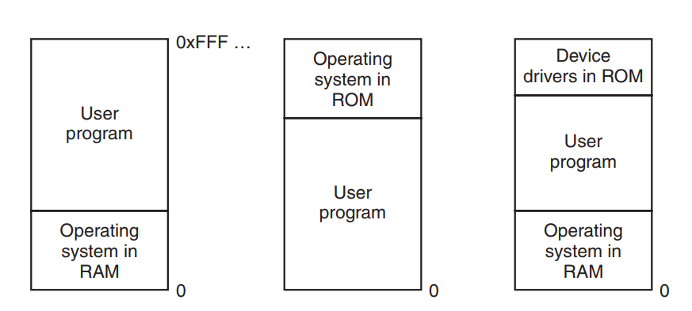

However, attempts were made to make it possible to run different programs at the same time. The thing was to actually
*drop* contents of the memory (with one program data in it) and then load other program data. It could work, however
, another problem appeared. Let's assume that the first program was loaded at a memory address starting at cell 0. It
 should be working fine no matter what. The problem is when a second program appears in memory - let's say
  starting at cell number **4563**. Suddenly when we get to an instruction that moves program execution to eg. cell
   number **28** (assuming all programs' memory start at **0**) - we got cell **4588** instead of expected
    **28**, and an avoidable crash as a bonus. What an example **early IBM 360** was doing is to use **static
     relocation** and adding constant value (where the second program started) to all direct memory calls by the
      second program. 
      
### A memory abstraction - address space

Exposing memory directly to the user is like begging for trouble. Therefore, a concept of **address space** was created.
Of course there were different approaches to how to implement it. The most basic was **base and limit registers idea
** (which is a form of **dynamic relocation**), which was similar to the solution described in the previous chapter
. Every time process was loaded into memory it
 was assigned a value of **base register**, that was holding the memory address that indicated start of the
  application. On the other side **limit register** was holding an address that indicated last memory cell used by
   the program. Subtraction of **base register** and **limit register** should give as program length. **CPU** was
    responsible to make calls to the memory addresses that took this registers under consideration
   . Below is a simple visualisation.

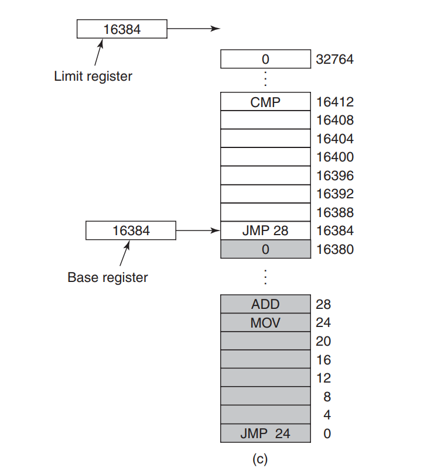

The problem was that the solution was slow (due to computation of **address space**), and what is most important - it
 was limiting by the fact, that a computer could run only programs that could fill in available memory. As we know - processes are being
  scheduled for execution, so there is no need to keep them all in a memory. There are two solutions to this problem
   - **swapping** and **virtual memory**. Here we go.
   
**Swapping** should be pretty familiar concept to every computer programmer. In terms of saving precious **RAM** from
 time to time memory used by the process that is not currently running can be just and dumped to the disc. As a
  result another process that requires memory at a time can have it. Below is a simple image to present it.

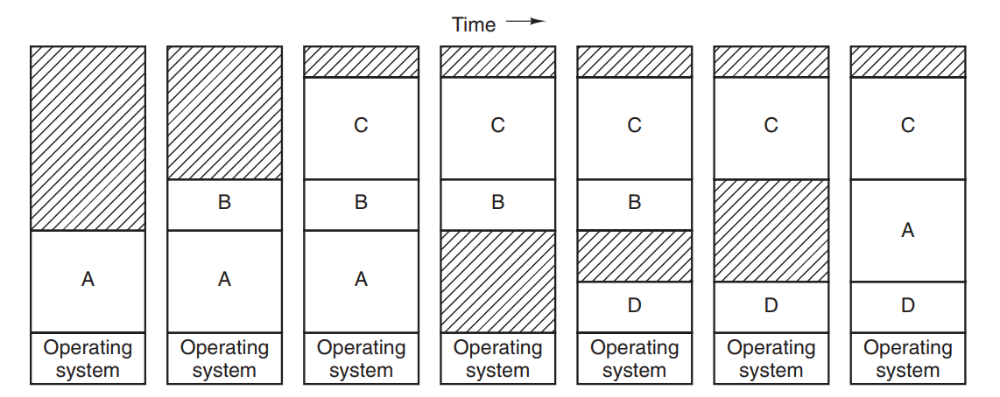

Right now (leaving computation time aside) **limit registers** were pretty useful tool here. Suddenly computers could
 store way more processes in the memory than they used to. Of course - as usual - there was a price to be paid. With
  image above it can be seen pretty clearly - along the way memory starts to look like a Swiss cheese - full of holes. 
 We can imagine that after some time there won't be enough continued memory space to hold process that is going to
  run next. One solution is to use **compacting** - which will just move memory contents up and down to make it more
   continuous. It solves the problem but has one drawback - takes time. What is more - **compacting** might be needed
    not only when the process is loaded from the disc. Usually processes tend to occupy more and more memory during
     its execution. It is easy to imagine a situation where a process cannot allocate more memory that lies next to
      the already occupied memory. In order to proceed with the execution **compacting** must be done *right now*. To
       avoid this usually processes are given a little more of memory than they require at the beginning, in order
        to avoid **compacting** from happening. 
      
    
 <blockquote> TIP:  
 A similar thing can be seen in **Java** world where **garbage collector** is responsible for memory
  management and running its compacting algorithm can result in *stop the world* situation. With the latest versions of
   **Java** (*15* and later) new types of collectors  were introduced - their main goal is to keep *STW* to the minimum
   .</blockquote>  

So far we've concentrated on the processes in the memory and how they are loaded and unloaded. Let's take a look now
 at ways OS is using to keep track which part of memory is free and which part is not. The author presents two
  solutions to this - first of them is **bitmap** - where every memory unit is assigned a bit that indicates whether a cell is empty (value *0*) or used
 (value *1*). The most important factor here is the size of a single unit - if it's too small the amount of bitmap will
  grow as more identifiers are there to be covered. If the unit size is larger, the size of bitmaps shrinks, but it
   may leave a lot of memory wasted by using too big box to hold small value.
   
More robust approach is **linked list**, sorted by memory addresses. Every element in it holds information about whether specific part of memory is taken or not, length of it and identifier (obviously) of the next
 element. When process finishes its work one the below situations can occur.

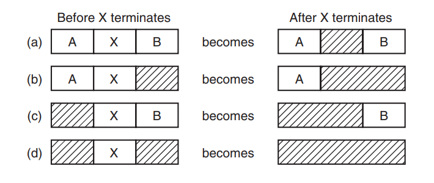

With sorted list when it comes to allocating memory a couple of algorithms can be used:
* **first fit** - is as simple as it sounds - **memory manager** scans the list and as soon as it finds the place
 where process can be put, it does just that
* **next fit** - it works as the above one, but **manager** stores the information where it finished list traversal
 and next time starts from there (and not from the beginning) 
* **best fit** - this one is technically the most efficient when it comes to memory usage but is slower than the rest
. It scans whole list and chooses the smallest area possible. On average however, it also leaves teeny-tiny holes that
 no process can use. 
* **worst fit** - in order to avoid such case (leaving tiny holes) this algorithm uses the biggest hole in the list
 assuming, that remaining place of allocated hole will be big enough to be still useful for other processes. 
 
Above methods are used when a single list is being used to store information about both - holes and used memory. It
 is possible to use two separate lists - one for the holes and one for processes. Sorting them by size makes **first
  fit** a perfect candidate to be used. As usual, it got its drawbacks - updating both lists takes additional time.
At the end author mentions **quick fit**, which is an algorithm that keeps a list of commonly used sizes. However, it
 takes time to check if freed memory can be merged with already freed ones. 
 
### New abstraction - virtual memory

As shown above it is hard to maintain a program's memory, especially when it grows in size. **Swapping** may be a
 solution but doing so for whole application is a waste of time and resources. In **1961** a new concept was born
  - **virtual memory with memory pages**. It's best to put a quote here:
  
> The basic idea behind virtual memory is that each program has
  its own address space, which is broken up into chunks called pages. Each page is
  a contiguous range of addresses. These pages are mapped onto physical memory,
  but not all pages have to be in physical memory at the same time to run the program. When the program references a part of its address space that is in physical
 >memory, the hardware performs the necessary mapping on the fly. When the program references a part of its address
> space that is not in physical memory, the operating system is alerted to go get the missing piece and re-execute the instruction
 that failed.

So how does it work? First we need to mention **memory pages**. In this approach whole amount of physical memory is
 divided into separate **pages** (that can differ in size - from small ones to *1 GB* and more). Every time there is a
  need for free memory and there is none, a **page** (which is just a part of memory) is persisted to the disc. Free
   space is used then to load another page from the disc for the requesting process to work with it. 

Ok, but how does **CPU** knows that specific memory address contains specific **memory page**? This is a job of
  **MMU** - **Memory Management Unit** which is a part of CPU/hardware and does only one thing - translates calls to
   the memory (using **virtual address** provided by **CPU** and **page table** that holds mapping between virtual
    and physical addresses) to the proper **memory page**. If requested page is not in memory (a
    concept of **present/absent bit** is used here), **CPU** calls **OS** with a signal of **page fault**. Usually
     recent used **page frame** (**pages** are chunks of data, **page frames** are actual *'boxes'* in physical memory)
     is swapped to disc and requested **page** is loaded. That's all.
     
Let's look now at **page table**. Its layout (also the layout of single entry) is machine dependent, but it usually works in the same way.
Below we can see a simple image of it.

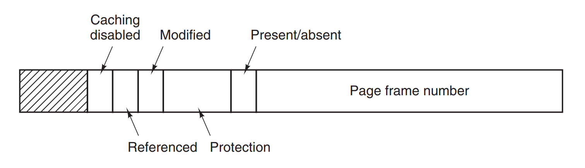

We already know the value (obviously) and **present/absent bit**. However, there are a couple of new pieces there. It
's best described by the author himself.

>The **Protection** bits tell what kinds of access are permitted. In the simplest
 form, this field contains 1 bit, with 0 for read/write and 1 for read only. A more
 sophisticated arrangement is having 3 bits, one bit each for enabling reading, writing, and executing the page.
 The Modified and Referenced bits keep track of page usage. When a page is
 written to, the hardware automatically sets the Modified bit. This bit is of value
 when the operating system decides to reclaim a page frame. If the page in it has
 been modified (i.e., is ‘‘dirty’’), it must be written back to the disk. If it has not
 been modified (i.e., is ‘‘clean’’), it can just be abandoned, since the disk copy is
 still valid. The bit is sometimes called the dirty bit, since it reflects the page’s
 state.
 The Referenced bit is set whenever a page is referenced, either for reading or
 for writing. Its value is used to help the operating system choose a page to evict
 when a page fault occurs. [...]
 Finally, the last bit allows caching to be disabled for the page. This feature is
 important for pages that map onto device registers rather than memory. If the operating system is sitting in a tight loop waiting for some I/O device to respond to a
 command it was just given, it is essential that the hardware keep fetching the word
 from the device, and not use an old cached copy. With this bit, caching can be
 turned off. Machines that have a separate I/O space and do not use memory-mapped I/O do not need this bit.

When it comes to mapping addresses there is only one important thing - make it as fast as possible. Authors mention
 that there are two problems with that - the size of **mapping table** (the larger, the longer it takes to search it
 ), and a speed of translation (**virtual** to **physical**). Starting with the latter - a familiar concept of
  *cache* can be used. Usually there are **pages** that process uses way more often than others. In such case it would be
  wise to actually cache mapping between **virtual address**, and a target **page**. 
  
> The solution that has been devised is to equip computers with a small hardware
  device for mapping virtual addresses to physical addresses without going through
  the page table. The device, called a **TLB (Translation Lookaside Buffer)** or
  sometimes an **associative memory** [...]. It is usually inside
  the MMU and consists of a small number of entries, [...]  rarely more than 256.

So when **MMU** gets a request to return something from the memory it first checks in **TLB** whether requested
 address is already cached. If yes - that's a hit! It returns the memory on the spot. If there was a miss, a proper
  page is returned but also at the same time the mapping is put in **TLB** too. If there is another request for that
   page coming soon, the process will be faster. Interesting thing is that **TLB** can be also implemented by the
    **OS**! That applies to *RISC* architecture, where **MMU** traps to **OS** when there is a cache miss. Author
     says that although it may sound wrong and completely inefficient - a proper size of **TLB** (circa *64*) makes
      it 'workable'. 
      
Second aspect of **mapping tables** I've mentioned was the size of it. To make the search more granular a concept of
 **multilevel page table** was introduced. Instead of having one big **mapping table** - there is a first level, that
  holds just identifiers of **page frames** (*PT1*). Second part (second level = *PT2*) consists of specific **page
   frames** with
   data in them (identified by **offset**). Let's assume that *32bits* are used to identify memory's address. Instead
  of using it all it is split into three parts - *10bits* for level 1, another *10 bits* for level 2, and the rest is
   *offset*. When **MMU** gets a request to return data from memory it first extracts *10bits* to find out what is
    the identifier of **second level mapping**, and then when knows that uses combination of *PT2* and *offset* to
     get the data. Of course, we don't have to stop at *level 2*, hence the word - **multilevel**.
     
Other solution for the size of **mapping tables** are **inverted page tables**. 

> In this design, there is one entry per page
  frame in real memory, rather than one entry per page of virtual address space. For example, with 64-bit virtual addresses, a 4-KB page size, and 4 GB of RAM, an
  inverted page table requires only 1,048,576 entries. The entry keeps track of which
  (process, virtual page) is located in the page frame.
  Although inverted page tables save lots of space, at least when the virtual address space is much larger than the
> physical memory, they have a serious downside: virtual-to-physical translation becomes much harder. When process n
> references virtual page *p*, the hardware can no longer find the physical page by using *p*
  as an index into the page table.
>
> Instead, it must search the entire inverted page table
  for an entry *(n, p)*. Furthermore, this search must be done on every memory reference, not just on page faults
>. Searching a 256K table on every memory reference is not the way to make your machine blindingly fast. The way out of this dilemma is to make use of the TLB. If the TLB can hold
all of the heavily used pages, translation can happen just as fast as with regular
page tables. On a TLB miss, however, the inverted page table has to be searched in
software. 

### Page replacements algorithms

When a **page fault** occurs the *OS* must decide which loaded page in memory to discard. Of course, it can be
 decided by mere luck, however in order to make *OS* more efficient a couple of algorithms was created to handle that.
 
**Optimal page replacement algorithm** - simple but impossible to achieve. It requires keeping labels on all the
 pages stating how many instructions will it take for a page to be referenced. Using this algorithm - the one, that
  will be referenced in the farthest future, should be discarded. However simple, it is not possible to know in
   advance how many instructions before page is referenced.
   
   
**The not recently used page replacement algorithm** - in order to keep *score* of how often pages are referenced
 (read or written) - there are *bits* (*R* for reads and *M* for modifications) that are assigned to every **page table
  entry** that keeps that information (usually modified by the *hardware*). You can see them below. 

Once every couple cycles the *R* bits are cleared. Knowing that, when **page fault** occurs the pages are
 one in four states: 
 
* Class 0: not referenced, not modified.
* Class 1: not referenced, modified.
* Class 2: referenced, not modified.
* Class 3: referenced, modified

**NRU (Not recently used)** algorithm removes a random page with the lowest class.
  
**The First-in, first-out algorithm** - good old FIFO. Simple but not often used, as the oldest page in memory can
 still be useful. Therefore, there is a modification of this algorithm - **the second chance algorithm**. It still
  checks pages based on the age, but also inspects aforementioned *R bit*. When it is set to *0* that means that it
   was not recently used and is discarded. However, if the value is *1* - this page is reordered and is marked as the
    one just coming into the memory. The search for the page to be removed carries on. This algorithm is pretty
     simple, however suffers from the constant reordering the linked list that holds data about pages' time-sequence.
A reasonable modification is **clock algorithm**, that holds pages in the same way a clock does (with hand pointing
 to the oldest page). When page fault occurs, and page is removed from table the latest one (that just came) is put
  in its place and *'clocks'* hand advances by one. One image says more than a hundred words.

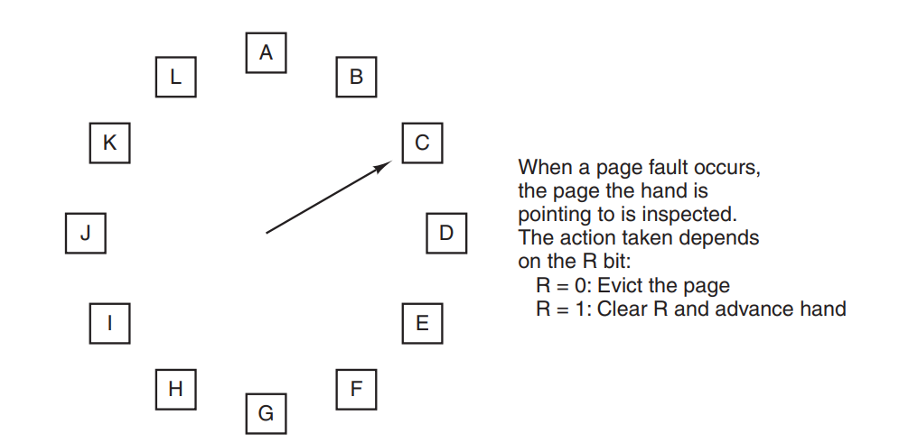

Of course there is also a possibility to create a simple algorithm based on time - **LRU (least recently used)**. It
's a modification of **FIFO**, however here we do not measure when the page was put in the memory but when it was
 lastly accessed. The problem with this algorithm is that it's pretty expensive to keep a linked list with all the
  pages and updating them at every memory access operation.
  
> However, there are other ways to implement LRU with special hardware. Let
  us consider the simplest way first. This method requires equipping the hardware
  with a 64-bit counter, C, that is automatically incremented after each instruction.
  Furthermore, each page table entry must also have a field large enough to contain
  the counter. After each memory reference, the current value of C is stored in the page table entry for the page just referenced. 
When a page fault occurs, the operating system examines all the counters in the page table to find the lowest one. That
 page is the least recently used.

Authors say that there is not that much of a hardware that does something like this. However, it is possible to
 achieve **LRU** with software emulation. First try could be **NFU (Not frequently used)**. The idea is to hold
  *counters* for every page and with every clock cycle *R bit* is read and added to the counter. When it comes to
   removal of page the one with the smallest counter is discarded. The problem is that with counters we loose the time
    component of the algorithm - some pages were used eg. 5 times, and all the other 10 times. So the choice should
     be simple. The problem is that our 5-times referenced page was used just a couple of CPU cycles ago and there's
      still a big chance it will be used soon again. The modification of this algorithm is called **aging** where
       instead of full-blown counters a bit setting is used. For every memory access *R bit* is checked but put in a
        counter with bit shift. So not only we have the amount of access operations but also how long ago did it occur.
    Below image should explain everything, but it is obvious that with this algorithm not only amount of access is
     taken under consideration but also a time.

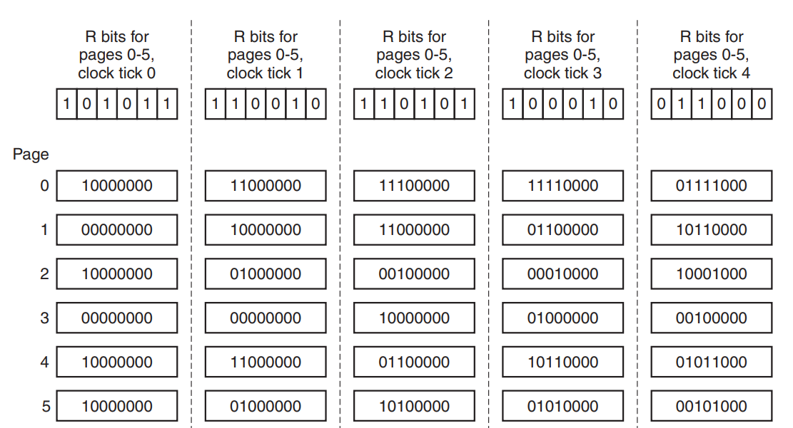

**Working set** algorithm is based on the idea that every process running uses at a given time only a handful of pages.
 Of course, along the process execution this **working set** of pages changes (as
  different parts of program are called and used), but the notion is the same - there is a **working set** for any
   given time process is executed. The idea is simple, however it is a problem to hold information about which pages
    are actually in the **working set** - storing how many times all the pages were accessed is an expensive operation.
 Therefore, there is an idea of tracking pages that were accessed in a specific amount of time (authors provide
  example of *100 msec*). The whole concept is better explained with a direct quote.
  
> In practice, such a definition is
  just as good and much easier to work with. Note that for each process, only its
  own execution time counts. Thus if a process starts running at time *T* and has had
  *40 msec* of CPU time at real time *T + 100 msec*, for working set purposes its time
  is *40 msec*. The amount of CPU time a process has actually used since it started is
  often called its **current virtual time**. With this approximation, the working set of
  a process is the set of pages it has referenced during the past **τ seconds of virtual
  time**.  [...]
>

The pages replace algorithm then works like this:

> The algorithm works as follows. The hardware is assumed to set the R and M
  bits, as discussed earlier. Similarly, a periodic clock interrupt is assumed to cause
  software to run that clears the Referenced bit on every clock tick. On every page
  fault, the page table is scanned to look for a suitable page to evict.
  As each entry is processed, the R bit is examined. If it is 1, the current virtual
  time is written into the Time of last use field in the page table, indicating that the
>page was in use at the time the fault occurred. Since the page has been referenced
 during the current clock tick, it is clearly in the working set and is not a candidate
 for removal (τ is assumed to span multiple clock ticks).
 If R is 0, the page has not been referenced during the current clock tick and
 may be a candidate for removal. To see whether or not it should be removed, its
 age (the current virtual time minus its Time of last use) is computed and compared
 to τ . If the age is greater than τ , the page is no longer in the working set and the
 new page replaces it. The scan continues updating the remaining entries.
 However, if R is 0 but the age is less than or equal to τ , the page is still in the
 working set. The page is temporarily spared, but the page with the greatest age
 (smallest value of Time of last use) is noted. If the entire table is scanned without
 finding a candidate to evict, that means that all pages are in the working set. In
 that case, if one or more pages with R = 0 were found, the one with the greatest age
 is evicted. In the worst case, all pages have been referenced during the current
 clock tick (and thus all have R = 1), so one is chosen at random for removal, preferably a clean page, if one exists. 

### Design issues for paging systems

Above algorithms are just scratching the complexity of the *memory management*. This chapter describes additional
 problems that *OS*-designers must face. First of them is **local vs global allocation policies**. Imagine we have
  three processes in the memory, and one of them hits *page fault*. Should we actually discard one of the pages of
    the current process or should we take all pages into account? Based on that decision we use *local* or *global
     allocation policy*. To make things short - from practice it is better to use *global* one, as it saves memory
      and splits it more just among the others. While using *global policy* it is important to keep track of how
       often the *page fault* happens - the indicator is called **PFF (Page Fault Frequency)**. It controls when 
       process' allocated memory should be increased or decreased. It is also worth noting - not all
        *replacing algorithms* can work with both
       policies. *FIFO* or *LRU* can work with both, however *clock algorithms* is applied only to *local* ones.
       
Sometimes there is another type of problem with memory management - what happens when **PFF** shows that one process'
memory should be increased, but no other process is able to actually shrink itself (also based on **PFF**)? In order
 not to settle on half measures - one of the processes is just in total swapped to disc and remaining ones can use
  freed memory.
  
Next topic discussed is **page size**. As the authors say - there is no optimum value for it, satisfying every use
 case. Usually when we have a program occupying a couple of *pages* in memory - the last page won't be filled 100
 %. If page size is big - the amount of wasted memory is also big. This wastage is called 
 **internal fragmentation** - the more processes, the more space is wasted that way. However, smaller pages makes
  bigger **page table** (and also making **TLB** more fragmented - therefore it decreases its value). A quote is in
   order:
   
> From this equation we can derive a formula that gives the optimum page size (considering only memory wasted in fragmentation and page table size). The result is:
  
>p = √2se
>
>  For **s = 1MB** and **e = 8 bytes per page** table entry, the optimum page size is **4 KB**. Commercially available
> computers have used page sizes ranging from **512 bytes** to **64 KB**. A typical value used to be **1 KB**, but nowadays 
>**4 KB** is more common. 

Now comes a concept of **address space** - we've already covered that in the beginning. However, also here there is a
 catch. As long as **address space** is large enough to store all the program's data (both *instructions* and *data
 *) everything is fine. Back in a day (also sometimes today) that was not a thing. Therefore, a concept appeared
  of actually separating an **address space** for *instructions* and *data* (called *I-space* and *D-space*). That way
   the  amount of addresses that could be used was doubled - as *instructions* and *data* were separated.   

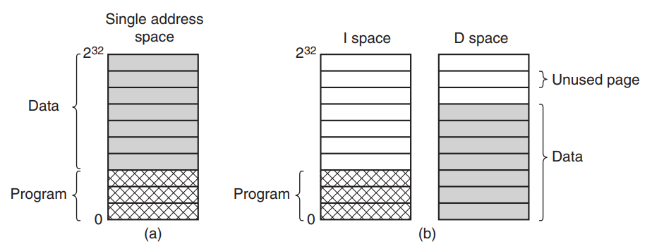

Knowing the above dychotomy we can now proceed to the notion of **shared pages**. Imagine that we fire up two
 instances of one process/application (like web browser). Is it really necessary to load the code twice into memory?
 Of course not! Knowing the distinction between *I-space* and *D-space* table page could actually reuse already
  loaded *I-space* containing the code of the browser. Of course, *D-spaces* remain separate, as every instance of
   the app operates on different data (eg. opened different web pages). As long as two (or more) instances are
    working everything is fine. However, what happens when we have two running instances and one of them is closed
    ? We have to be sure that pages used by it (and still used by second instance) are not wiped out. Unfortunately
    , authors provide only short info that *there are special data structures that keep track of this.*
Sharing data is also possible (however hard). An example of *UNIX fork* system call is provided, where child process
 uses the same data pages that parent one. As long as both processes are only *reading* from them - there is no
  problem. When *write* instruction appear, changed page is copied and starting then both processes have separate
   copies of them. Any changes to the page results only in changing this only page (referenced by one of the processes
   ). This approach is called **copy on write**.

The whole idea of programming industry is to reuse components as much as possible. Therefore, a concept of *libraries* appeared.
 We do not reinvent the wheel - we use work done by the others before. That applies to a lot of apps (especially desktop ones
  ). The question is - if many applications are using the same libraries, they are loading them into memory, right
  ? Is there a way to actually *reuse library code* (not application's code *per se*) that is already in the memory? The
   answer is yes - there is such a possibility.

> Before we go into the topic it is needed to explain the concept of **dynamic** and **static libraries**. I plan to
 write a separate blog post about it (and how they are created and used), but for the time being a simple explanation
  should suffice. **Static library** is a part of reusable code, that is used by the program, and bundled inside of
   it during build process. It solves a never-ending story of program's dependencies not being available during run
   . The downside is that - the size of the program increases and what is more important - any updates to the library
    require recompilation of the whole app. With **dynamic libraries** that is not a case. A **dynamic library** is
     installed in the *OS* and can be used by many apps. Every time a library is updated, all the apps using it 'see
     ' this and benefit from bug fixes, security patches, etc. The problem is one - how to determine that a library
      is present in the system? What is more - what this library uses other library? As I've said - never-ending story.

**Static libraries** are a part of program's code. So they *might* been used via *I-space*. However, **dynamic
 libraries** are loaded separately, making it easier for the OS to reuse pages where they are loaded among different
  processes. In order to be fully reusable, every library during build process must be told to avoid *direct
   memory jumps*. Every change in position of executable code in a library is done using *jump X bytes*, instead of
    directly referencing an address. 
    
Authors make a generalisation stating that **dynamic libraries** are an implementation of 
**memory-mapped files**. To make things short - quote:

>  The idea here is that a process can issue a system call to map a file onto a portion of its virtual address space. In most implementations, no pages
    are brought in at the time of the mapping, but as pages are touched, they are demand paged in one page at a time, using the disk file as the backing store.
> When the process exits, or explicitly unmaps the file, all the modified pages are written
       back to the file on disk.
       Mapped files provide an alternative model for I/O. Instead, of doing reads and
       writes, the file can be accessed as a big character array in memory. In some situations, programmers find this model more convenient.

So far, we've discussed algorithms and techniques to speed them up and decrease resource usages. One of the last
 things to mention is **cleaning policy**. It was tested that it is actually not wise to use up all the available
  memory, and when the *page fault* occurs, swap the oldest (and not used) one to the disc and bring another one. It
  's way better to keep a couple of free pages at hand (avoiding forced disc call). That is **paging deamon** job
   - to wake up periodically, inspect the state of memory, and if there are too little empty pages, it performs the
    cleaning. It speeds up any kind of **scheduling algorithm** used.
    
At the end of subchapter a concept of **direct memory access** is mentioned, however IMHO as a trivia at this point
 with a promise that an example will be discussed later in the book (discussing network), so I will skip that for the
  time being.
  

### Implementation issues

Authors start this subchapter by specifying moments when *OS* is involved with **paging issues** - however this is
 just a recap of what was mentioned above, so I'll just list it with short description:
 * **process creation time** - mostly allocating memory for **page table** of the process 
 * **process execution time** - reset *MMU* and flush *TLB*
 * **page fault time** - read hardware registers, compute page that is missing, locate it on disc and load
 * **process termination time**  - release all the resource (**page table** entries, pages itself and disc space
  where pages were swapped)
  
Next comes exact instruction what happens when a **page fault** happens. Honestly, it will be best handled with just
 quoting the list.

> 1. The hardware traps to the kernel, saving the program counter on the
> stack. On most machines, some information about the state of the
> current instruction is saved in special CPU registers.
> 2. An assembly-code routine is started to save the general registers and
> other volatile information, to keep the operating system from destroying it. This routine calls the operating
> system as a procedure.
> 3. The operating system discovers that a page fault has occurred, and
> tries to discover which virtual page is needed. Often one of the hardware registers contains this information. If
> not, the operating system must retrieve the program counter, fetch the instruction, and parse it in software to
> figure out what it was doing when the fault hit.
> 4. Once the virtual address that caused the fault is known, the system checks to see if this address is valid and the protection is consistent
  with the access. If not, the process is sent a signal or killed. If the address is valid and no protection fault has occurred, the system checks
  to see if a page frame is free. If no frames are free, the page replacement algorithm is run to select a victim.
> 5. If the page frame selected is dirty, the page is scheduled for transfer to
  the disk, and a context switch takes place, suspending the faulting
  process and letting another one run until the disk transfer has completed. In any event, the frame is marked as busy to prevent it from
  being used for another purpose.
> 6. As soon as the page frame is clean (either immediately or after it is
  written to disk), the operating system looks up the disk address where
  the needed page is, and schedules a disk operation to bring it in.
  While the page is being loaded, the faulting process is still suspended
  and another user process is run, if one is available.
> 7. When the disk interrupt indicates that the page has arrived, the page
  tables are updated to reflect its position, and the frame is marked as
  being in the normal state.
> 8. The faulting instruction is backed up to the state it had when it began
  and the program counter is reset to point to that instruction.
> 9. The faulting process is scheduled, and the operating system returns to
  the (assembly-language) routine that called it.
> 10. This routine reloads the registers and other state information and returns to user space to continue execution
, as if no fault had occurred.

Next comes **instruction backup**. Let's take an example of *CPU* instruction that contains of a word and two
 separate operands. 

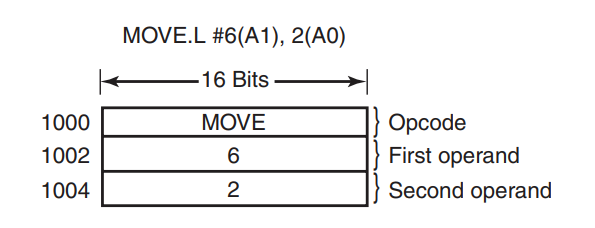

Numbers on the left represent memory addresses. What happens when during execution of that instruction a
 **page fault** occurs? It's hard to actually determine which part of the instruction caused the problem. The final
  say from the authors (after giving history lesson about one of the *Motorola CPUs*) is that
   *some CPU manufacturers* were able to add a hidden register to copy current program's
   counter when entering the instruction and therefore after **page fault** it is easy to reset it. Usually however
    it's *OS* job to do, but the details are omitted. Great writing guys ;)
    
Very shortly authors mention **locking pages in memory** - it is actually *I/O* related issue which will be discussed
 in the next chapters. Here, just to indicate a problem - imagine that a memory page is waiting to be filled with
  data coming from *I/O* (eg. reading contents of a plan text file). During the wait process is suspended and another
   process runs. While running, second process hits **page fault** and therefore a scheduler chooses our
    **page** that awaits for the data read from the disc to be discarded. What happens then? Disaster. So mentioned
     solution is just to specifically mark pages that are involved in *I/O* to prevent them from being evicted (which
      is called **pinning**).

Still being somewhat in the scope of *I/O* it's time to describe how the disc is used in the 
*memory management* process. Often in the above text there is a mention that data is put on the disc or from the disc
. However, there was never a more detailed information about it, so the time has come to change that. In the most 
*UNIX-like*  systems a special disc partition called **swap partition** (with special file system) is used to handle
 page faults. Description
 that follows is pretty simple - more details are promised to be discussed in the chapter about *UNIX-like* systems.

One solution can be this - every time a new process starts a part of *swap* is being assigned to it. Mapping of
 addresses 
 between **page table** and **swap partition** is kept in the first one. When process starts, a part of *swap*
  assigned to it must be initialised. It can be done in two ways - whole process can be loaded into the *swap* and
   when needed loaded into the memory. On the other hand it can be done the other way around - whole process is
    loaded into the memory and only parts that are removed from it (via **scheduling algorithm**) is put to the
     dedicated part of *swap*. Everything would be great if the processes did not change their's size. Instructions
      usually does not change the size
, but that cannot be said about stack or program's data. So to keep things simple it is better to assign parts of
 *swap* to process data, instructions and stack separately.
 
Second approach can be this - do not use *swap* at the beginning at all! Just think about using it when the **page
 fault** hits, and some pages must be swapped. The authors show two methods how it can be done:

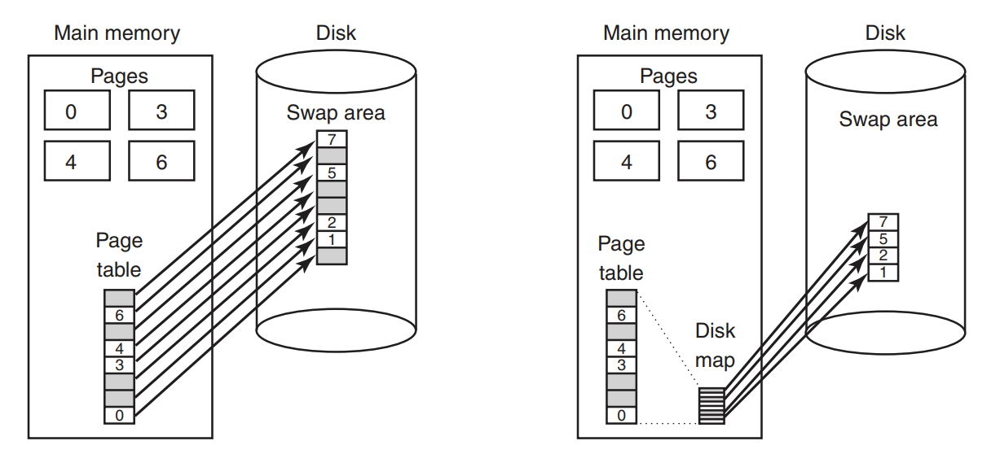

 
The one on the left keeps predefined mapping between process' pages and its *swap space*. In such situation finding a
 specific page on the disc (or swapping one back) is fairly simple - **page table** knows where *swap* space starts
  and just do simple math to calculate address of a page. This approach achieves duplication of pages - what is in
   memory also is put on the disc. The second solution avoids that - when a page must be put on the disc, a random
    *swap* part is taken and page is put there. There is no data duplication and *disc map* is used to keep track
     between pages and their addresses on the disc. 
     
To finish this topic - *Windows* does not use above solution - it just uses one big file as a *swap* on the regular
 disc. 
 
At the end of this subchapter a differentiation of *policy* and *mechanism* is used. It's a common concept in IT
 world, so I would not go into details here. The things to differentiate are:
* MMU
* page fault handler (kernel) - *mechanism*
* external pager (user space) - *policy*

The following image should tell more than words:

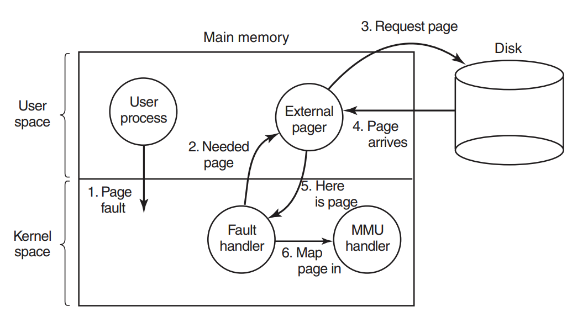

### Segmentation

To start with - *Wikipedia* says that this concept of managing memory is actually almost non-existent nowadays and
 (especially on Intel *x86-64* architectures it's kept only for backward-compatibility reasons). I've consulted the
  other book on *OS concepts* (by **William Stallings**) and **segmentation** is described on maybe one page in >1k pages
   book. Therefore, I will limit myself here to just describing the basics and skip specific descriptions how
    **segmentation** was done in **MULTICS** and in **x86**.
 
**Segmentation** is a technique of memory management that instead of using **page table**, divides whole memory used
 by a process into **segments** (separate address spaces for different usages). Below picture will show how's done.

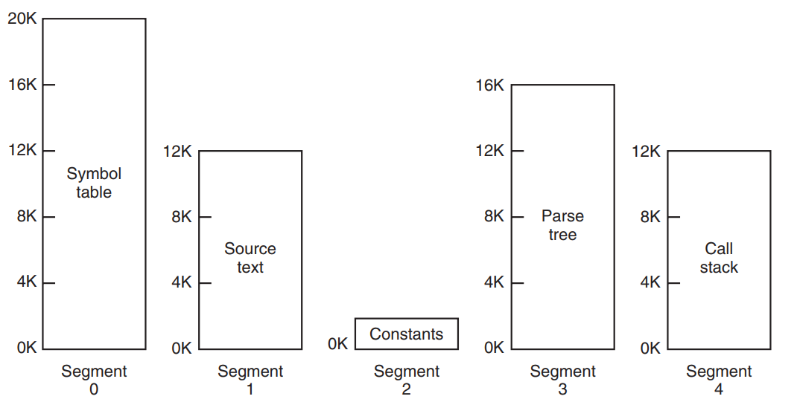

Every part of a process - instructions, data, stacks, etc. has separate **memory segment** that grows separately
 from the others. As **segments** are usually pretty large (whatever that means) it is unusual for it to run out of
  free space. However, as we do not use predefined size of **page** we can save more memory by creating 
  **segments** with more fine-tuned size. What is more - as *paging mechanism* is invisible to the programmer
  , **segmentation** actually is. What is more - as **segments** occupy contiguous part of memory, when segments
   reaches the end of its free space (it would overlap with other segments), we have to move it somewhere. Even if we
    find free place in the memory, there's a hole left by evicted segment. Therefore, the whole memory with time
     becomes more and more fragmented. That can be fixed with **compacting** the memory, but it also takes time. 
 To finish this topic - here is a great question <a href="https://stackoverflow.com/questions/56213569/linux-memory-segmentation">on SO concerning this topic.</a>
To also end the whole chapter I recommend <a href="https://www.youtube.com/watch?v=7aONIVSXiJ8">this YouTube video about Linux memory management</a>
that nicely summarizes a lot of concepts we've  discussed here.  

