## Chapter 4 - File systems

> Files are logical units of information created by processes. A disk will usually
contain thousands or even millions of them, each one independent of the others. In
fact, if you think of each file as a kind of address space, you are not that far off, except that they are used to model the disk instead of modeling the RAM.
Processes can read existing files and create new ones if need be. Information
stored in files must be persistent, that is, not be affected by process creation and
termination. A file should disappear only when its owner explicitly removes it.
Although operations for reading and writing files are the most common ones, there
exist many others, some of which we will examine below.
Files are managed by the operating system. How they are structured, named,
accessed, used, protected, implemented, and managed are major topics in operating
system design. As a whole, that part of the operating system dealing with files is
known as the file system and is the subject of this chapter

### Files

The concept of naming is handled differently - depending on the OS. However, the usual approach is to enable up to 
*255* characters in a name. It's possible to use special characters as well, although, several of them can be 
forbidden or used for something else (eg. like *.* to indicate the file extension). In *MS-DOS* it was a crucial 
thing for a file type, in *UNIX-like* systems is on the other hand just a convention.

The structure which is used by OS to store the file on the disc can differ. Below image shows examples of that.

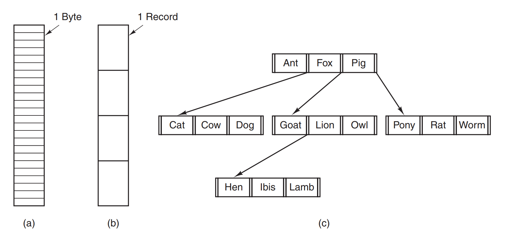

In the example *A* - file is just a stream of bytes positioned next to each other. It's application/OS job to figure 
out the sense of it (both *Windows* and *UNIX-family* works like that). Example *B* was heavily used back in a day, 
when punched cards were used. Obviously, this is not a thing anymore. The last example authors are pointing in some 
mainframe computers for commercial data processing. 

I've mentioned *file extensions* before. Very often they are indicators of the *file type*. Below quote explains the 
thing.

> Many operating systems support several types of files. UNIX (again, including
OS X) and Windows, for example, have regular files and directories. **UNIX** also
has character and block special files. Regular files are the ones that contain user
information. All the files of above images are regular files. **Directories** are system files
for maintaining the structure of the file system. We will study directories below.
**Character special files** are related to input/output and used to model serial I/O devices, such as terminals, 
 printers, and networks. **Block special files** are used to model disks. In this chapter we will be primarily 
> interested in regular files.

Regular files can be divided into two separate categories:
* **ASCII files** - that in general contains human-readable text and can be easily processed.
* **binary files** - that are stream of bytes. Their internal structure is understood by the programs that are 
  operating on them. 
  
When it comes to the **binary files** and their structure, things varies. However, the OS must be able to at least 
know how to process **binary files** that are **executable** - which means they represent a program that can be 
executed on the machine. Below is an image representing *UNIX* binary files structure (executable one and an archive).

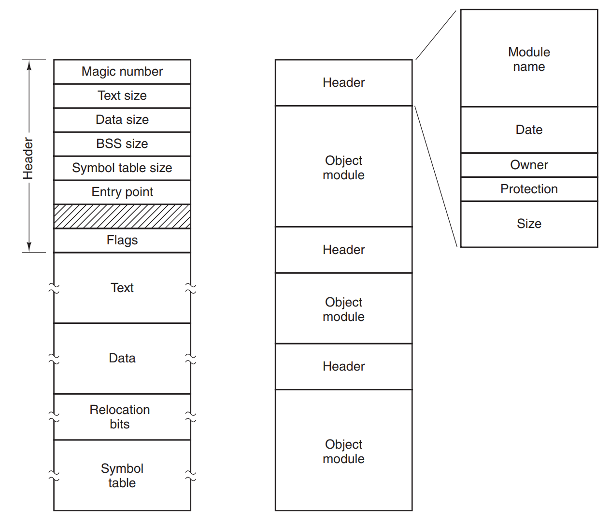

When it comes to files, a concept of **file access** appears. Depending on the system, it is possible to read files 
in **sequential mode** - that is derived from magnetic tapes that served as storage back in a day. There was no way 
to read bytes starting from the middle of the file, or read just chunks of it. However, with the dawn of hard-discs, 
a new concept of **random-access** appeared. This mode is with us today - there's no problem with reading part of 
the file (system calls of *read* and *seek* are used for that).

Aside from its name and data, files also can have a lot of different additional properties that are called 
**attributes** or **metadata**. The list varies between systems. Below I just present the list from the book.

| Attribute                                   | Meaning                                                  |
|---------------------------------------------|----------------------------------------------------------|
| Protection                                  | Who can access the file and in what way                  |
| Password                                    | Password needed to access the file                       |
| Creator                                     | ID of the person who created the file                    |
| Owner                                       | Current owner                                            |
| Read-only flag                              | 0 for read/write; 1 for read only                        |
| Hidden flag                                 | 0 for normal; 1 for do not display in listings           |
| System flag                                 | 0 for normal files; 1 for system file                    |
| Archive flag                                | 0 for has been backed up; 1 for needs to be backed up    |
| ASCII/binary flag                           | 0 for ASCII file; 1 for binary file                      |
| Random access flag                          | 0 for sequential access only; 1 for random access        |
| Temporary flag                              | 0 for normal; 1 for delete file on process exit          |
| Lock flags                                  | 0 for unlocked; nonzero for locked                       |
| Record length                               | Number of bytes in a record                              |
| Key position                                | Offset of the key within each record                     |
| Key length                                  | Number of bytes in the key field                         |
| Creation time                               | Date and time the file was created                       |
| Time of last access                         | Date and time the file was last accessed                 |
| Time of last change                         | Date and time the file was last changed                  |
| Current size                                | Number of bytes in the file                              |
| Maximum size                                | Number of bytes the file may grow to                     |

### Directories

> To keep track of files, file systems normally have directories or folders, which
are themselves files.

Directories being files actually does not change the fact, that they differ a little from their 'normal' brothers. 
Directories are there to act as a scaffold of structure for the files containing data. As such we can make a binary 
distinction of them:

* **single-level system** - a concept where all the files reside in one 'root' folder. It's plain and simple.
* **hierarchical system** - the one that we're familiar with. It forms a reversed-tree-like structure with one single 
  root node at the top.
  
The concept of **absolute path**, **relative path** and **working dir** are discussed next, but I assume if You're 
reading this notes - You definately know what they are and how they work. The same goes to the operations that can 
be done upon directories.

### File systems implementation

Now here comes the meat. We dive into the very details of implementing a file system. Let's dig in.

#### File-system layout

*Disclaimer: The author does not mention anything about **GPT** or **UEFI** here. I know that the book is from 2014, 
but still, the aforementioned solutions were used back then already!*

Hard disc, a hardware part that can store data, usually are not just plugged-in and used. When they're big, we want 
to divide them in the smaller parts we call **partitions**. In order for the OS to know where these partitions are, 
some kind of map or index is needed. That kind of index is called **MBR**, and is located at the very beginning of 
every disc. First thing the *BIOS* does when booting a computer it checks **MBR partition table** for a partition 
that is marked as bootable. Then it goes to the proper segment of the disc and tries to start a *boot loader* that 
is stored in the **boot block** of the partition. Below image presents an example structure of the disc.  

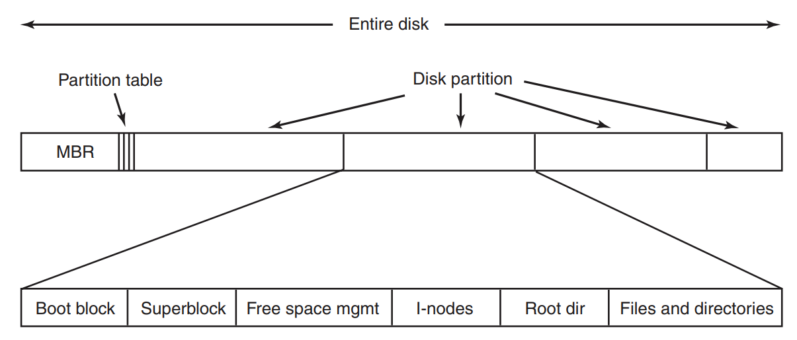

#### Implementing files

The most important thing when it comes to file is to know where are the boundaries (in terms of **disc blocks**) of 
the specific file. Here are usual solutions that can be used for that.

**Contiguous allocation** - the simplest one. We allocate files in the contiguous blocks. So finding every file is 
simple - just find the starting block and add the number of blocks the file occupies in total. Boundaries are there. 
It's cheap, simple and fast. However - there's obvious drawback of disc fragmentation when files are moved around or 
deleted. That's making it not that perfect for usual hard discs, although, this type of allocation is still used in 
CDs or DVDs (thus there with **UDF - Universal Disc Format** the files are put in *1GB* chunks).

**Linked list allocation** - here we use linked list to keep track of the next block containing the rest of the file.
In such case the first word of block contains a pointer to the next block (with the next part of the file), and rest is 
data. It saves the blocks, and avoids fragmentation. However, random access to the file is painfully slow.

**Linked-List Allocation Using a Table in Memory** - the problems with simple **linked list allocation** can be 
omitted when we keep the pointers in the memory. This solution is called **FAT - file allocation table**. It's fast, 
but the problem lies in a memory consumption. Here are calculations from the book:

> The primary disadvantage of this method is that the entire table must be in
memory all the time to make it work. With a 1-TB disk and a 1-KB block size, the
table needs 1 billion entries, one for each of the 1 billion disk blocks. Each entry
has to be a minimum of 3 bytes. For speed in lookup, they should be 4 bytes. Thus
the table will take up 3 GB or 2.4 GB of main memory all the time, depending on
whether the system is optimized for space or time. 
> 

**I-nodes** - instead of keeping everything in a memory, **I-nodes** (from *index-nodes*) are put there only when 
the file is actually open/used. **I-node** contains blocks addresses that makes the file a whole. Of course there's 
a possibility that there's a lot of them (due to the file size) - in such case the last block contains reference to 
the block that contains more information about the pointers. And so on and so forth. *Windows NTFS* and all 
*UNIX-like* systems are using this approach.

Files are one thing. The second one are directories. Every file is located somewhere in the logical directory 
structure and therefore a **directory entry** is linked to it. Every entry contains **attributes** that describe 
the file (author, creation date, etc.). The simplest solution is to store them in every directory as a 
predefined-length map. The keys are file names, and the contents are attributes (or in case of **i-nodes** - their 
addresses). That approach could work well in the old days, when file names were small. With the modern computers and 
file names that can be up to *255* characters long that would mean a lot of wasted space.

Therefore, a new approach is used - first we store predefined-length data (author/permissions/dates or file length) 
and just then the file name that varies in size. This data can be put directly inline in the memory (image on the left).
We can also use *heap* to store the data (image on the right), which again saves us the problem of starting every 
entry at the word boundary.
However, this approach has a problem when data in memory is scattered through a couple of *memory pages*. In such
case a couple of *page faults* can result while trying to read information about the file.

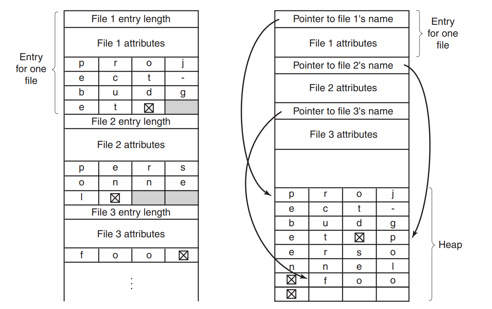

In addition to storing the information about *directory entries* the problem lies when we want to search for a file 
within 
a directory. For directories that contain not that much files the problem is non-existent. However, for large 
directories it becomes a problem. One of the solutions is to use *hash table* to store references to the entries or 
cache the search results. Either way - these solutions increase complexity and are recommended only for a 
directories that contain thousands of files.

Next thing to cover are **shared files**. It is convenient for the users to work on the same file and see it in the 
user's specific folder, even if the file creator and owner is a different person. Such connection and doubled 
presence is called a *link*. In such situation the file system hierarchy is not a simple tree but **directed acyclic 
graph** that is presented below.

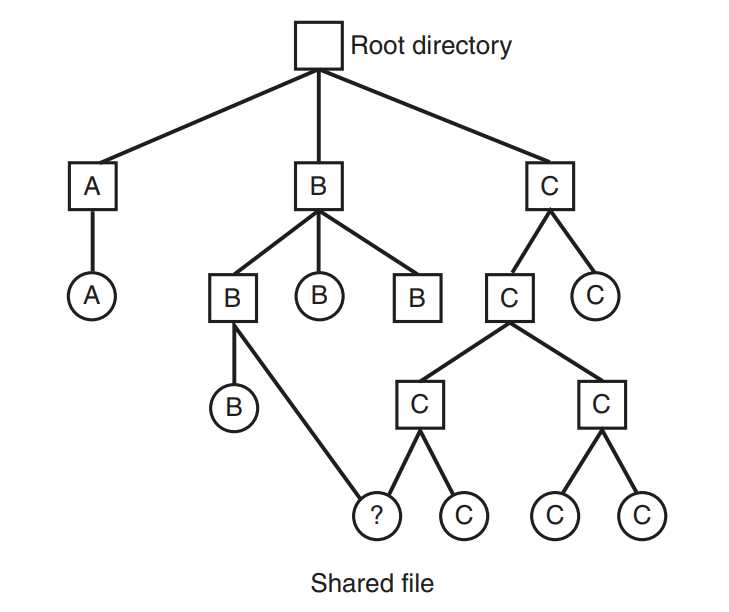

Usually when something is convenient for the user it's not the same for OS designer. In this case it's true. We've 
discussed **directory entries** already - if we have the same file present in the two folders the question arises - 
which **directory entry** is the ultimate source of truth? To maintain data integrity two solutions can be used. One 
 are already described **I-nodes** - **directory entries** contain only links to them and the changes to the file 
(wherever it is located) result in concurrent changes in the **I-node**. Second solution is not to create a file in 
the second location but just a **symbolic link**, that actually points to the target file instead of copying it and 
syncing afterwards.

As usual there are drawbacks. When using direct pointers to the **I-node** in the **directory entry** what happens 
when the owner deletes the original file? The **I-node** still exists as it holds the counter with the number of all 
the links to it, and also the original file is set as an owner, and a creator of the file. As long as the counter it's 
bigger than 0 there's no way to remove an **I-node**. With **symbolic links** this problem does not happen - when 
the original file (and **I-node** along) is deleted, **symbolic link** becomes useless. 

Next concept described in a book is **Log-structured file systems**. I've checked <a href="https://en.wikipedia.org/wiki/Log-structured_file_system">Wikipedia about it</a>, 
and it seems that the concept was there for some time, but right now it's basically not used anywhere at all. So, if 
You're interested in this kind of file system, visit an aforementioned link.

On the other hand - **Journaling File Systems** are still with us as a part of *NTFS* or *Ext3* and *ReiserFS*. The 
idea is simple - most disc operations are (or should be) - *atomic*. Author provides an example of removing a file 
which steps are:
* remove the file from directory
* release the I-node to the free I-nodes pool
* return disc blocks (released just now) to the pool of free blocks

As long as there's no such thing as system failure the order of the above steps does not matter. However, systems 
crash from time to time. Depending on the order of the above steps, and the place when system crashes - the output is 
always wrong for the system (resource shortage/data inconsistency/etc). What to do then?

Here the concept of **journal** comes in. Before making an actual operation on the disc, first the intent of what's 
gonna be done is stored in a **journal** and then on the disc. Usually re-read of this entry is done to make sure 
that it was properly stored. Then operations are performed step by step, but, when during that operation a system 
crash occurs, we loose nothing. Upon then startup, a **journal** will be checked and if there's any operation that 
was not finished, it will be made so.

Last topic to be discussed is **Virtual File System**. Examples provided are based on *Unix-like* systems, as 
*Windows* does not support such notion (every partition in *Windows* has separate file system). **VFS** concept 
supports the idea that from the perspective of the system's user - the whole directory hierarchy can be seen as a 
whole, without caring about file systems that actually are used there. It's a common thing for example, to have 
*swap* partition using specific file system, *root* folder mounted with *ReiserFS* and all the rest using popular 
*ext4*. From the user's perspective access to the files looks exactly the same.

Logical view over this solution presents this image.

Processes are using system calls for manipulating files or directories. **VFS** is *POSIX-compliant* and presents 
unified interface for that. That's the upper part of the image. When it comes to low-level details - **VFS** knows 
how to handle specific file systems and when communicating with specific partitions/mount points it uses proper calls.
What is more - **VFS** was originally designed (at *Sun Microsystems*), to support **Network File System**, which 
means to provide the unified interface for operating the files, even if they're located on a completely different 
machine!

> To understand how the VFS works, let us run through an example chronologically. When the system is booted, the root file system is registered with the VFS.
In addition, when other file systems are mounted, either at boot time or during operation, they, too must register with the VFS. When a file system registers, what it
basically does is provide a list of the addresses of the functions the VFS requires,
either as one long call vector (table) or as several of them, one per VFS object, as
the VFS demands. Thus once a file system has registered with the VFS, the VFS
knows how to, say, read a block from it—it simply calls the fourth (or whatever)
function in the vector supplied by the file system. Similarly, the VFS then also
knows how to carry out every other function the concrete file system must supply:
it just calls the function whose address was supplied when the file system registered
>
> After a file system has been mounted, it can be used. For example, if a file system has been mounted on /usr and a process makes the call
open("/usr/include/unistd.h", O RDONLY)
while parsing the path, the VFS sees that a new file system has been mounted on
/usr and locates its superblock by searching the list of superblocks of mounted file
systems. Having done this, it can find the root directory of the mounted file system
and look up the path include/unistd.h there. The VFS then creates a v-node and
makes a call to the concrete file system to return all the information in the file’s inode. This information is copied into the v-node (in RAM), along with other information, most importantly the pointer to the table of functions to call for operations
on v-nodes, such as read, write, close, and so on.
After the v-node has been created, the VFS makes an entry in the file-descriptor table for the calling process and sets it to point to the new v-node. (For the
purists, the file descriptor actually points to another data structure that contains the
current file position and a pointer to the v-node, but this detail is not important for
our purposes here.) Finally, the VFS returns the file descriptor to the caller so it
can use it to read, write, and close the file.

Additionally, below image presents the above process.

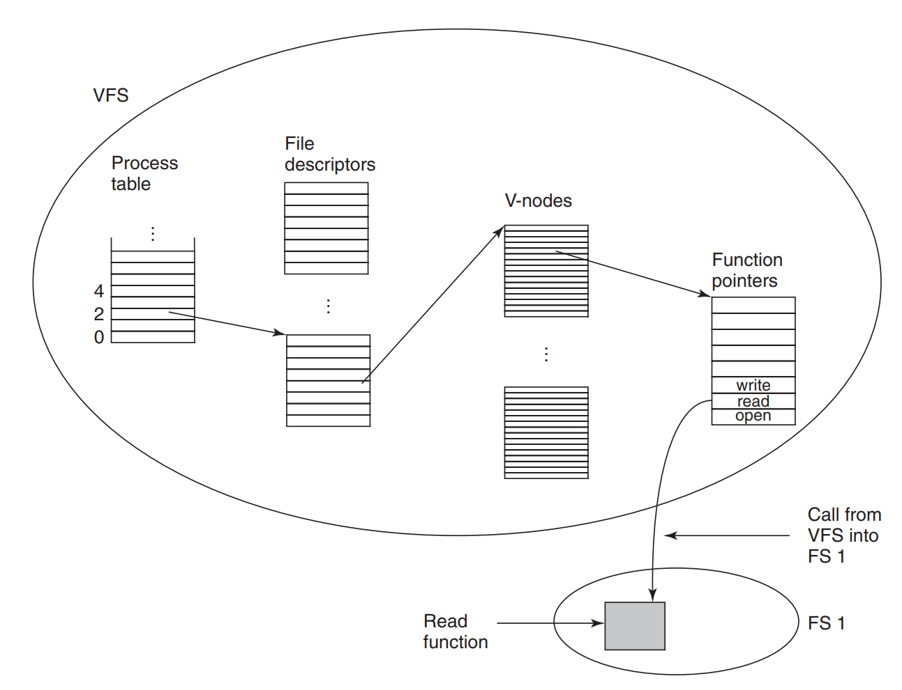

### File-system management and optimalization

There are several things besides working of file system - we usually want it to be as fast and reliable as possible. 
Below we describe a couple of things that are important to make that happen.

When it comes to the storing files on the disc we've already discussed contiguous storage and chopped one ;)  
Usually the second is a better approach but then additional question arises - what size should a disc block have? An 
obvious solution would be to look at the statistics. The authors provide them based on their research from *1985* 
and again in *2005*. I'm not going to rewrite the whole statistics and charts, let's just sum everything up by the 
quote:

> What the curves show, however, is that performance and space utilization are
inherently in conflict. Small blocks are bad for performance but good for diskspace utilization. For these data, no reasonable compromise is available. The size
closest to where the two curves cross is 64 KB, but the data rate is only 6.6 MB/sec
and the space efficiency is about 7%, neither of which is very good. Historically,
file systems have chosen sizes in the 1-KB to 4-KB range, but with disks now
exceeding 1 TB, it might be better to increase the block size to 64 KB and accept
the wasted disk space. Disk space is hardly in short supply any more.
>

Choosing the proper block size is one thing, keeping track which one of them is free is a separate issue. Two 
solutions are usually used - **linked list**, that is stored in the free blocks, holding as many pointers to the 
free blocks as it can store (usually this data is also stored in memory to speed things up). In a memory only one 
block of pointers must be kept - there's no need to cache everything. However, this solution in special 
circumstances can lead to additional *IO*, when the blocks stored in memory are almost filling it. In order to avoid 
that usually the list kept in memory is split the full block of pointers in memory and reducing the need to 
read/write information about them on and from the disc.

The second idea is a **bitmap** - with simple information whether the block is empty or not indicated by the value 
of the specific bit. It takes a lot less place when used. Also, storing **bitmap** in memory results in lesser 
amount of disc rotations as bits in a specific entry represent blocks adjacent to each other.

Last thing to discuss in this subchapter is **disc quota**. It is not uncommon for system administrators to limit 
the amount of disc space the user can user. To hold that information - every time a user opens a file a specific 
entry is added to the **open-file table**, that stores information about the file, user and also the pointer to the 
**quota table**, that stores information about the quotas of all the users, which files were opened. Below image 
represents this solution.

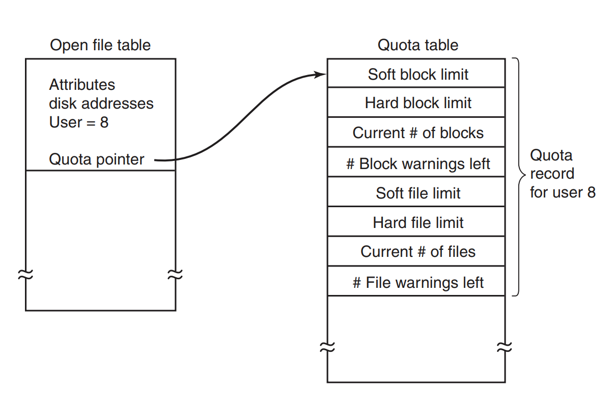

This mechanism is checking every time a block is removed or added from the user's file - it increases or decreases 
the counters for blocks usage or total file amount. *Soft limits* can be broken, but must be back to lesser value 
before user's session ends. *Hard limits* cannot be broken no matter what.

### File-systems backups

As the old saying goes - 'people can be divided into two groups - one is doing backups, the second one will do them 
in the future'. The truth is that with a lot of our data moving to the cloud it is not that crucial anymore to make 
backups on the regular basis. We trust 'the big guys' to keep our data and make sure that it's safe. However, we're 
discussing OS-concepts here, so we dive into the concepts behind the backups in more detail.

When it comes to making backups there are two approaches. The first one is **physical backup** - when all the blocks 
(starting from 0) are 1:1 copied to the backup disc. As simple as that. However, the question arises is it necessary 
to actually store empty blocks? It seems irrational to do so. On the other hand, when skipping empty blocks, we must 
additionally store information about the block id/number, for it to be properly restored in the future. The same 
thing goes with **bad blocks**. It is possible than **disc controller** handles them, and they're not seen by the OS. 
However, if that is not the case - and OS sees **bad blocks**, the information about them is crucial for the backup 
program to prevent it from copying them.

The second type of backup is a **logical backup**. In such case we're more directory and file oriented, rather than 
block oriented. What is more - **incremental backups** are possible, as there's no need to backup the files that did 
not change since the last backup. Now the authors describe the backup system that is used in most of the *UNIX-like* 
systems.

The backup algorithm maintains a **bitmap** indexed by **I-node** number. As the backup process proceeds, the 
specific bits are being modified. What is worth mentioning - in the **incremental backup** also the unchanged 
directories that are a part of changed data hierarchy are being backed too. Here is how it goes.

> Phase 1 begins at the starting directory (the root in this example) and examines all the entries in it. For each modified
file, its i-node is marked in the bitmap. Each directory is also marked (whether or
not it has been modified) and then recursively inspected.
[...] Phase 2 conceptually recursively walks the tree again, unmarking any directories that have no modified files
or directories in them or under them. [...] For efficiency, phases 1 and 2 can be combined in one
tree walk.
At this point it is known which directories and files must be dumped. [...]
> Phase 3 consists of scanning the i-nodes in numerical order and dumping all the directories that are marked for 
dumping. [...] Each directory is prefixed by the directory’s attributes (owner, times, etc.) so that they can be 
> restored. Finally, in phase 4, the files marked in phase 3 are also dumped, again prefixed by their attributes.
This completes the dump.

Authors here mention a couple of additional problems with the above solutions like handling empty blocks, empty space 
in the files, links and pipes but do not go into details, so I won't either.

### File-system consistency

We operate on the assumption that all the file-related operations are ending with a success. Unfortunately that's 
not the case. Crashes happen, and the worst part of them is that they can influence not just plain data files, but 
also *I-nodes* or *empty blocks lists*. In order to make file systems consistent after the crash a special kind of 
programs are used - we will discuss *fsck* here, which comes from *UNIX*.

There are two types of consistency checks - **block** and **file** checks. Let's start with the former. The idea is 
simple. We create two separate lists - one with the blocks identifiers that are used by files, and the 
second one holding information about blocks that are free (no matter if usually free blocks are maintained by 
**linked list** or **bitmap**). Starting from block 0 we go through all the *I-nodes*, and we mark every used block 
in the first list. Then we go through the list of free blocks, and we mark them in the second list. If after this 
process two lists contain all the blocks on the disc we're fine. However, it's possible that some blocks are not in 
any of the lists, or they're represented twice in the free list. They're called **missing blocks** and in order to fix 
that they're just incorporated into free blocks list as a single one. 

We got a bigger problem when block appears twice in the used list. It means that for some reason, the same block is 
used by two (or more) files. The solution to resolve that is for checking program to allocate a new block, copy the 
contents of doubled block there and then update one of the *I-nodes* that points to the doubled block. In such 
situation the doubling is resolved and data in the files preserved.

A similar algorithm is used for **file checks**. All the filesystem is traversed, counting all the occurrences of the 
file (*hard links* here) and putting that information into the list. When it's done the counters per files are 
compared with the values in corresponding *I-node*. Here two solutions are possible - the counter value in the 
*I-node* can be too high or too low. When it's too high it's not a problem - we just set the value to the correct 
one. When it's too low then we have a problem, as a situation is possible, when we have two files occurrences, and 
the *I-node* count is 1. When one of these files is removed, *I-node* count drops to 0, and it can be reused by the 
OS. The file left still has the pointer to this *I-node*, resulting in a wrong data being pointed to. However, as in 
the first scenario - we just fix the *I-node* value to the proper one.

### File-system performance

There are a couple of methods to speed up the disc access - oldschool, rotating discs are slowly going away (at 
least in desktop computers), however they're still used as a long-term storage. *SSD* are faster but still not that 
fast as direct *RAM* calls. Below methods to speed up filesystem's operations are described.

first one is **caching**. It's a simple as it sounds - specific *blocks* can be put in the memory and if access to 
it is requested then a call to the disc becomes unnecessary. *HashTables* are used to uniquely identify specific 
blocks. When the cache is getting too big - eviction algorithms are used (similar to the ones in memory) like *LRU* 
or *FIFO*. 

There is a catch - for some blocks (eg. *I-nodes*) we don't exactly want for it to be *LRU*ed - waiting for them to 
be updated on the disc can be a problem when crash happen. Data stored in memory are lost due to the crash, but the 
actual state of block on the disc is inconsistent, as its state wasn't stored before a crash. That leads to the 
*LRU* being modified with taking these questions under consideration:
* Is the block gonna be needed soon?
* Is the block essential for the consistency of the system?

In the nowadays' systems there's usually a background process that periodically puts all the changed blocks from 
memory onto the disc. I such way a risk of losing the data and/or integrity is reduced. When that process is done 
for every cache modification it's called **write-through cache**. 

Second technique used to speed up filesystems is **block read ahead**. The main idea is to *forsee* which blocks 
might be used in the future and load them into the cache before they're requested. That approach increases cache 
*hit rate*. It works greatly when we assume, that all the files are read sequentially. When that happens, 
OS when reading *k* block from the disc, also checks if *k + 1* is in the cache. If not - then reads it ahead. On 
the next call to the block it is already read from the memory.  

The last technique applies to **reducing disc arm movement** - the idea is to put the files in a blocks that are 
close to each other (eg. in the same **cylinder**). The movement of the disc arm would be greatly reduced resulting 
in increased speed. Second idea is applied to the systems using *I-nodes* - as they store information about the 
blocks, accessing single block results in two usages of the disc being made. In order to speed that up the *I-nodes* 
should be placed in the middle of the disc (physically) - which should shorten the time it takes to make both reads. 

### Defragmenting discs

There's not that much useful information here, just left the title to let You know that the topic was discussed.

## Example file systems

### MS-DOS file system

When it comes to the *Windows* systems right now, they've moved towards *NTFS* usage, however there's still a lot of 
flash-drive based hardware that uses this file system.  *MS-DOS* disc entry uses *32 fixed byte size*. How it's 
being used is depicted below.

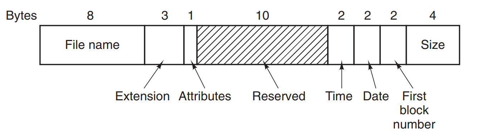

The *attributes* field contains information such as the file is *read-only*, *archived*, *is system file* or *is 
hidden*. What is interesting is that *creation and modify time* date and time are stored in separate fields, however 
they lack accuracy - for time it is up to *2 seconds* (time stored in *2 byte field*) and for date (eg. year is 
stored in *5 bit field* which makes this filesystem vulnerable to *Y2108* problem). Storing the size of the file in 
*32bit number* could technically allow the filesystem to store **4 GB** files, however that's not possible due to 
other constraints.

The allowed size of partitions and files is restricted to be a multiplication of *512 bytes* (which is a base 
**block size**). Below table summarises the sizes of partitions.

| Block size   | FAT-12     |  FAT-16       | FAT-32     |
|--------------|------------|---------------|------------|
|  0,5KB       |  2 MB      |               |            |  
|  1KB         |  4 MB      |               |            |  
|  2KB         |  8 MB      |  128 MB       |            |  
|  4KB         |  16 MB     |  256 MB       |  1 TB      |  
|  8KB         |            |  512 MB       |  2 TB      |  
|  16KB        |            |  1024 MB      |  2 TB      |  
|  32KB        |            |  2048 MB      |  2 TB      |  
  

### The UNIX V7 File System

This filesystem was derived from *MULTICS*, but it's not in use anymore. We've covered parts of it already as the 
concept of **directed acyclic graph** is used for all the filesystem. File name can take up to *14 signs* (without 
slash as a separator and *NUL* for padding). Disc entry is minimalistic as the aforementioned concept of *I-nodes* 
is used. I won't repeat myself about *I-node* structure and data, the only thing worth mentioning here is the 
keeping list of blocks that file uses. For smaller files first *10 blocks* are stored in the *I-node* directly. If 
that is not sufficient, then additional **indirect blocks** are used (reaching up to **triple indirect block** if 
needed). What they actually are is a list containing the addresses of the next blocks the file uses. Below images 
tells everything.

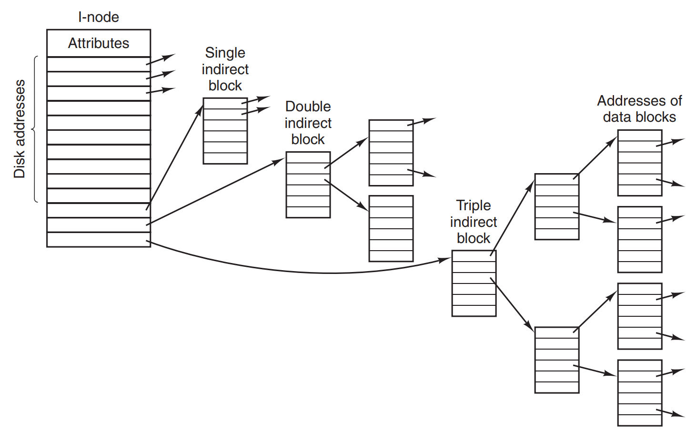

Searching for a specific file is simple, no matter if we got an absolute path or the relative one. All the 
operations are resolved against *I-nodes* identifiers - in case of an absolute path it's simple, as the *root 
directory* has its *I-node* stored in predefined location. For the relative path we start the traversal from the 
places pointed out by *.* or *..* entries that contain current folder's *I-node* and parent folder *I-node*. 

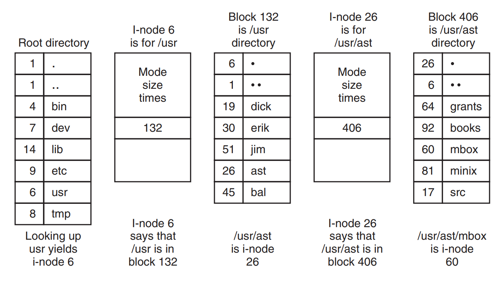

### CD-ROM File Systems

As the CD-ROMs in general, are designed to be written once and never modified (CD-R just appends data to the end of the 
existing ones), filesystems used there are pretty simple. The standard is **ISO 9660**, where all the data is put in 
a linear way into *2352 bytes* of **logical blocks**. Of all these bytes only *2048* are actually used for data. How 
is CD-ROM structured from the beginning is described with below quote:

> Every CD-ROM begins with 16 blocks whose function is not defined by the
ISO 9660 standard. A CD-ROM manufacturer could use this area for providing a
bootstrap program to allow the computer to be booted from the CD-ROM, or for
some nefarious purpose. Next comes one block containing the primary volume
descriptor, which contains some general information about the CD-ROM. This
information includes the system identifier (32 bytes), volume identifier (32 bytes),
publisher identifier (128 bytes), and data preparer identifier (128 bytes). The manufacturer can fill in these fields in any desired way, except that only uppercase letters, digits, and a very small number of punctuation marks may be used to ensure
cross-platform compatibility.
The primary volume descriptor also contains the names of three files, which
may contain the abstract, copyright notice, and bibliographic information, respectively. In addition, certain key numbers are also present, including the logical
block size (normally 2048, but 4096, 8192, and larger powers of 2 are allowed in
certain cases), the number of blocks on the CD-ROM, and the creation and expiration dates of the CD-ROM. Finally, the primary volume descriptor also contains a
directory entry for the root directory, telling where to find it on the CD-ROM (i.e.,
which block it starts at). From this directory, the rest of the file system can be located.

Every file on the CD is represented with *disc entry* that is presented below.

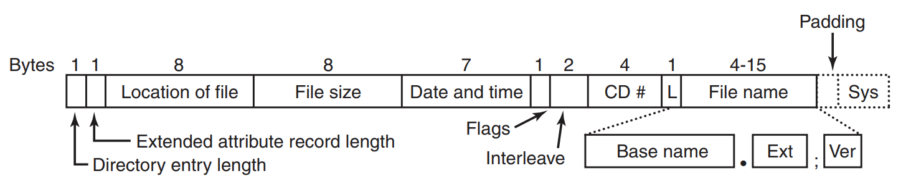

Interesting things to mention is that CD-ROMs will suffer from *Y2156* problem. Also, the maximum allowed nesting 
levels for this filesystem is **eight**. Finally, there's a concept of *levels*.

> ISO 9660 defines what are called three levels. Level 1 is the most restrictive
and specifies that file names are limited to 8 + 3 characters as we have described,
and also requires all files to be contiguous as we have described. Furthermore, it
specifies that directory names be limited to eight characters with no extensions.
Use of this level maximizes the chances that a CD-ROM can be read on every
computer.
Level 2 relaxes the length restriction. It allows files and directories to have
names of up to 31 characters, but still from the same set of characters.
Level 3 uses the same name limits as level 2, but partially relaxes the assumption that files have to be contiguous. With this level, a file may consist of several
sections (extents), each of which is a contiguous run of blocks. The same run may
occur multiple times in a file and may also occur in two or more files. If large
chunks of data are repeated in several files, level 3 provides some space optimization by not requiring the data to be present multiple times.
> 

At the end authors mention extensions to the above filesystem. Their main goal was the ability to putting the *UNIx* 
filesystem directly on the CD (**Rock Ridge extension**) or *FAT* - **Joliet extension**. 
