## Chapter 5 - Input/Output


### Principles of I/O Hardware

**I/O devices** can be roughly separated into two categories - **block** and **character** devices. A simple quote to 
start with:

> A block device is one that stores information in fixed-size
blocks, each one with its own address. Common block sizes range from 512 to
65,536 bytes. All transfers are in units of one or more entire (consecutive) blocks.
The essential property of a block device is that it is possible to read or write each
block independently of all the other ones. Hard disks, Blu-ray discs, and USB
sticks are common block devices


Second type are **character** devices, which accept a stream of characters. That type include hardware like printers, 
mouse or network interfaces. Of course this division is just a rough one - there is hardware that does not fit in, 
but for our purposes it will suffice. 

Usually when discussing hardware we have to actually make additional division - for a **controller** or **adapter** 
and a mechanical part which is a **device itself**. **Controllers** usually follow some standard that enables 
different manufacturers to produce hardware that can be widely used. The communication between hardware itself and a 
**controller** is a very low level one, and we as users or programmers do not care about it. What we actually use is 
some higher abstraction that **controller** handles alone. This is done usually through **CPU registers** that 
**controller** sets in order to let the CPU know its state. Additionally, there are **data buffers** that actually 
are used to send or retrieve an actual data from the device.

The CPU can communicate with these registers in three different ways. First one is to keep separate *I/O* and *memory 
space*. In such cases registers that are being modified for *I/O* 
are separate from the memory and reading their state or writing to it is done with different assembly instruction. 
However, this solution used in the first mainframes is almost gone now. The second solution is called 
**memory-mapped I/O**, where all communication registers and data buffers are assigned predefined addresses in the 
memory. The third one, being mostly used in *x86* nowadays is a **hybrid approach**, where there control registers 
are put in the **separate I/O ports**, and the buffers are stored in the memory. Below picture shows that.


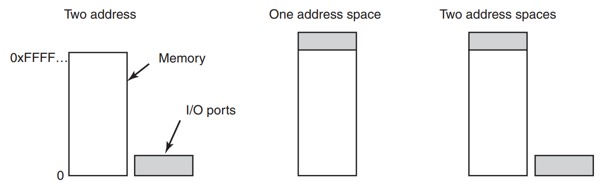


Above mechanisms have their strengths and weaknesses. With **memory mapping** it's easier, as the addresses are just 
variables in the memory and can be addresses and used directly from *C* code, without it an assembly code is needed. 
Second bonus is that there is no need to deal with security - as long as the OS does not put *communication 
registers* in the user-related memory pages there's no way for a user to access them. Last advantage is a 
possibility to test the state of registers with simple memory-access instructions. When we use **I/O ports**, the 
state must be first read by the CPU and then tested against. 

It seems that **memory mapping** takes it all, however, it's not that simple (as usual). The first trade-off was 
mentioned in the chapter about memory. In the nowadays computers, there's a lot of caching involved when accessing 
memory. For the devices, where we need always-up-to-date-state, that cannot be applied. Therefore, there must be a 
way (and it must be used) to make sure that when accessing *control registers* that are memory-based, the caching is 
disabled. That adds complexity to the whole process. Second problem is more complicated - and to present it I will 
use the picture and a direct quote.

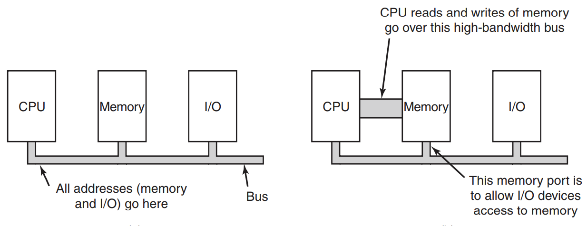


> Second, if there is only one address space, then all memory modules and all
I/O devices must examine all memory references to see which ones to respond to.
If the computer has a single bus, (on the left), having everyone look at every
address is straightforward. However, the trend in modern personal computers is to have a dedicated highspeed memory 
> bus, as shown on the right. The bus is tailored to optimize memory performance, with no compromises for the sake of 
> slow I/O devices. x86 systems can have multiple buses (memory, PCIe, SCSI, and USB) [..].
The trouble with having a separate memory bus on memory-mapped machines
is that the I/O devices have no way of seeing memory addresses as they go by on
the memory bus, so they have no way of responding to them. Again, special measures have to be taken to make memory-mapped I/O
> work on a system with multiple buses. One possibility is to first send all memory references to the memory. If the
memory fails to respond, then the CPU tries the other buses. This design can be
made to work but requires additional hardware complexity.
A second possible design is to put a snooping device on the memory bus to
pass all addresses presented to potentially interested I/O devices. The problem here
is that I/O devices may not be able to process requests at the speed the memory
can.
A third possible design, [..], is to filter addresses in the memory controller. In that case, the memory
controller chip contains range registers that are preloaded at boot time. For example, 640K to 1M − 1 could be marked as
> a nonmemory range. Addresses that
fall within one of the ranges marked as nonmemory are forwarded to devices instead of to memory. The disadvantage of this
> scheme is the need for figuring out at
boot time which memory addresses are not really memory addresses. Thus each
scheme has arguments for and against it, so compromises and trade-offs are
inevitable.


Modern CPUs are a precious resource - hence all the caching, buffers, etc. The problem with accessing *I/O 
controllers* by the CPU is, that it can do so one byte at a time. Imagine now reading Blu-ray disc - it would be a 
complete waste of CPU time. Therefore, to speed things up, and save CPU cycles a concept of **DMA - Direct Memory 
Access** was introduced. **DMA** is a hardware part, that handles reading data from data buffers of *I/O 
controllers*, and when that's done, it informs CPU about it using *interruption*. **DMA** has a couple of registers 
that are used to be programmed by CPU. Below picture shows the whole concept.

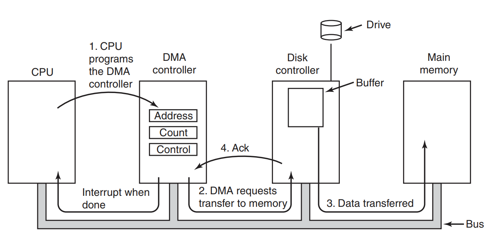


**DMA**s can vary when it comes to their complexity. Sometimes they can handle only one transfer at a time, 
sometimes more. A direct quote will explain that.

> Many buses can operate in two modes: **word-at-a-time mode** and **block mode**.
Some DMA controllers can also operate in either mode. In the former mode, the
operation is as described above: the DMA controller requests the transfer of one
word and gets it. If the CPU also wants the bus, it has to wait. The mechanism is
called cycle stealing because the device controller sneaks in and steals an occasional bus cycle from the CPU once in a while, delaying it slightly. In block mode,
the DMA controller tells the device to acquire the bus, issue a series of transfers,
then release the bus. This form of operation is called **burst mode**. It is more efficient than cycle stealing because 
> acquiring the bus takes time and multiple words
can be transferred for the price of one bus acquisition. The down side to 
> **burst mode** is that it can block the CPU and other devices for a substantial period if a
long burst is being transferred.
In the model we have been discussing, sometimes called **fly-by mode**, the
DMA controller tells the device controller to transfer the data directly to main
memory. An alternative mode that some DMA controllers use is to have the device
controller send the word to the DMA controller, which then issues a second bus request to write the word to wherever it is supposed to go.
> This scheme requires an
extra bus cycle per word transferred, but is more flexible in that it can also perform
device-to-device copies and even memory-to-memory copies (by first issuing a
read to memory and then issuing a write to memory at a different address).

When accessing the memory **DMA** uses physical addresses, rather than virtual ones. Therefore, the OS must 
translate virtual addresses to the physical ones (and put them in **DMA** registers). Authors mention that rarely 
virtual addresses can be used, but that requires hardware support on the bus and also asking *MMU* for translation.

What is worth mentioning - the **controller** has its own **internal buffer** that it writes to (taking data from 
the hardware). The idea is that for every portion of data some checks can be performed, and when eg. checksum on the 
disc read does not match - the transfer fails and **DMA** is informed about that. No memory is touched then. The 
second thing is that accessing the bus is expensive. So instead of sending the bytes from the device one by one, 
it's better to group them and then acquire bus and send them to the memory at once. 

At the end we have to discuss **interrupts**. Below picture shows high-level overview.

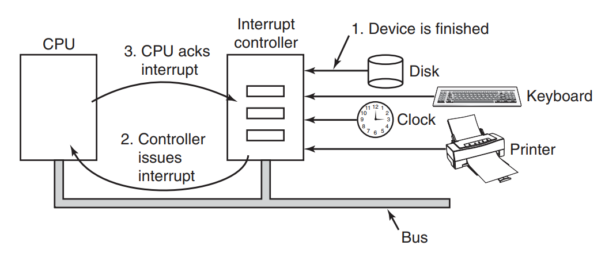

If there's no other interrupts, the incoming one is handled right away. However, there's a possibility that there's 
other interrupt being handled right now and therefore the new one must be queued. CPU when gets interrupt stops its 
work and handles the interrupt - based on the number on the address line that interrupt was delivered by, a handling 
procedure is resolved using **interrupt vector**, that contains **program counter**. As the service handling the 
interrupt starts working, it sets a proper value in one of the controller's *I/O ports* - that is treated as ACK. 
With that the controller can start handling another interrupts. 

Before starting the handling procedure, the CPU stores some registers. Which ones - that depends on the machine. 
However, at least the program pointer must be saved in order for the interrupted process to be restored after the 
interrupt is handled. The best place to store this data is kernel stack (as this omits storing data on the user 
process stack, which might be impossible). However, that requires a lot of additional processing - *MMU* being asked 
for mapping, *TLB* being cleared, etc. No free lunches there.

Another problem is the fact, that modern computers are usually *multi-parallel*, which means that there's not only 
one process being executed at a time as one, single unit. Below picture presents such approach on the left.

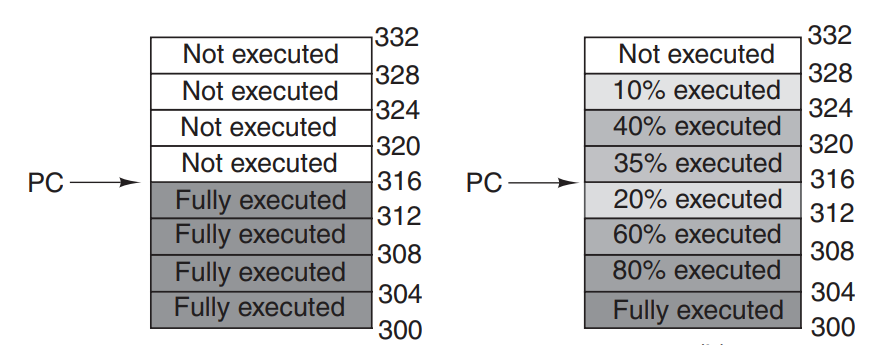

On the left we see that all the steps within the process are executed in a sentence, and that all the steps until 
the interrupt occurred, were finished. Modern computers are represented on the right - we can have multiple steps 
being performed at once. 

> An interrupt that leaves the machine in a well-defined state is called a
> **precise interrupt** (Walker and Cragon, 1995). Such an interrupt has four properties:
> 1. The PC (Program Counter) is saved in a known place.
> 2. All instructions before the one pointed to by the PC have completed.
> 3. No instruction beyond the one pointed to by the PC has finished.
> 4. The execution state of the instruction pointed to by the PC is known.

> [...] 
> 
> An interrupt that does not meet these requirements is called an imprecise interrupt and makes life most unpleasant for the
> operating system writer, who now
has to figure out what has happened and what still has to happen. Picture on the right illustrates an **imprecise 
> interrupt**, where different instructions near the program counter
are in different stages of completion, with older ones not necessarily more complete than younger ones. Machines with
> imprecise interrupts usually vomit a large
amount of internal state onto the stack to give the operating system the possibility
of figuring out what was going on. The code necessary to restart the machine is
typically exceedingly complicated. Also, saving a large amount of information to
memory on every interrupt makes interrupts slow and recovery even worse. This
leads to the ironic situation of having very fast superscalar CPUs sometimes being
unsuitable for real-time work due to slow interrupts.


### Principles of I/O Software

Hardware is hardware, it comes in a lot of flavours, types and standards. The main idea for every *I/O software* is 
to be able to work with this richness. The second thing is **uniform naming**, to make it not dependent on the 
hardware where the accessed resource lies. What is more - **error handling** should be done at the lowest layer 
possible - by the hardware itself, and if that fails - on the controller level. Only when that did not help a 
software should take over. To end this list - **async** vs **sync** is described, where hardware itself is usually 
**async** (CPU interrupted when data has come), as the software is **synchronised**. Another thing to consider is 
**buffering**, to make sure that all the data is sent/retrieved even when the clients/consumers are busy for the moment.
At the end there's a notion of **sharable vs. dedicated devices** - some devices are allowed to be accessed by 
several users at once (eg. discs), however for some (eg. printers), that should not happen. It's the OS job to make 
sure these constraints are there.

There are three ways the *I/O* can be programmed - below we will present three of them. First one is **Programmed 
I/O**, which authors describe via example depicted below.

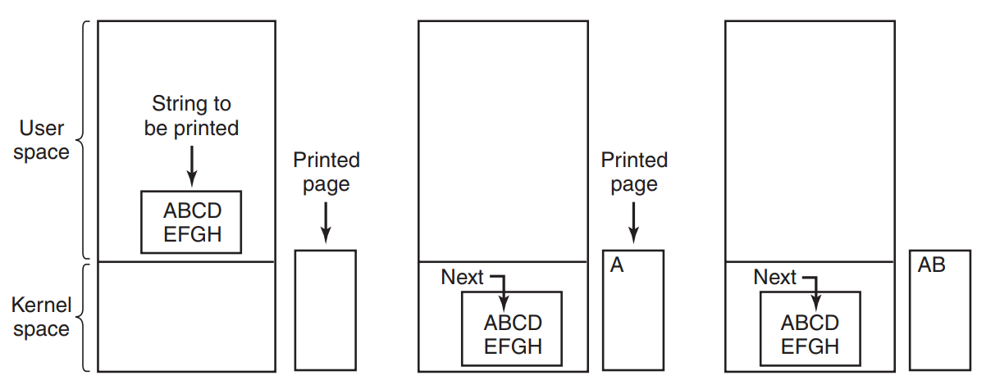

The main aspect of it is the fact, that *I/O* to be performed is copied to the kernel space, and then it's the 
kernel job to make sure that every single bit of data to be operated on is processed properly. In an example 
provided that results in kernel asking the printer if it's ready after every single character is sent to it. This is 
called **busy waiting** or **polling**. Below snippet shows how it's done in the code.

```c
copy_from_user(buffer, p, count);              /* p is the kernel buffer */

for (i = 0; i < count; i++) {                  /* loop on every character */
    while (*printer status reg != READY);      /* loop until ready */
    *printer data register = p[i];             /* output one character */
}

return_to_user();
```

What must be said at the end - it's a pretty slow solution and should not be used in a systems that are able to use 
CPU for more important tasks. For embedded systems it's fine, for a desktop machine - rather not.

In order to make it better (than previous solution), another one was introduced - **Interrupt-driven I/O**. The name 
says everything and this approach was presented before in this chapter. After every character is being sent to the 
printer, CPU suspends the current task that is waiting for the printed document, does something else, and as soon as 
the printer prints the character it sends an interrupt. After getting it, the CPU restores temporarily suspended 
process and tries to send another character to the printer. When there's no more characters to be printed - it 
returns the control to the original user thread. 

Although, the above solution is better in terms of CPU cycles, it still causes context switching for CPU every time 
a single character is printed. For a 20-pages document that's a lot of time wasted by the CPU for just up&down 
cycling. To avoid this an already known concept is used - **DMA**. It works exactly like the previous solution - the 
only difference is that instead of the CPU, a **DMA** feeds the printer character after character.


### Software layers

*I/O software* can be presented in a *layered architecture* as depicted below. Here comes the description of each one of them.

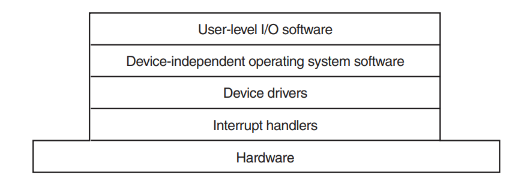

At the very bottom we have **interrupts**. As the authors put it - they're ugly and should be hidden somewhere deep 
inside the OS. Unfortunately, they're crucial and cannot be avoided. It may seem that **interrupts** are simple - 
**driver** just blocks until the **interrupt** is send by the hardware and that's it. Unfortunately, that's not so 
simple as it will shown by a direct quote.

> 1. Save any registers (including the PSW) that have not already been saved by the interrupt hardware.
> 2. Set up a context for the interrupt-service procedure. Doing this may involve setting up the TLB, MMU and a page table.
> 3. Set up a stack for the interrupt service-procedure.
> 4. Acknowledge the interrupt controller. If there is no centralized interrupt controller, reenable interrupts.
> 5. Copy the registers from where they were saved (possibly some stack) to the process table.
> 6. Run the interrupt-service procedure. It will extract information from the interrupting device controller’s registers.
> 7. Choose which process to run next. If the interrupt has caused some high-priority process that was blocked to become ready, it may be chosen to run now.
> 8. Set up the MMU context for the process to run next. Some TLB setup may also be needed.
> 9. Load the new process’ registers, including its PSW.
> 10. Start running the new process.

Above the **interrupts** we have **device drivers**, that are responsible for direct communication with the hardware,
especially with setting *control registers* of the specific **hardware controller**. Nowadays **drives** are usually 
part of the kernel (which can result in sudden crashes when the drivers are not written properly). How it's 
structured is shown below.

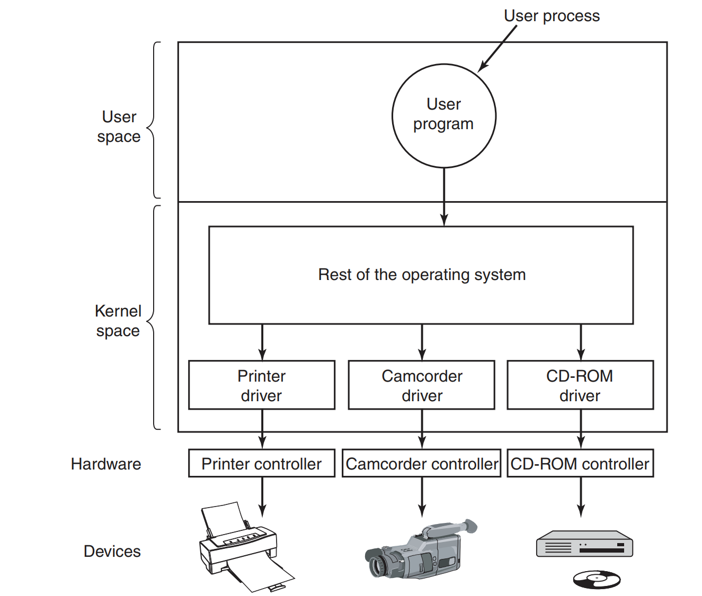


Remember **block devices** and **character devices** typology that was introduced at the beginning if this chapter? 
Usually the drivers fall into one of them, which results in all the drivers comply with some kind of contract (or 
predefined interface) expected from the drivers. With such approach, an OS can use a wide variety of drivers. Back 
in a day the kernels actually incorporated all the **drivers' code** in them, although, with a raise of PCs it was 
no longer possible - there's just too many of them out there. The approach is to *dynamically load* the drivers 
as they're plugged/system is starting. The driver's work was actually somehow described in the previous section when 
we've discussed **hardware controllers** - the *driver* is actually the part of the OS that handles the 
communication with the **controller**. 

Although, we have a humongous number of different devices in use, still there's a limited amount of operations that 
can be performed on them (or while using them). These operations can be handled by the **drivers** obviously, but it 
is wiser to actually extract them into the separate layer and make it generic (and with it - more mature and better 
tested as it is used heavily by myriads of drivers). This layer is called **Device-Independent I/O Software**. The 
list of the operations that can be handled by this layer are listed below.

* **Uniform interacting for device drivers** - this is the concept I've mentioned before. There's unified interface 
  that 
  OS exposes and all the drivers have to comply with it. Each class of drivers (eg. for discs or printers) must 
  implement a specific set of calls that can be used by the OS. In *UNIX-like* systems all the devices are exposed 
  as files, and all the files have corresponding *I-nodes* with them. Every *I-node* contains **major device 
  number** and **minor device number**, that enable the OS to choose a proper driver to handle it.   


* **Buffering** - why **buffering** is important was already discussed (in short - to reduce **wait blocking**). 
 
* **Error reporting** - errors in the *I/O* happens quite often, and usually they must be resolved as closed to the 
  hardware as possible. However, the general idea of handling the errors is a generic ones, involving decisions how 
  to report them, retry/wait policies and so on. 
  
* **Allocating and releasing dedicated devices** - some devices should be accessed only by one specific process at a 
  time (the best example are printers). A simple enabled/disabled functionality is a task that is completly 
  independent task from the driver itself.
  
* **Providing a device-independent block size** - different pieces of hardware report their **block size** in 
  different formats or values. There's a serious difference between solid discs and printers. The amount and format 
  of data being accessed are completely different. Hence, it's the **device-independent I/O layer** job to translate 
  these details and present an unified size for the OS.
  

At the end the subject of **User Space I/O Software** is discussed. Taking under consideration all the things from 
above it may be said, that there's nothing to be added by the user-space in terms of *I/O*. However, it's still 
crucial part of the actual communication between the applications and the hardware. Without the programs actually 
accessing data through *I/O*, all the previously described solutions/methods/drivers/etc won't be needed. Of course, 
we can reason that the entry points to the whole garden of *I/O* aren't that complicated, we are still going to take a 
look. 

First things are **library procedures**, which are aforementioned entry points to the OS *I/O* system calls. 
Examples include *printf* or *write* in *C* library. Nothing much to add here. A different concept is 
**spooling**. Author provide the example of a printer - in order to guard the access to the device and avoid the 
situation when one process crashes or blocks the device for hours, there's a special *deamon* running, checking the 
contents of the **spooling directory**, where files to be printed are put by the different processes. Only the *deamon* 
has the rights to access this directory in order to actually send the files to the printer. The described system is 
used not only for printers - network communication is also an example of it (eg. usenet groups).

To summarize this subchapter, a simple picture for clarity.

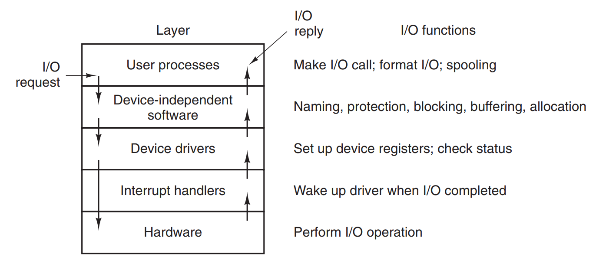


### Disks

Disks are pretty simple to understand, however their history, structure and performance make it quite a wide area. 
As an example an oldschool **magnetic disc** will be used, as they're still in heavy use in the industry. Also - 
understanding them gives more knowledge about all other types of hard storage (CDs, SSDs, etc).

> Magnetic disks are organized into **cylinders**, each one containing as many
**tracks** as there are **heads** stacked vertically. The **tracks** are divided into **sectors**,
with the number of **sectors** around the circumference typically being **8 to 32** on
floppy disks, and up to **several hundred** on hard disks. The number of **heads** varies
from **1 to about 16**.

First hard disks were fairly simple, just delivering the stream of bits. Newer ones (based on *IDE* or *SATA*) are 
way more robust, with microcontroller build into the disk and performing many operations instead of *controller*. 
Due to that fact, the *controller* is allowed to perform two seeks operations at once using two different drives 
(when they're present). What is more - **physical geometry** of the disks right now, is usually completly different 
from the **virtual geometry** that the *controller* is using. That's because of the backward compatibility with all 
the other disks - here is why:

> For PCs, the maximum values for these three parameters (cylinders/tracks/sectors) are often (65535, 16,
and 63), due to the need to be backward compatible with the limitations of the
original IBM PC. On this machine, 16-, 4-, and 6-bit fields were used to specify
these numbers, with cylinders and sectors numbered starting at 1 and heads numbered starting at 0. With these parameters 
> and 512 bytes per sector, the largest possible disk is 31.5 GB. To get around this limit, all modern disks now support
> a system called **logical block addressing**, in which disk sectors are just numbered consecutively starting at 0, 
> without regard to the disk geometry.

We're used to single disks being used in laptops or desktop machines. However, that's not enough for the redundancy 
expected eg. from storing backups or server solutions. That's the first problem. The second one is speed - disk 
access is always slower than memory and CPU. What was done to increase the speed of computing was parallelization. 
Instead of one big CPU we got a couple of them (physically or with additional cores). Why the same concept couldn't 
be applied to the disks? That was the beginning of **RAID** (Redundant Array of Inexpensive/Independent Disks). The 
idea is simple - we take a couple of smaller disks, we stack them together into one machine/server, and a specific 
controller (designed specifically for **RAID**), was presenting the disk as single (and usually big) one to the OS. 
Physically a couple of small disks were used, which could improve speed of *I/O*, as there could be a couple of 
moving disk heads operating at once. The concept of **RAID** is a vast one, what must be said is that there are **7 
levels** of **RAID**, which describe the structure and minimum number of disks needed for creating specific level. I 
won't be rewriting the book in total - below is an image presenting different levels of **RAID**. I also recommend a  
<a href="https://en.wikipedia.org/wiki/Standard_RAID_levels">very detailed article on the Wiki</a>.

Going further - the disk structure is a one thing, the second thing is its ability to be actually used by the 
software. In order to do so, a **format** must be performed, to create a specific structure of every **sector**. 
Every time a disk is added to the machine, a **formatting** is necessary. 

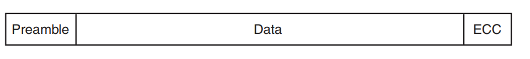

As we can see first there's **preamble**, which contains information about the **cylinder** and **sector**, along 
with other information. *512-bytes* are mostly used for this part. **ECC** is a field that contains redundant 
information in order to help recover from read errors. *16-byte* size is not unusual as the authors say.

We've mentioned **tracks** as a middle-level organisation unit for disks (having **sectors** as children and 
**cylinders** as parents). The location of *0* sector on every **track** is actually the *offset* from the previous 
one (called **cylinder skew**). The below image shows how it looks like.

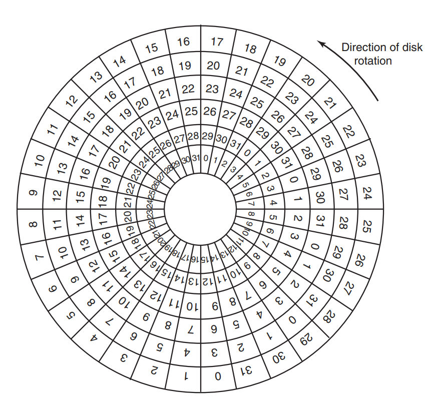


The idea here is that with rotating head over the disk, reading a file that spans through two **tracks**, could 
result in a wasted time spend on the next rotation. In the image above let's assume that the file we want to read is 
located in the innermost track of the disk, but also is contained in the next **tracks** with **sectors** from *0* 
to *5*. With the given architecture a *disk head* just goes round the whole innermost **track**, and then it just 
knows that the next **track** is *3* **sectors** away. It does not have to spin the whole disk again to start. It 
just requires going to the next 'level' of the disk (innermost + 1), skip *3* sectors, and a new **track** is right 
there. There's also a **head skew**, as moving the *head* between the **tracks** also takes time. The size of it is 
usually smaller than the one for **sectors**, however it's up to the specific type of disk - taking under 
consideration the size and spinning speed. 

Taking under consideration everything that was written above, it is obvious that there's always a capacity loss 
present when it comes to hard disks. Depending on the size of *preamble* and *ECC* a part of disk space is lost. The 
same applies also to the **spare sectors**, which are always present to substitute the ones that were destroyed 
(*bad sector* is a commonly known term). 

The last thing to be discussed about **formatting**, is that it also affects the speed of the reads. Up until know 
we were mostly concerned about the speed of getting the data from the disk assuming moving disk head. However, 
that's only the first part of the story. Next, we have a *controller* that has its *buffer* used to store this data 
temporarily. The quote from the book describes this.

> Actually reading continuously at this rate requires a large buffer in the controller. Consider, for example, a controller with a one-sector buffer that has been
given a command to read two consecutive sectors. After reading the first sector
from the disk and doing the ECC calculation, the data must be transferred to main memory. While this transfer is taking place,
> the next sector will fly by the head. When the copy to memory is complete, the controller will have to wait almost an
entire rotation time for the second sector to come around again.

It's a variation of reading from the disk using **cylinder** and **track skew**). It is presented in the following 
picture.

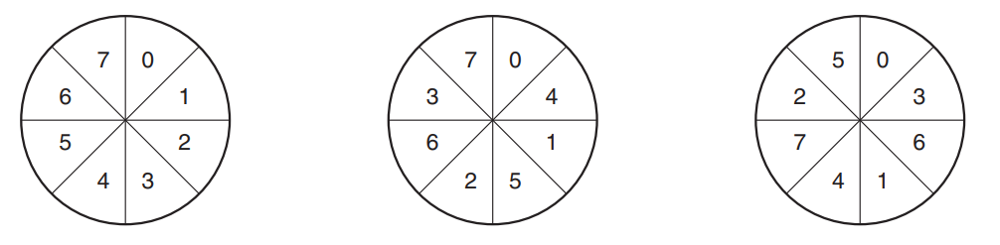


The most left picture presents a structure without **sectors interleave**. This is the situation described in the 
quote - every **sector** to *controller* read results in a next spin being made. The middle picture presents the 
situation, where **sectors** are interleaved by *1*. It could be still too small value to avoid additional spin and 
therefore it is possible to make it **double interleaving**, which is depicted on the right. However, such a situation 
is still a bottleneck, and therefore modern *controllers* are actually able to buffer a couple of **tracks** to 
improve the efficiency.

**Formatting** prepares the physical disk to be recognized by the OS. Usually what is done next is a creation of 
**partitions** (at least one). Every **partition** is seen as a separate disk. That's in order to separate data on 
the very high level, but also it's possible to actually run a different OSes on them, use different **file systems** 
(with specific use case of **swap partition**). For most of the computers **sector 0** of the disk contains **MBR** 
or **GPT** entry. I don't want to go into much detail here - the thing is that aforementioned data structures 
contain information about booting, and the **partition table**, that exposes metadata about every partition (like 
their starting position and size). At the end of the process a **high-level format** is performed, resulting in 
creation of a specific *file system* on a specified **partition**. That information is also stored in the 
**partition table**, allowing OS to know which driver/code use to access the data.

Next section is dedicated to **disk arm scheduling algorithm**. Actually making a seek of proper **sector** we want 
to change or read is the longest part of the disk *I/O*. As long as there's FIFO used there (in disks called 
**FCFS - first come, first served**) nothing can be done about it. Although, it's possible that at the same time many 
  processes are making calls to the disk, and maybe, processing the requests sequentially is not a good idea. The 
  algorithm used to make it faster is called **SSF - shortest Seek First** and is depicted below.

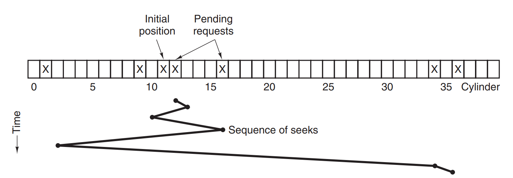

Let's assume that the current request queue for **cylinders** is 1, 36, 16, 34,9 and 12, with current one being read 
to be 11. Using **FCFS** the cylinders from the above picture would be read in order - 11, 1, 36, 16, 34, 9 and 12. 
Therefore, it will require a lot of arm and disk movement. However, when using **SSF**, the path of retrieval will be 
based on the shortest accessible **cylinder**. So in our case it will be 12, 9, 16, 1, 34 and 36. The amount of 
required arm movement is greatly reduced (usually circa *50%* compared to **FCFS**).  

It may look like a great solution, although, there's a problem. Let's assume that we're processing **cylinder** with 
number *16*. Next one in a queue is number *1*. However, when we're almost done with processing *16*, a new request 
to **cylinder** *8* is coming. As it's closer to the current position, it's gonna be read. If there's a new request 
eg. for number *11*, the arm will go there as it is still closer than number *1*. In such case there's a possibility 
that the arm would stay forever (or for a long time) in a middle of the disk, not reaching its far 'corners'. The 
way to handle this is an **elevator algorithm** (because it resembles how the elevators in tall building work). We 
use additional bit to store information in which direction the arm is moving, and we do not stray from this 
direction, unless there's no awaiting requests for the **cylinders** that are located in a direction specified by 
bit. When that happens, the bit is reversed (bits can be named *UP/DOWN*), and the arm starts moving in an opposite 
direction. Below picture presents this algorithm using the previous request's queue.

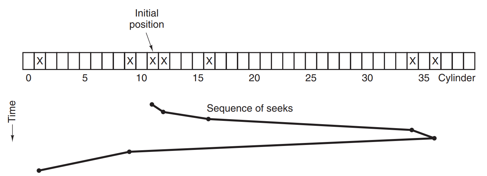

Modern disks are usually quite fast, but what is more important - the memory chips are also not that expensive. 
Therefore, an optimisation was introduced, that actually makes the *controller* not just read single **sector**, but 
a stream of them or even the whole **tracks** (I've mentioned it before). When there's a read request for a specific 
**sector** or **track**, and it's already in the *controller's cache*, it can be used right on. That makes this 
cache not that efficient in the terms of *hit ratio*, however the data put there is cheap, as it's being read as the 
arm must be over them to actually get the target **sector**. 

I've mentioned **ECC**, when describing the structure of **sector** on the disk. It is used to fix inconsistent data 
of the **sector**. However, sometimes the damage to the **sector** is so big, that the recovery is not possible. 
Then we have a **bad sector**. There are two possibilities to handle them - in the *controller* or in the OS. Let's 
start with the first one.

In handling errors by the *controller*, the information about the **bad sectors** is stored on the disk, and the 
*controller* maps the bad ones into the **spare sectors** that are present in all the disks. It can be done in one 
of two ways that are depicted below. 

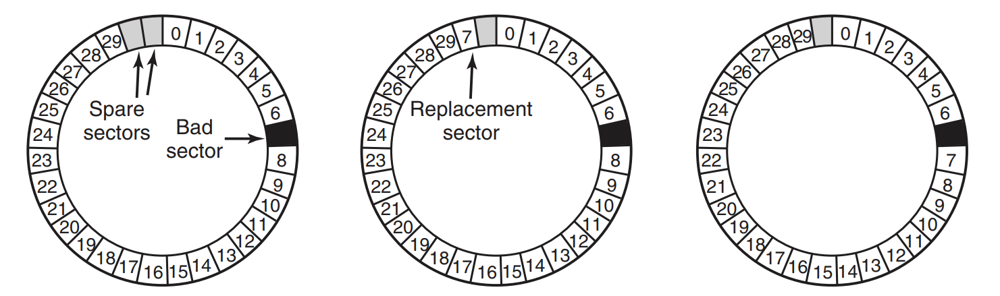

When we have our **bad sector** with number *7*, a *controller* can just replace its address with a spare one. This 
is presented in the middle. Although, there's efficiency problem, as the **track** cannot be read as a stream now. 
To avoid that, there's another solution presented on the right - all the **sectors** are moved 'up' (rewriting 
metadata in the **preambles** is needed), resulting in the possibility to read he whole **track** in one go. These 
solutions work fine when we're making checks to the disk before it's being used. However, **bad sectors** appear 
also when the disk is being used and contains some data. In such a case, usually the first option is used, as moving 
the data will take too much time.

If the *controller* is not able to handle the remappings, it's the OS job to do so. Usually, the scan of the whole 
disk is performed and information about **bad sectors** is stored somewhere in the file system. Authors state that 
there's always a catch there with hiding this file from eg. backup software (hiding from regular users is usually 
quite trivial), as that kind of software can run with elevated privileges. What is more - when the backup is not 
file-based, and rather **sector-based** it is really hard to hide it.  

At the end of describing disks a concept of **stable storage** is mentioned. Every web or database developer is 
aware of the *ACID* acronym, that is used to describe transactional behaviour of the database. **Stable storage** is 
the same concept in the disk area - to keep the data consistent at all costs. I won't go into the details that 
authors presented with the probabilities of several things happenning (eg. how many **EEC** bytes can cover the 
errors in data part). How the **stable storage** is done is best presented with a direct (and rather long) quote:

> To achieve this goal, the following three operations are defined:
> 1. **Stable writes** - a stable write consists of first writing the block on
drive 1, then reading it back to verify that it was written correctly. If
it was not, the write and reread are done again up to n times until they
work. After n consecutive failures, the block is remapped onto a spare
and the operation repeated until it succeeds, no matter how many
spares have to be tried. After the write to drive 1 has succeeded, the
corresponding block on drive 2 is written and reread, repeatedly if
   need be, until it, too, finally succeeds. In the absence of CPU crashes,
   when a stable write completes, the block has correctly been written
   onto both drives and verified on both of them.
> 2. **Stable reads** - a stable read first reads the block from drive 1. If this
   yields an incorrect ECC, the read is tried again, up to n times. If all
   of these give bad ECCs, the corresponding block is read from drive 2.
   Given the fact that a successful stable write leaves two good copies of
   the block behind, and our assumption that the probability of the same
   block spontaneously going bad on both drives in a reasonable time interval is negligible, a stable read always succeeds.
> 3. **Crash recovery** - after a crash, a recovery program scans both disks
   comparing corresponding blocks. If a pair of blocks are both good
   and the same, nothing is done. If one of them has an ECC error, the
   bad block is overwritten with the corresponding good block. If a pair
   of blocks are both good but different, the block from drive 1 is written
   onto drive 2.
 
The above recovery processes can be improved by using **nonvolatile RAM**, that can be used to store information which
**sectors** or **blocks** are being updated right now, and when the crash occurs, it can be used to directly restore 
the data (or just to be used for comparison). That speeds up the recovery process as the whole disk scan is not needed.
If there's no such memory available, OS can simulate this solution by writing specific **block** addresses on both 
disks (the ones that are being written) and when the write operation is finished, the addresses can be set to some 
obsolete number. 


### Clocks

**Clocks** are important in computing, as besides keeping the current date and time, they're used for counting the 
time and announcing it, so eg. one process does not occupy the CPU for too long. It used to be a simple 50-60 Hz 
frequency interruption clock, powered by simple 110 or 200 volts power line. This solution is not used anymore - 
right now the **crystal oscillator**, a **counter**, and a **holding register** are used for that as presented below.

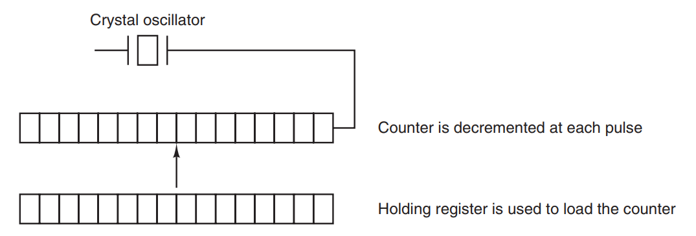

> The advantage of the programmable clock is that its interrupt frequency can be
controlled by software. If a *500-MHz* crystal is used, then the counter is pulsed
every *2 nsec*. With (unsigned) *32-bit* registers, interrupts can be programmed to occur at intervals from *2 nsec* 
> to *8. 6 sec*. 
> Programmable clock chips usually contain
two or three independently programmable clocks and have many other options as
well (e.g., counting up instead of down, interrupts disabled, and more).

So, as we see - the **clock** at its basis is a very simple thing. A lot is going on in the **clock software**:

* **Maintaining the time of day** - this is quite trivial, as it includes just an incrementation of the internal 
  clock every time the *tick* occurs. Of course storing the number of *ticks* would be hard as this is a large 
  number, and simple *32bits* won't suffice. *64bit* can be used, but that slows things down. The solution used is 
  to mostly use *seconds* instead of *ticks* to track time. Another possibility is to track the time since the 
  system start. When a call to get the current time occurs, these two values (boot time and number of seconds passed)
  are combined and returned as a present time.
* **Preventing processes from running longer than they are allowed to** - we've discussed this topic when describing 
  *processes* and *schedulling*. When a **process** starts, the *scheduler* sets the quantum of process *ticks* and 
  when that amount is spent it assigns the CPU to another process.  
* **Accounting for CPU usage** - it's not usually done by the **system clock**, but a separate **second clock** is 
  used. The **accounting** means in this case the total amount of time/ticks that a process has spent using CPU (so 
  we don't count *I/O* for example). It can be also done using global state and increasing some value assigned to 
  every entry in the *process table* (the increment is done by software).
* **Handling the alarm system call made by user processes** - sometimes the OS must be informed that a specific time 
  has passed (eg. with networking to retry sending the packet if the ACK was not retrieved). If it's possible - a 
  hardware can back this up (firing separate clock for every request), although that's usually not a case. We can 
  simulate this approach with a list of the requests that are 'awaiting' for some specific time and a value of the 
  current time. With every clock *tick* the values are compared, when the current request time has come, a 
  message/interrupt is sent and the next one (in terms of time to pass) is taken. It can also be simply done with 
  *linked list* - containing the amount of *ticks* from the previous request. It is depicted below.

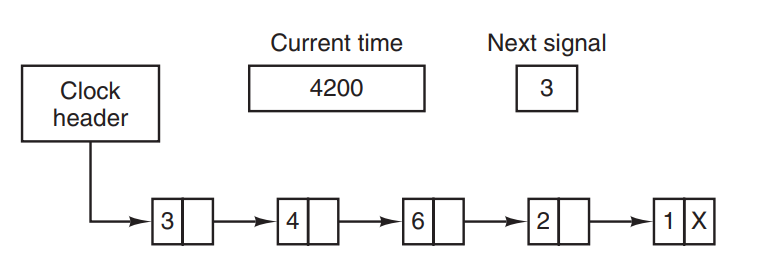

* **Providing watchdog timers for parts of the system itself** - these timers are used for specific parts of the OS, 
  that must guard the time passing. Example provided in the book is the **watchdog**, that guards whether the OS is 
  working properly (eg. in embedded systems). As long as the OS is working, it resets this counter from time to time.
  When a specific amount of time has passed, and the counter was not reset, is usually means that the OS stopped 
  working. A reset then is in order. 
* **Doing profiling, monitoring, and statistics gathering** - it's possible for some OSes to actually create a 
  histogram of process' counter, to see in which parts of code it has spent time. 
  

### User interfaces: keyboard, mouse, monitor

The topic of interfaces is long, and therefore is split into two sections - about **input** and **output** respectively.
We will start with the **input**, being *keyboards* and *mouse*. 

**Keyboard** from the hardware perspective is a very simple thing. It just sends **interrupt** with information 
which key was used and in which 'mode' - I mean whether it was pressed down or up. The key is identified with **scan 
code**, which is completely unrelated to ASCII code. As the usual keyboard has less than *108* keys, one byte can be 
used to represent the **scan code** and also additional bit is used to mark up/down state. It's *driver* job to 
actually handle that information.

Programs waiting for user input, usually can be divided into two types (or use both of them in different contexts). 
Let's assume the web browser. Sometimes when we type a comment into the text input, the program is interested in 
every character we type in order to put it directly into the memory and on the screen. On the other hand - when 
issuing longer command (eg. in the shell), the program presents the typed characters on the screen, but actually 
waits with execution of any logic until there's a whole line entered and confirmed with ENTER or RETURN being pressed.
The first approach is called **raw mode** (or **noncanonical mode** in *POSIX*). The second one is called **cooked** 
(or **canonical mode** in *POSIX*). It's the driver job to handle these modes and buffer the data entered when 
necessary.

**Mouse** is even simpler thing sending information about movement in *x* and *y* dimension and buttons clicked. How 
to handle the data is left completly to the driver. 

**Input** may seem simple. Therefore, now we switch to more demanding one - **output**. The basic one is **text 
window**. Back in a day, when mainframes were ruling the world, simple **terminals** were just presenting 25x80 
characters and that was all. The whole control logic was handled by **escape characters**, that were different for 
every type of terminal there were. *Berkeley UNIX* introduced something called **termcap**, that mapped some generic 
**escape characters** to the specific terminal that was in used. However, that wasn't the perfect solution, so *ANSI 
standard* for these characters was introduced. 

That is although a distant history. Since the *80s* a **X Window System** is used in the *UNIX-family*. It contains 
**X client** (being usually the application) and **X server** - that is responsible for just rendering on the screen 
whatever the client expects. Both of them are running in *user space*, which makes sense as the GUI is for the user 
only, OS prefers raw bits ;) However, **X** is not the only piece of the puzzle. It defines a **protocol** for 
communicating, although still a library is needed to get access to **X** functionalities. Above that there are 
**toolkits** and finally **window managers**. The whole stack is presented below.


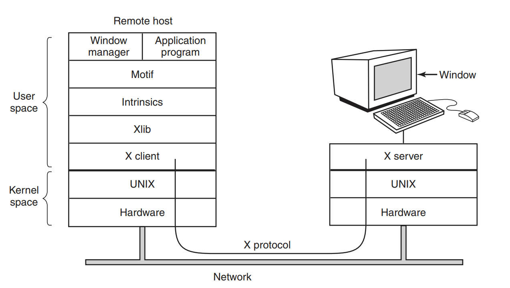


If You find this architecture complicated, You're definately right. What is more, **X System** has a lot of 
legacy/compatibility code inside and is seen as obsolete - an attempt was made to replace it with a newer solution 
called **Wayland**, and it seems that it finally gets its momentum. More on that 
in <a href="https://en.wikipedia.org/wiki/Wayland_(display_server_protocol)">the Wiki article</a>.

For brevity, I 
will skip an example programs using **X System** and also **Windows GUI** that authors presented in the book as it is 
(in my opinion) not that  important for learning *I/O* concepts, rather just a presentation of the applications' code.
The same will be done to the concept of **think clients**, as they're only mentioned here and nothing special is 
written about them.

At the end of the chapter a concept of **power managements** is presented. Which may actually not be seen as *I/O* 
in the popular meaning, although it makes sense to see it as one. Again, I've skipped it as to be honest, there's 
not that much actual information rather than the basic notion that **power management** is always a compromise 
between user experience and performance. 
