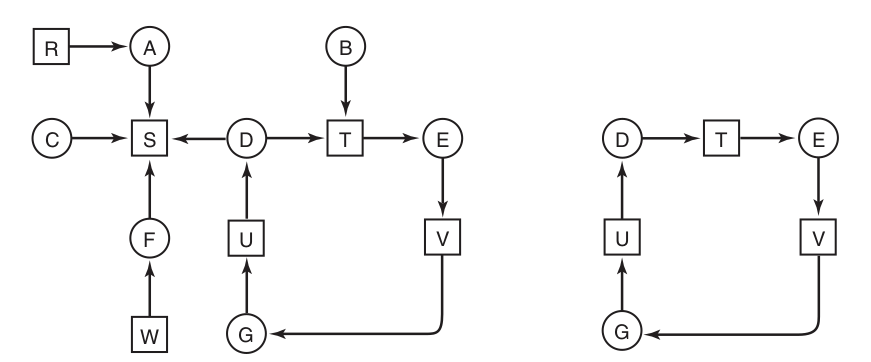
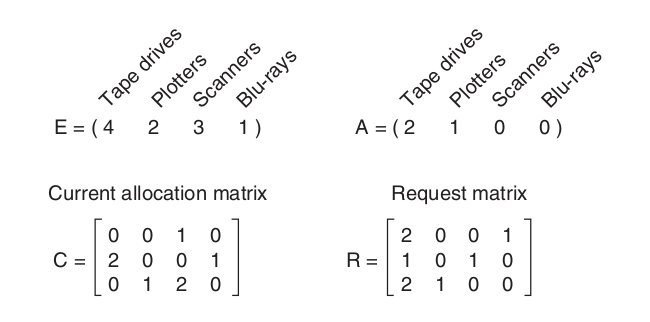
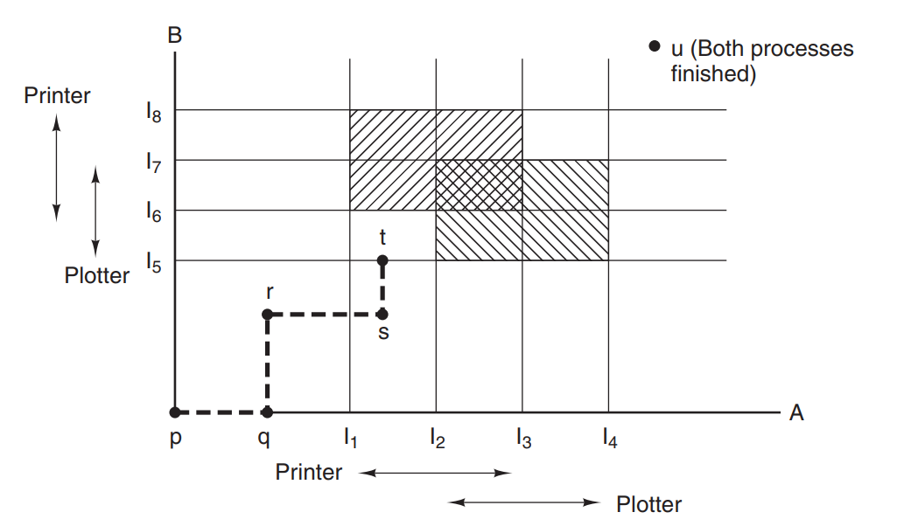
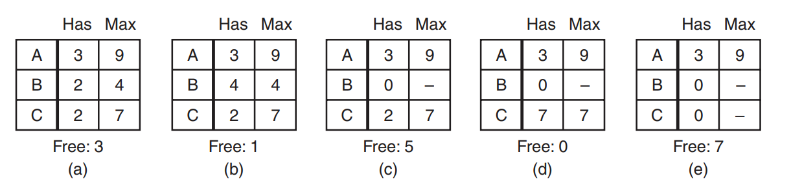
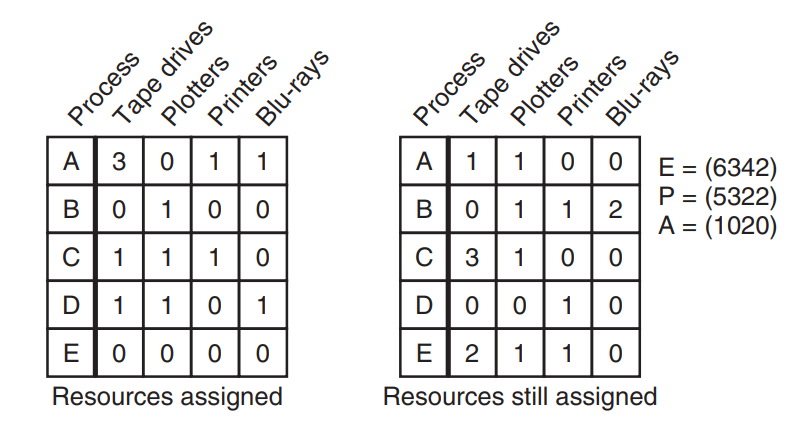
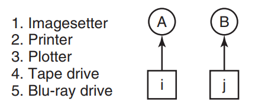

## Chapter 6 - Deadlocks

**Deadlocks** as a topic were described in the chapter dedicated to processes. However, the topic is more generic, as
**deadlocks** can appear in many situations, processes being only one of them.


### Resources

> A major class of deadlocks involves resources to which some process has been
granted exclusive access. These resources include devices, data records, files, and
so forth. To make the discussion of deadlocks as general as possible, we will refer
to the objects granted as **resources**.

There are two types of resources.

* **preemptable** - an example of printer and memory is given. Direct quote I think will be best:

> Process A requests and gets the printer, then starts to
compute the values to print. Before it has finished the computation, it exceeds its
time quantum and is swapped out to disk.
Process B now runs and tries, unsuccessfully as it turns out, to acquire the
printer. Potentially, we now have a deadlock situation, because A has the printer
and B has the memory, and neither one can proceed without the resource held by
the other. Fortunately, it is possible to preempt (take away) the memory from B by
swapping it out and swapping A in. Now A can run, do its printing, and then release the printer.
 

* **nonpreemptable** - an example of DVD writer is given. As long as it is in use (eg. writing new DVD with data), 
  there's no way to use it without doing wrong to the current process.
  
The subject of **deadlocks** is valid only when it comes to **nonpreemptable resources**, although which resources are 
**nonpreemptable** is highly context dependent. When it comes to the topic of using the resource, three steps are 
involved.

* acquiring the lock on the resource
* using the resource
* releasing the lock

Operating systems can handle access to its resources pretty nicely, as all the resources requests are made using system
calls, and the kernel can actually guard against the **deadlocks** there. Requesting process is usually blocked 
until the resource is available.

However, there are also resources that are created and used only by the user application. An example provided in a book
 is a database, although it does not matter in this case. 


```c
// Usage of one resource
typedef int semaphore;
semaphore resource1;

void process_A(void) {
 down(&resource1);
 use_resource1();
 up(&resource1);
}

// Usaage of two resources
typedef int semaphore;
semaphore resource1;
semaphore resource2;

void process_A(void) {
 down(&resource1);
 down(&resource2);
 use_both_resources();
}
 
up(&resource2);
up(&resource1);
```

The above example may seem simple, but actually **deadlocks** can arise even from such simple code. Take a look at 
the examples below.


```c
typedef int semaphore;
semaphore resource1;
semaphore resource2 ;

void process_A(void) {
    down(&resource1);
    down(&resource2);
    use_both_resources();
    up(&resource2);
    up(&resource1);
}

void process_B(void) {
    down(&resource1);
    down(&resource2);
    use_both_resources();
    up(&resource2);
    up(&resource1);
}
```

In this case, let's assume *process_A* starts executing, alongside with *process_B*. Although, they might have 
started at once, only one of them gets a *down* on *resource1*. When second call tries to get a lock on *resource1*, 
it fails, and the whole process is blocked. The first call finishes, releases the lock and the blocked process can be 
enabled and allowed to do its job.

Let's take a second example under consideration (I've commented near the relevant lines).

```c
typedef int semaphore;
semaphore resource1;
semaphore resource2 ;

void process_A(void) {
    down(&resource1);
    down(&resource2);
    use_both_resources();
    up(&resource2);
    up(&resource1);
}

void process_B(void) {
    down(&resource2);      // changed value
    down(&resource1);      // changed value
    use_both_resources();
    up(&resource1);       // changed value
    up(&resource2);       // changed value
}
```

When the code is created this way, there's a possibility that two methods start at once. Processing further they 
acquire the first resource (being *resource1* for *process_A* and *resource2* in *process_B*), although then we have 
a problem. Separate methods are trying to acquire a resource that the second method already acquired. **Deadlock** 
in its pure beauty.


### Introduction to deadlocks

Here is the official definition of a **deadlock** from the book.

> A set of processes is deadlocked if each process in the set is waiting for an
  event that only another process in the set can cause.
 
First the authors concentrate on the **resource deadlocks**, as they're the most common ones. Before we proceed - here an 
assumption is made that the processes are *single-threaded* and there are no interrupts that could resolve the **deadlock**.
Even more, the authors (following the guy named *Coffman* and his peers) list four conditions for the **resource deadlock**
to take place.

> 1. **Mutual exclusion condition.** Each resource is either currently assigned to exactly one process or is available.
> 2. **Hold-and-wait condition.** Processes currently holding resources that were granted earlier can request new resources.
> 3. **No-preemption condition.** Resources previously granted cannot be forcibly taken away from a process. They 
     > must be explicitly released by the process holding them.
> 4. **Circular wait condition.** There must be a circular list of two or more processes, each of which is waiting for 
     > a resource held by the next member of the chain.


In general the following pages are dedicated to present the **deadlocks** in a graph form - which I don't know if introduce 
anything additional to the knowledge about them. The target summary is this:

> In general, four strategies are used for dealing with deadlocks.
> 1. Just ignore the problem. Maybe if you ignore it, it will ignore you.
> 2. Detection and recovery. Let them occur, detect them, and take action.
> 3. Dynamic avoidance by careful resource allocation.
> 4. Prevention, by structurally negating one of the four conditions.


### The ostrich algorithm

We start with an **ostrich algorithm** - which takes its name after the typical behaviour of an ostrich. We just ignore 
the **deadlock**. This approach is not as irrational as it sounds - if a **deadlock** happens very rarely, and the OS suffers 
from other bugs a lot more often, then spending time fixing the **deadlocks** happening in a specific situation, may not 
be the wisest idea.


### Deadlock detection and recovery

The second approach may seem more suitable for the programmers. We acknowledge, that **deadlocks** occur. Same as bugs in 
the code. They're just part of the system and we can nothing to prevent them. The idea here is to actually let them 
happen, although then we must be sure to detect them ASAP, and fix right on the spot. First we take a look at the 
**deadlock detection of one instance of single resource type**. With **processes** as circles (named from *A* to *G*)
and **resources** as squares (named *R* through *W*) we can create a graph showing what holds lock or requires what.




Picture on the right is a part of the one on the left. We see there a **deadlock** occurring, as there is circular
 reference between resources and processes. However, in the OS design there's no way to draw a graph - some kind of 
 algorithm must be present. Below I quote an example one from the book.
 
> 1. For each node, **N**, in the graph, perform the following five steps with
  **N** as the starting node.
> 2. Initialize **L** to the empty list, and designate all the arcs as unmarked.
> 3. Add the current node to the end of **L** and check to see if the node now
  appears in **L** two times. If it does, the graph contains a cycle (listed in
  **L**) and the algorithm terminates.
> 4. From the given node, see if there are any unmarked outgoing arcs. If
  so, go to **step 5**; if not, go to **step 6**.
> 5. Pick an unmarked outgoing arc at random and mark it. Then follow it
  to the new current node and go to **step 3**.
> 6. If this node is the initial node, the graph does not contain any cycles, and the algorithm terminates. 
     > Otherwise, we have now reached a
  dead end. Remove it and go back to the previous node, that is, the
  one that was current just before this one, make that one the current
  node, and go to **step 3**.
  
It does no matter, whether we start from the left or from the bottom. As long as no duplicates occur
in the **L**, we're safe. Authors say that this algorithm is far from being optimal and that other possibilities exist. 
However, the idea was to present that such an algorithm is possible at all.

The second type of **deadlock detection** is the one when there are **more than one instance of resource type**. I have 
to admit that I don't like doing that, but here again a direct quote from the book is necessary.

> We will now present a matrix-based algorithm for detecting deadlock among **n** processes, **P1** through **Pn**.
 Let the number of resource classes be **m**, with **E1** resources of class **1**, **E2** resources of class **2**,
  and generally, **Ei** resources of class **i (1 ≤ i ≤ m)**. **E** is the **existing resource vector**. It gives the
  total number of instances of each resource in existence. For example, if class **1** is tape drives, then **E1 = 2**
   means the system has two tape drives.
   
> At any instant, some of the resources are assigned and are not available. Let **A** be the **available resource vector**,
  with **Ai** giving the number of instances of resource **i** that are currently available (i.e., unassigned). If both
   of our two tape drives are assigned, **A1** will be **0**. Now we need two arrays, **C, the current allocation matrix**,
    and **R, the request matrix**. The **ith row** of **C** tells how many instances of each resource class **Pi**
     currently holds. Thus, **Cij** is the number of instances of resource **j** that are held by process **i**.
      Similarly, **Rij** is the number of instances of resource **j** that **Pi** wants.
      

Yep, the description of an algorithm is never an easy thing to read. Therefore, there's a picture too (with the direct 
example of resources).





The algorithm runs in a such fashion:

> Each process is initially said to be unmarked. As the algorithm progresses,
  processes will be marked, indicating that they are able to complete and are thus not
  deadlocked. When the algorithm terminates, any unmarked processes are known
  to be deadlocked. This algorithm assumes a worst-case scenario: all processes
  keep all acquired resources until they exit.
  The deadlock detection algorithm can now be giv en as follows.
  
> 1. Look for an unmarked process, **Pi**, for which the **ith** row of **R** is less
  than or equal to **A**.
> 2. If such a process is found, add the **ith** row of **C** to **A**, mark the process,
  and go back to **step 1**.
> 3. If no such process exists, the algorithm terminates.
  When the algorithm finishes, all the unmarked processes, if any, are **deadlocked**.
  
In the presented scenario the first process cannot be processed (missing *Blu-ray*). The second one also cannot be 
processed, as *scanner* is missing. However, the last one can be processed, as we have enough of *Tapes* (being *2* in
this case), and *Plotters* (being *1*) available to satisfy the process. The process should then start, use the 
necessary resources and after finishing return them to the **available pool**. 

Now in our discussion about **deadlock detection algorithms**, two things remained to be answered:

 
* **when these algorithms should be used?** Scanning all the processes in search for **deadlocks** can be a lot 
of wasted CPU cycles. Therefore, usually some time interval is used to run this, or it is being executed based on the
 CPU load - if loads drop beneath a specific threshold, it usually means that it is not doing the work as the processes
  are **deadlocked**.
* **What to do when deadlock is detected?** Here the authors give three solutions, although they can be summarised
 as *'that depends'*.
  * First one is **recovery through preemption**, which means taking the resource from one of the 
 processes and giving it to the other one. The problem is with saving the state of process properly (how many of the 
 resource-related work was done). It is usually highly dependent on the nature of the resource.
  * Next one is **recovery through rollback**. Here, process authors must implement in them the functionality of a 
  **checkpoint**, which records the state of process memory, resource usage, everything actually, to a separate file. 
  When **deadlock** is detected, we may try to revert the process to the latest **checkpoint** which happened, before 
  the process acquired the resource we need. Then the resource could be used by the other process. The problem here is 
  that whatever was done after the **checkpoint** must be discarded, and that sometimes is not that easy in terms of 
  user experience (is it possible to *unplay* the already played music?).
  * The last one is **recovery through killing processes**. It might sound crazy, but sometimes it might actually work.
  The authors provide compilation as an example - killing it won't affect a thing, after restarting it can resume the 
  work from the start. The problem is with the processes where it's not that easy, eg. updating the DB. 
  

### Deadlock avoidance
  
It seems that **deadlock detection** is possible, the problem mostly arises when it comes to resolving them. So 
maybe there's a way to actually do not go that path, and just try to **avoid deadlocks**. In the previous subchapter 
we've assumed that all the resources are allocated at once. Usually it does not look that way, and the OS actually 
**can predict** if the locking the resource will cause **deadlocks** in the future. However, that's only possible with 
the OS having knowledge about scheduled processes and their needs in the future. 

The whole concept of **avoidance** is based on the notion of **safe state**. However, before they're explained below
picture is presented.




It's a graphical representation of the state we're gonna use to present the whole concept. Horizontal and vertical 
bars are representing separate processes. The *I-numbered* points represent the points in time, when specific 
process requests the specific resource. The execution is indicated by the bold line (it can only go up and right - 
never back). As long as the OS mechanism does not let the execution go into 'mixed' area in the middle (when 
**deadlock** occur) - the execution should be completely **deadlock-free**. 

Having that in mind we can now explain a concept of **safe state**. It is a state, from where taking under 
consideration current resource allocation, maximum (possible) needed allocation, and the amount of free resource, 
there's a path to fulfill all the processes' needs. Simple, right?  Yeah, I thought so ;) Below picture presents it 
better.



This example uses only one resource type to simplify things. *A, B and C* are processes. *Has* column says how many 
instances of the resource the current process **already locked**. the *Max* column states what is the
**possible maximum** amount of resources this process could use. **Mind the word - COULD - it's not said to be always 
used fully.** *Free* is obviously the amount of unused resources ready to be picked up.

Let's go from left to right. In the situation *(a)* we can assume that it is **safe state**, because there is a 
possible series of steps that will allow all the processes to complete their jobs. From the *(a)* state we see, that 
with *3 free* resources, we can serve process *B*. Even if it suddenly wants to use *Max* amount of resources, we 
have *3 free* instances, so *Max - Has <= Free*. That situation is presented in the second picture *(b)*. When *B* 
finishes, we have the state presented in the *(c)*. Right now it's possible for us to serve *C*, as with *5 free* 
instances we add them to the already locked *2* and in total use *7* of them (which is defined as *Max* for *C*). 
The process *C* finishes then, releases its resources and therefore *A* can be served. 

Based on the state presented in the first picture, we can actually compute whether it's **safe** or **unsafe**. It is 
used in the *Dijkstra* **Banker's algorithm for Single Resource**. The algorithm checks for every request whether it 
fullfillment leads to the **unsafe state**. If that is the case - the request is rejected. What must be said here - 
**unsafe state** does not necessarily lead to **deadlock**. I've mentioned it before - the *Max* column is a 
**possible maximum amount** that **could** be used. It's not deterministic to be used every time in full. However, the 
OS cannot rely on that if the algorithm has to be 100% accurate.

There's also an implementation of the above algorithm in **Banker's algorithm for multiple resources**. It operates 
using aforementioned multiple types resource graph presented below.


Having information about all the existing resource instances, used ones and free ones - it can be computed whether 
we're in the **safe state** or not. 



The direct quote will be best here:

> The algorithm for checking to see if a state is safe can now be stated.
> 1. Look for a row, **R**, whose unmet resource needs are all smaller than or equal to **A**. If no such row exists, 
     > the system will eventually deadlock since no process can run to completion (assuming processes keep all
   resources until they exit).
> 2. Assume the process of the chosen row requests all the resources it needs (which is guaranteed to be possible)
     > and finishes. Mark that process as terminated and add all of its resources to the **A vector**.
> 3. Repeat **steps 1** and **2** until either all processes are marked terminated (in which case the initial state
     was safe) or no process is left whose resource needs can be met (in which case the system was not safe).
   If several processes are eligible to be chosen in step 1, it does not matter which one is selected: the pool of
     > available resources either gets larger, or at worst, stays the same.


To conclude this subchapter - since *Dijkstra* presented this algorithm, a lot of papers were written about it. There's 
just one, small, teeny-tiny detail. **It's in-implementable**. There's just no way for a process to know how many of 
resources it will use along the execution. It can depend on a lot of variables, such as system state, config, date and 
time or user input. Some variations of the algorithm are used (authors use example of **network traffic**), but pure 
implementation is impossible. Sad situation to be honest ;(


### Deadlock prevention

As we saw above, avoiding **deadlocks** is actually impossible. So how to deal with **preventing deadlocks** in a 
real-world system? Authors revisit here the four concepts for **deadlock occurrence** presented above, but I will 
repost them for clarity, and describe what are the posssible solutions to avoid them.

> 1. **Mutual exclusion condition.**

It can be applied to the data-access - just make them read-only, and the problem is solved. Unfortunately that cannot be
the case for many other resources. However, the one-entry-point solution can be used - the same one that was 
presented by the printer example. If only the **printer deamon** is able to access the printer, and the requests to the 
**deamon** can be queued, that is a solution we can use. Although, there are possibilities for the **deadlocks** 
along the way (while requesting **deamon** itself - eg. filling *spooling area* in half by two processes). It may 
sound not possible at all, yet it is imaginable.
 
> 2. **Hold-and-wait condition.** 

The idea is simple - if we could make processes to actually lock all the necessary resources **before** the process 
starts - we could avoid **deadlocks**. But that is actually **banker's algorithm** with a different name. It was used 
in some mainframes, but is not applicable to the modern computers.
 
> 3. **No-preemption condition.** 

Mentioned printer example (with access only through a **deamon**) is an example. Unfortunately the problem is the same 
like with avoiding **mutual exclusion** - there are resources where it is impossible (table rows being an example).

 
> 4. **Circular wait condition.**

A solution to this could be **ordering of resources**, and then making scheduler not to enable processes run that are 
trying to lock the resources which are present lower on the list than the one they're currently processing. Example 
provided below shows it.



Let's assume that resource *i* is number *2* (printer), and resource *j* is number *4* (tape drive). If a process 
*A* wants to lock first resource *number *1* is imagesetter), it is not allowed to do so. Only the processes that 
are trying to lock the higher items than they're currently locking are allowed to run. The problem with this 
approach is that it is impossible to find satisfying ordering of the resources to make all the processes happy.


### Other issues

At the end of this chapter a few additional items are discussed when it comes to **deadlocks**. These concepts apply 
only to the specific use-cases, and it is not possible to make them widely used.
First one is **two-phase locking**, and an example of a database is provided. This **deadlock prevention** system 
applies to the specific use-case, which happens in the DB very often (due to holding *ACID* operations). We want to 
lock some records and then update them one by one in a synchronized way. To avoid **deadlocks** that operation is done in 
**two phases**. In the first one, DB tries to lock the rows one by one. If that fails in any way (mostly because one 
of the rows is already locked), the whole operation starts over. 

Second example of a specific case is **communication deadlock**. If You go back to the beginning of this document, 
You'll remember that it was mentioned, that **resource deadlocks** are not all the **deadlocks** that are there. 
It's funny that it took a whole chapter to finally present another type of **deadlock** ;) It is a common situation 
in the web-development, where process/application *A* sends some message to the process/application *B*. While waiting 
for the response from *B* the *A* just blocks. What happens when the message send to the *B* is lost? Of course the 
idea here is to use **timeouts** - in that case we cannot say with 100% truth that process *A* is 'blocked'. It 
maintains its state by counting the time it is left to retry or just give up. 

A third quirk is called a **livelock**. The authors describe it with *C* code and sophisticated examples, but the 
simplest one is the best. Imagine two people trying to go through the door leading into the building - one is outside, 
and one is inside the building. At the same time they're taking the step to go through the door, but see the other 
person doing the same, so as a polite citizens, they step back. Nothing changed, two people/processes retreated. If 
somebody (something?) does not intervene, they could be doing that till the apocalypse comes. That's a **livelock**.

The last one is **starvation**. It appeared in the background in the previous chapters - eg. when process scheduler 
decides which process should run next. Or when there's a disk access needed, and we want to minimize the disk arm 
movement. Sometimes, based on the policy being applied, a request can wait eternally to be allowed to be answered. 
An example of a printing policy is given, where always the smallest documents are being printed first. If suddenly a 
larger document comes, but there's still a constant stream of smaller documents coming, it will never get printed. 
Of course that is a problem with the policy - using **FIFO** can remedy this problem.  

