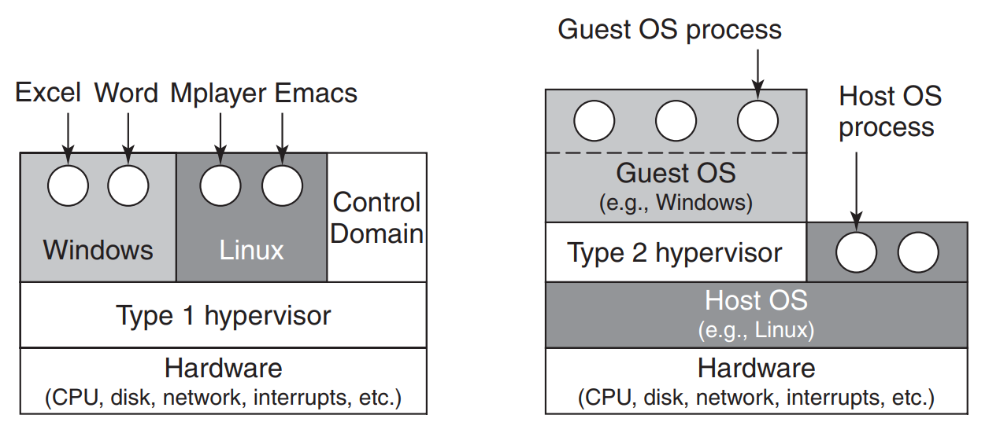
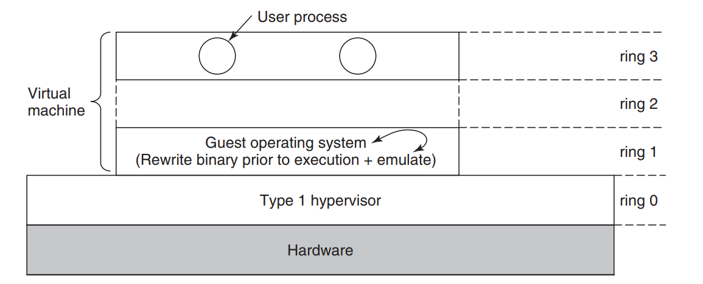
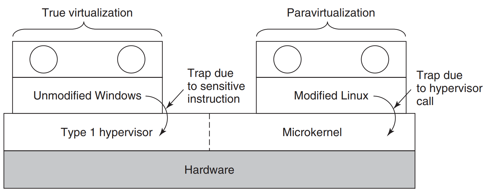
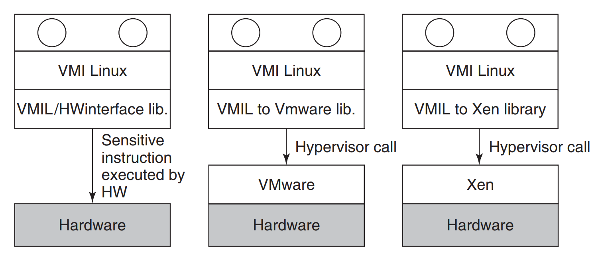
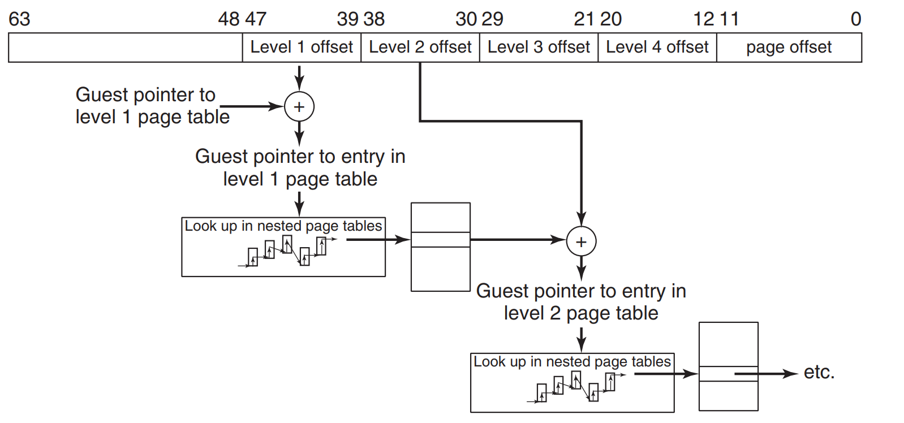

## Chapter 7 - Virtualization and the cloud

The chapter starts with description of what virtualization is, but I assume as You're reading this notes You already
know what that is.

### History

Long time ago in the *1960s* it was IBM that started with the idea of **hypervisors** and even had two of them - 
*SIMMON* and *CP-40*. The latter was a research process that then went series of changes and mutations (*CP-67*, 
*CP/CMS* and later *VM/370*), although it is not that important.

> In 1974, two computer scientists at UCLA, Gerald Popek and Robert Goldberg, published a seminal paper ("Formal 
> Requirements for Virtualizable Third Generation Architectures") that listed exactly what conditions a computer 
> architecture should satisfy in order to support virtualization efficiently. It is impossible to write a chapter on
> virtualization without referring to their work and terminology. Famously, the well-known x86 architecture that
also originated in the 1970s did not meet these requirements for decades. It was not the only one. Nearly every 
> architecture since the mainframe also failed the test.

Things started to change in the beginning of the *90s* when *VMWare* was born, however it was up until *1999* for 
the **hypervisor** for *x86* to appear. After that other (now also known) solutions emerged - *KVM, VBox, Hyper-V, etc*.

### Requirements for virtualization

In general as authors says, there are three requirements for virtualization.

> 1. Safety: the hypervisor should have full control of the virtualized resources.
> 2. Fidelity: the behavior of a program on a virtual machine should be identical to that of the same program running
     > on bare hardware.
> 3. Efficiency: much of the code in the virtual machine should run without intervention by the hypervisor

**Safety** is related to the fact, that the **hypervisor** should make sure that the guest OS, does not make a change 
to the mechanisms that will influence the host system. On the other hand, for the host OS to be unaware of the 
virtualization taking place, such mechanisms must be simulated by an **interpreter**. In general **hypervisors** try 
to execute most of the operations directly, simulating only necessary operations.

As for the **fidelity** a quote will present it better:

> In a nutshell, every CPU with kernel mode and user mode has a set of instructions that
behave differently when executed in kernel mode than when executed in user
mode. These include instructions that do I/O, change the MMU settings, and so
on. Popek and Goldberg called these **sensitive instructions**. There is also a set of
instructions that cause a trap if executed in user mode. Popek and Goldberg called
these **privileged instructions**. Their paper stated for the first time that a machine
is virtualizable only if the **sensitive instructions** are a subset of the **privileged instructions**. In simpler 
> language, if you try to do something in user mode that you should not be doing in user mode, the hardware should trap.

That was not the case for *x86* for a very long time (mostly because of backwards compatibility) - it was introduced in 
*2005*. Before (authors point that out) there were **hypervisors** actually doing **binary translation**, which is a 
on-the-fly translation of the **sensitive instructions** - we trap, check the instruction, perform it if possible 
or emulate the behaviour. 

There's also a different type of virtualization called **paravirtualization**. That type explicitly presents the 
guest OS information that it is actually virtualized. With that, there are **hypercalls** being exposed (to the 
guest OS), that cane be used to communicate with the host OS and perform some actions that way.

### Type 1 and type 2 Hypervisors

There are two types of **hypervisors** which are depicted below.

**Type 1 hypervisor** presented on the left, runs directly on the bare metal, and guest OSes are run directly by the 
**hypervisor**. In the **type 2 hypervisor** (mostly used on desktop computers), they are actual processes that run 
on some kind of host OS. In that case the guest OSes are running 2 levels above the bare metal. 

### Techniques for efficient virtualization 

I would imagine that this subchapter was dedicated to the performance and efficiency, although it concentrates 
mostly on explaining again in detail how **hypervisors** work, which actually is interesting thing. Let's start with 
more detailed picture for **hypervisor type 1**.

As You can see a new prefix - *virtual* was introduced to indicate user and kernel mode of the guest operating system. On
the CPUs without *VT* any call done in *virtual kernel mode* will result in a crash. However, on the CPUs that support *VT* 
the call goes to the **hypervisor** and is tested - based on the type it is emulated or executed directly.

Now we go back to the subject of **binary translation**, which is a way the virtualization was done before *VT* was 
officially build into the CPUs. It was possible due to a feature called **protection modes**, also called **protection 
rings**. **Ring 0** is the most privileged one (kernel operates there) and **ring 3** is the least privileged one (user 
mode resides there). The rest of the **rings** was not used, and that's where guest OS was kept. That situation shows the 
picture below.

To show how it was done this quote shows that best:

> As for the sensitive instructions in the guest’s kernel code: the hypervisor
  makes sure they no longer exist. To do so, it rewrites the code, one **basic block** at a
  time. A **basic block** is a short, straight-line sequence of instructions that ends with
  a branch. By definition, a **basic block** contains no jump, call, trap, return, or other
  instruction that alters the flow of control, except for the very last instruction which
  does precisely that. Just prior to executing a basic block, the hypervisor first scans
  it to see if it contains sensitive instructions (in the Popek and Goldberg sense), and
  if so, replaces them with a call to a hypervisor procedure that handles them. The
  branch on the last instruction is also replaced by a call into the hypervisor (to make
  sure it can repeat the procedure for the next basic block). Dynamic translation and
  emulation sound expensive, but typically are not. Translated blocks are cached, so
  no translation is needed in the future. Also, most code blocks do not contain sensitive or privileged instructions
> and thus can executes natively. In particular, as long
  as the hypervisor configures the hardware carefully (as is done, for instance, by
  VMware), the binary translator can ignore all user processes; they execute in non privileged mode anyway.
  After a basic block has completed executing, control is returned to the hypervisor, which then locates its successor.
> If the successor has already been translated, it can be executed immediately. Otherwise, it is first translated, cached,
> then executed. Eventually, most of the program will be in the cache and run at close to full speed.

The same techniques are usually also used by **hypervisors type 2**, although to be performed they need to manipulate
hardware at the very low level and therefore they must be run in **ring 0**. It is done by having the part of the 
**hypervisor** run in this **ring** and when a *virtual kernel* executes *privileged instruction*, the **hypervisor** 
is able to given the host OS access to the hardware, although when there's a need from the host OS to get the hardware back, the 
part of **hypervisor** just gives it politely back. It's called **world switching**.

Finally, at the end of subchapter there is some writing about the performance, but that can be summed up by stating 
that sometimes even **type 1 hypervisors** are doing **binary translations** as it can speed up things. 

### Are hypervisors microkernels done right?

A concept of **microkernels** was discussed in the first chapter and *MINIX* was presented as an example of such. With 
**paravirtualization**, people began to wonder - isn't it the actual *microkernel done right?* It is a controversial 
concept as authors mention, although they proceed to describe **hypervisors** using that perspective in this subchapter.

First we start with the picture of virtualization and paravirtualization.

In the right part of the picture, if **type 1 hypervisor** is dedicated only to use **paravirtualization** it is 
efficiently becoming a **microkernel**. Authors put it that way:

> If the hypervisor is intended to run only
paravirtualized guest operating systems, there is no need for the emulation of sensitive instructions and we have a true microkernel, which just provides very basic
services such as process dispatching and managing the MMU. The boundary between a type 1 hypervisor and a microkernel is vague already and will get even less
clear as hypervisors begin acquiring more and more functionality and hypercalls,
as seems likely. Again, this subject is controversial, but it is increasingly clear that
the program running in kernel mode on the bare hardware should be small and reliable and consist of thousands, not millions, of lines of code.

NOTE: As **Andrew Tanenbaum** is the author of *MINIX*, which implements *microkernel* architecture, this opinion can 
be biased at least. If You're interested in the way *MINIX* works - <a href="https://www.youtube.com/watch?v=oS4UWgHtRDw">
check out the presentation of this system given by the author himself</a>.

The approach used in **paravirtualization** and **hypercalls** is problematic for one reason. OSes can run both - on 
the bare metal and in the virtualized environment. How to make OS aware and ready, for both situations? The solution 
was proposed for the OSes, to implement something called **VMI - Virtual Machine Interface**, which is a set of 
procedures the kernel should call when there's a **sensitive instruction** needed. The solution is depicted in the 
below picture.

Other proposals were there too - **paravirt ops** is one of them. It was the initiative of heavyweight Linux 
contributors (IBM/RedHat/VMWare), and is similar to the solution presented above. It was merged into mainline kernel in 
version 2.6.23. 

### Memory virtualization

Up until now we've discussed mostly CPUs and processes. However, the computer is not only the CPU - there's also a 
memory, and I/O present. In this subchapter we handle memory topic in virtualization, and in the next one the I/O.
We've discussed the concepts of memory management in the third chapter, and it is clear, that it's not a trivial 
task. What is important - nowadays all modern OSes support *virtual memory*, which abstracts the details of 
underlying raw memory, although it was still really hard to virtualize the memory, and as authors say - it took two 
turns to make it right.

The simplest example is GOS1 (Guest OS 1 - abbreviation for readability), that wants to map its *virtual pages* 4, 5 
and 6 to the *physical pages*  40, 50 and 60. While doing it for the first time (eg. just right after the GOS starts)
, there's also <a href="https://en.wikipedia.org/wiki/Control_register">CPU control register</a> updated to point to 
the top-level memory page. No matter the type of **hypervisor type** it can choose to do just that - allocate the 
*physical pages* to the specified *virtual ones*. So far, so good. 

Let's take for example the GOS2 - which wants to allocate its own *virtual pages* to the *physical pages* 40, 50 and 
60. What then? To resolve the conflict a **shadow page table** must be created for every GOS by **hypervisor** (and 
    remap there calls from the specific GOS). That is doable and not that much of a problem. Actual problems lies in
the fact, that **changing the page table** in the GOS, does not need to be done in the **hypervisor** now (it does 
    not require **sensitive operation**). Clumsy solution is to mark in the **shadow tables** top-level page as 
    *read-only*, therefore, any subsequent changes to them will result in *TRAP* being issued and passing the control 
    to the **hypervisor**. Second solution is a complete opposition of the first one - we let GOS operate on its 
    page tables, however when it tries to actually get them, **hypervisor** intervenes, inspects GOS page tables and 
    make proper changes in the **shadow page table** for specific GOS. On the other hand, when the mapping is 
    removed (instead of remapping the addresses), *INVLPG* instruction is used, which is intercepted by the 
    **hypervisor**.
    
Both of these techniques result in *page faults*, and they're expensive. A quote would be good here.

> We typically distinguish between **normal** page faults that are caused by guest
programs that access a page that has been paged out of RAM, and page faults that
are related to ensuring the shadow page tables and the guest’s page tables are in
sync. The former are known as **guest-induced page faults**, and while they are
intercepted by the hypervisor, they must be reinjected into the guest. This is not
cheap at all. The latter are known as **hypervisor-induced page faults** and they are handled by updating the shadow 
> page tables.

As stated above - the memory translation is general is expensive. No surprise then, that wise man came with an idea 
of **hardware acceleration** for that (we have MMUs, TLBs, so why not some hardware to help here?). AMD calls them 
**nested page tables** and Intel **EPT (Extended Page Tables)**. In the case such solution is present in the machine,
**hypervisor** still has **shadow pages**, although the computation of addressess is done by the hardware. Below is 
a picture presenting the **pages walk** by the hardware, and a quote summing that up.

>  In our example, the hardware first walks the
**regular** page tables to translate the **guest virtual address** to a **guest physical address**, just as it would do 
> without virtualization. The difference is that it also walks the **extended (or nested) page tables** without 
> software intervention to find the **host physical address**, and it needs to do this every time a **guest physical 
> address** is accessed.

At the end the concept of getting back the memory is described. It is quite common (not only in the CS, but in the 
world in general), to offer more resources than the provider actually has (*virtual memory* being an example). What 
happens, if on the *32BG* machine, we host 3 GOSes, with each of them assigned *16GB* of memory? As long as they do 
not try to use the maximum amount of allowed memory, everything is fine. However, when suddenly the demand for the 
memory increases - what should **hypervisor** do? Or rather - which pages it should reclaim? Besides the simplest 
solution to just page whatever page is at hand (no matter if for GOS it is very important one), we then can approach 
the situation, when GOS also decided to throw that page away. When it tries to do this - the page was already 
swapped by the **hypervisor**. So the behaviour of the **hypervisor** is to load back the page for GOS to write it 
to the disk again. Not very efficient, to say the least. 

To handle this an idea of **ballooning** was introduced. It would be best to just quote.

> A common solution is to use a trick known as ballooning, where a small balloon module is loaded in each VM as a 
> pseudo device driver that talks to the hypervisor. The balloon module may inflate at the hypervisor’s request by allocating
more and more pinned pages, and deflate by deallocating these pages. As the balloon inflates, memory scarcity in the 
> guest increases. The guest operating system
will respond by paging out what it believes are the least valuable pages—which is
just what we wanted. Conversely, as the balloon deflates, more memory becomes
available for the guest to allocate. In other words, the hypervisor tricks the operating system into making tough decisions for it.

### I/O virtualization

When GOS starts, and tries to figure out what external devices it can use (and load specific drivers for), a 
**hypervisor** has two options. First one is to just throw everything it got to the GOS. Unfortunately it is 
problematic to say the least, as usually there are other VMs (or HOS in the **hypervisor type 2**) that also want 
access to the I/O. Remember all the **deadlocks** we've discussed in the previous chapter? Yup, all the knowledge 
from there applies here.

Second solution for the **hypervisor** is as usual - to emulate and restrict the access to the devices. However, 
we've discussed the way to actually speed up the I/O in chapter 5, and a concept of *DMA* was described there. As 
long as we have one system being the owner of the devices that's not a problem. However, in a virtualized world - 
how GOS can actually use the *DMA* which uses absolute addresses of the memory? GOS trying to use them will corrupt 
the **hypervisor**. As usual - there's a solution for that.

>  As might be expected, the **hypervisor** has to intervene here and remap the addresses before the DMA starts. 
> However, hardware already exists with an I/O MMU, which virtualizes the I/O the same way the MMU virtualizes the 
> memory. [...] Just like regular MMUs, the I/O MMU uses page tables to map a memory address that a device wants to
> use (the device address) to a physical address. In a virtual environment, the hypervisor can set up the page tables
> in such a way that a device performing DMA will not trample over memory that does not belong to the
virtual machine on whose behalf it is working.

With *I/O MMUs* there's **device pass through** possible, which directly assigns the device to the GOS. Second term 
here is **device isolation**, that makes sure that the device does not try to access other GOSes besides the 
assigned one. To conclude the topic we have to mention, that modern *I/O MMUs* are also supporting **interrupt 
remapping** - we have to be sure that the **interrupt** send by the device reaches proper GOS. 

A different approach to *I/O* is used by **Xen** - it uses separate **domain 0** 
(or **dom0**), that serves as the brain for the whole **hypervisor**. Part of that brain actually performs all the 
*I/O* operations (as a separate OS). If You want to learn more <a href="https://wiki.xenproject.
org/wiki/Xen_Project_Software_Overview">please visit its Wiki</a>.

We saw that every time **hypervisor** starts to do heavy-lifting with emulating devices the efficiency drops. 
As we have already *I/O DMA*, wouldn't it be best that the hardware handle the virtualization? It would, therefore, 
a concept of **Single root I/O virtualization (SR-IOV)** appeared (which is *PCI* extension) - the hardware itself 
handles the calls from different GOSes (we bypass the **hypervisor** completely). As authors write:

> The device appears as
multiple separate devices and each can be configured by separate virtual machines.
For instance, each will have a separate base address register and address space. A
virtual machine maps one of these memory areas (used for instance to configure
the device) into its address space. SR-IOV provides access to the device in two flavors: PF (Physical Functions)
and (Virtual Functions). PFs are full PCIe functions and allow the device to be
configured in whatever way the administrator sees fit. Physical functions are not
accessible to guest operating systems. VFs are lightweight PCIe functions that do
not offer such configuration options. They are ideally suited for virtual machines.

### Virtual appliances

It's just a term for *I've-build-this-VM-and-packed-it-with-necessary-stuff-You-can-use-it*. 

### Virtual machines on multicore CPUs

The overall summary is - it's gonna be big when the programmers finally will learn how to reuse many CPUs. 

### Licensing issues

Do we care?

### Clouds

I won't be putting here notes about what a cloud is, how they're typed, etc. I assume the reader in *2021* knows 
what is *IASS* or *PASS*, and I do not have to explain that. Let's move to the next subtopic - **machines migration**.
That is what makes cloud providers so successful. Of course, it is always possible for the GOS to be stopped, put 
into an image, then transferred to the other machin and then restarted. Unfortunately, that would cause a service 
downtime, which is usually unacceptable. Second solution would be to just to pause the GOS, move memory pages, disks,
data, actually everything to other machine and then restart. If the machines are located in the same data center it 
should be relatively fast. Yet again - downtime is unavoidable. 

What is being offerred now is **live migration**, which can happen while the GOS is still running. Copying of memory 
pages is hapenning on the fly.

> Most memory pages are not written much, so copying them over is safe.
Remember, the virtual machine is still running, so a page may be modified after it
has already been copied. When memory pages are modified, we have to make sure
that the latest version is copied to the destination, so we mark them as dirty. They
will be recopied later. When most memory pages have been copied, we are left
with a small number of dirty pages. We now pause very briefly to copy the remaining pages and resume the virtual machine at the new location. While there is still a
pause, it is so brief that applications typically are not affected. When the downtime
is not noticeable, it is known as a seamless live migration.

### Case study: VMWare

As this is not strictly OS or CS oriented subchapter I've decided not to make notes here. However, the lecture was 
interesting and fun so if You got the book read it just for pure pleasure.

  