## Chapter 8 - Multiple processors systems

The chapter starts with short history and typography of multicore processors - nothing new or worth writing down. 


### Multiprocessors

> A shared-memory multiprocessor (or just multiprocessor henceforth) is a
computer system in which two or more CPUs share full access to a common RAM.
A program running on any of the CPUs sees a normal (usually paged) virtual address space. The only unusual property this system has is that the CPU can write
some value into a memory word and then read the word back and get a different
value (because another CPU has changed it). When organized correctly, this property forms the basis of interprocessor communication: one CPU writes some data
into memory and another one reads the data out.


Usually the OS for **multiprocessors** is the usual one, although some additional things must be taken under 
consideration. These topics will be discussed in this subchapter, starting with the hardware itself, then we'll move 
to the OS types and synchronization and scheduling at the end.

First we start with the basic distinction for **UMA (Uniform Memory Access)** and 
**NUMA (Nonuniform Memory Access)** processors. The first type has an additional property - it can read whatever word
in memory at the same speed. The second one does not have this ability. To understand the difference below picture 
says more.

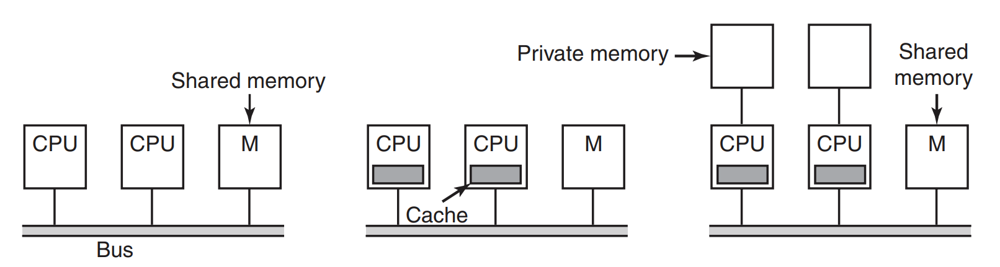

On the left we see a solution where there's one bus that connects all the CPUs with the memory. Every time CPU wants 
to read or write in the memory - it waits for the bus to be free. Of course, for the small amount of CPUs that is 
manageable, for thousands-core-supercomputer it's definately not (99% of CPUs will be idle waiting for the bus to 
clear). The solution is presented in the center - we add **the local CPU cache** (in it, near it, does not matter) 
and therefore part of reads can be done from cache. What is more - we do not cache single words, rather *32* or *64* 
byte blocks (called **cache line**). It's the technique similar to the one used by DMA for disk access. Every 
**cache line** is marked as RO or RW - when the second one is being modified, all the CPUs caches must be informed 
about that and update the values accordingly. The last option presented on the right is a separate instance of the 
private CPU memory, that is used for storage. However, that approach implies that the compiler of the program can 
actually use that local memory.

The solutions used above still are not enough for the systems with more that 32 CPUs. For that a **crossbar switch** 
is used, a solution already heavily used in the telephone switching exchanges. The picture below shows it.


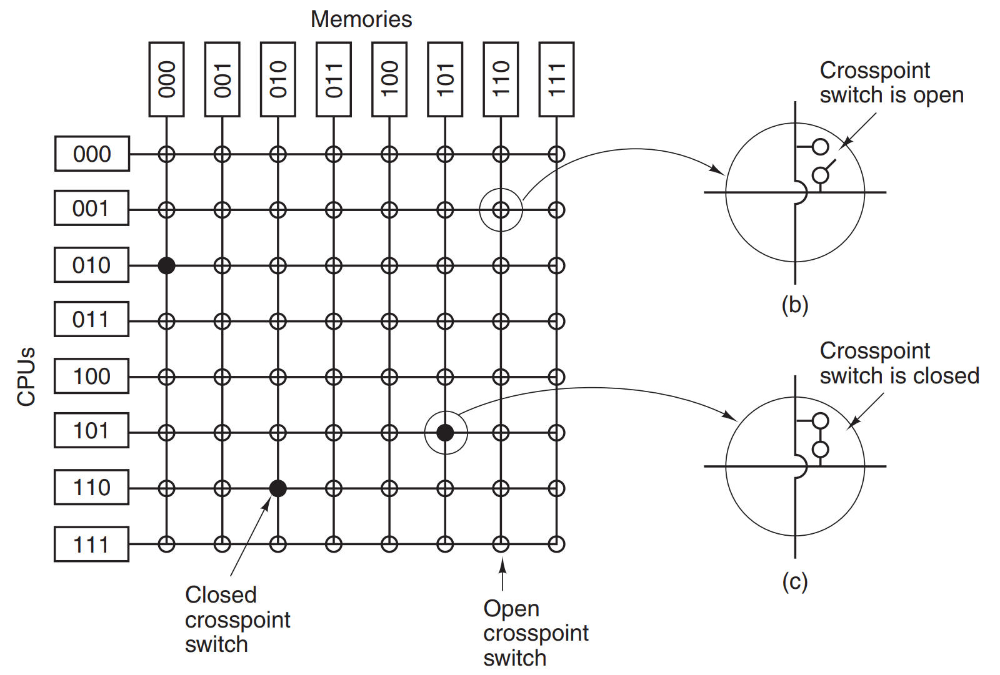


This approach enables mid-sized multiprocessor computers to work nicely, although, as authors say.

> One of the worst properties of the crossbar switch is the fact that the number of crosspoints grows as n2. With 
> 1000 CPUs and 1000 memory modules we need a million crosspoints. Such a large crossbar switch is not feasible. 
> Nevertheless, for medium-sized systems, a crossbar design is workable.

Solution to deal with the problem of too many **crosspoints** is to go back to the basics. That means using simple 
**2x2 switch**, although in many copies. The simple **switch** is presented below on the left. On the right we see 
an example message that comes as an input, and can be put to the *X* or *Y* output line depending on the target 
**module**.

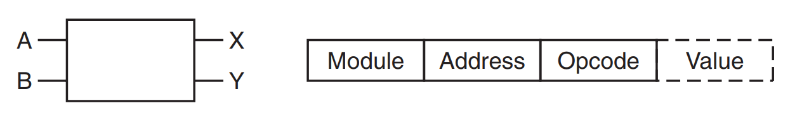

having such simple unit as a base for the messaging system, we can create various topographies. Simple one is 
presented below (called **omega network**).


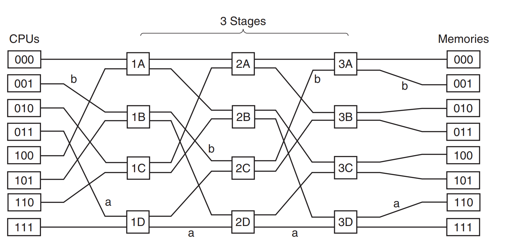


The wiring pattern here is called **perfect shuttle** - for the first 'line' of switches, the leftmost bit of the 
**module** address is used to decide, whether the message should go to the output *X* or *Y*. Based on that the 
routing is done and **2x2 switch** forgets about the message it just had. However, the routing is still in progress 
- the second 'line' takes under consideration the second bit in the **module** (with the same logic for 1/0 applied).
With that logic applied along the way CPU request finds its way to the proper memory unit. What is more - as the 
  message goes through the **switches**, the leftmost bits are not necessary, however, the message after processing 
  in the memory must be returned to the caller CPU. So this time leftmost bits are being used to store the output 
  lines. So for the incoming message with module address *110*, the route to follow back to the CPU is *011*, but 
  this time read from the right. All that is indicated by letter *'a'* in the picture.
  
Although the above technique seems perfect it's still **blocking one** - there's always a possibility for the two 
requests (any combination of incoming/outgoing ones) can clash in the **switch**. To reduce the possibility of that 
happening, usually **the least significant bits** are used for module address. Authors summarize that this way.

> Consider, for example, a byte-oriented address space for a computer that mostly accesses full *32-bit* words. The
> *2* low-order bits will usually be 00, but the next *3* bits will be uniformly distributed. By using these *3* 
> bits as the module number, consecutively words will be in consecutive modules. A memory system in which 
> consecutive words are in different modules is said to be **interleaved**.


Now it's time to describe the second type of multiprocessors - **NUMA**. To remind You - **NUMA** does not guarantee 
the same operation type speed for any kind of word read from the memory. 

> Like their **UMA** cousins, they provide a single address space across all the CPUs, but unlike the **UMA** machines, 
> access to local memory modules is faster than access to remote ones. Thus all **UMA** programs will run without change
on **NUMA** machines, but the performance will be worse than on a **UMA** machine. **NUMA** machines have three key 
> characteristics that all of them possess and which together distinguish them from other multiprocessors:
> 
> 1. There is a single address space visible to all CPUs.
> 2. Access to remote memory is via LOAD and STORE instructions.
> 3. Access to remote memory is slower than access to local memory.

> When the access time to remote memory is not hidden (because there is no caching), the system is called **NC-NUMA 
> (Non Cache-coherent NUMA)**. When the caches are coherent, the system is called **CC-NUMA (Cache-Coherent NUMA)**.

Next the authors present one of the architectures used for **CC-NUMA**, which is  **directory-based multiprocessor** 
concept. The **directory** here is an index/cache/database that stores information where each **cache line** is 
stored. Below is the picture presenting the concept, and a quote explaining it.

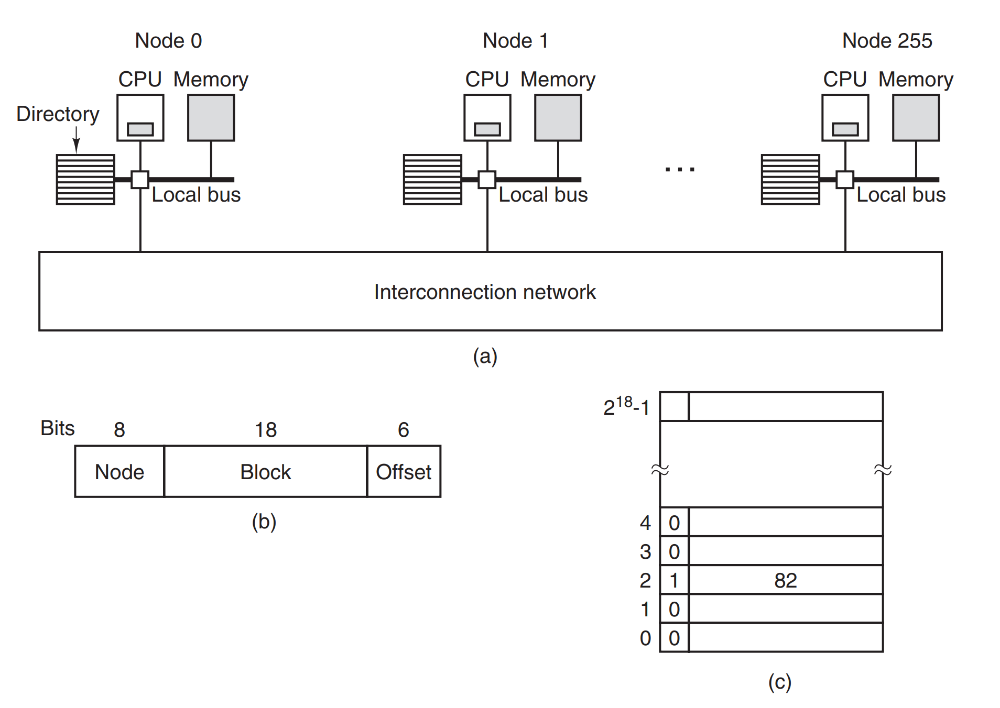

> To see how the directory works, let us trace a LOAD instruction from CPU 20
that references a cached line. First the CPU issuing the instruction presents it to its
MMU, which translates it to a physical address, say, *0x24000108*. The MMU
splits this address into the three parts shown in part *(b)*. In decimal, the three
parts are node *36*, line *4*, and offset *8*. The MMU sees that the memory word referenced is from node *36*, not node 
> *20*, so it sends a request message through the interconnection network to the line’s home node, *36*, asking 
> whether its line *4* is cached, and if so, where. When the request arrives at node *36* over the interconnection 
> network, it is routed to the directory hardware. The hardware indexes into its table of *218* entries,
one for each of its cache lines, and extracts entry *4*. From picture's *(c)* we see that
the line is not cached, so the hardware issues a fetch for line *4* from the local RAM
and after it arrives sends it back to node *20*. It then updates directory entry *4* to indicate that the line is now 
> cached at node *20*.

We've assumed that in this solution only one node can store the data. If it were to be stored in multiple nodes do 
that, every **directory entry** in the **directory mapping** should contain a bit representing data whether the 
specified node contains that entry too. The problem with that approach is that it takes a lot of storage.

Second type of **CC-NUMA** are **multicore chips**, where in one physical CPU we got a couple of separate **cores** 
doing the job. They have separate *L1* and *L2* caches, although they usually share common *L3* cache. Special 
hardware exist to make sure that when the *cache line* is modified (in general - main memory is modified), all the 
occurrences in separate cores are invalidated.


Let's take care of **multiprocessors OSes**. Back in a day the below model was used - every CPU was given its own 
copy of the OS (however, the memory with instructions of the OS was shared, only data was instance-based). However, 
this model suffered from a lot of inefficient solutions (no way to 'share' memory/caching/etc), so it's not used 
anymore (except in research).

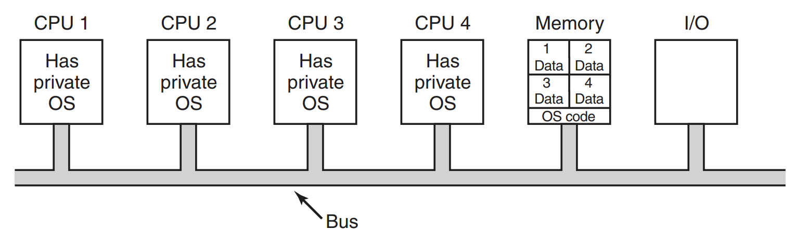

Second type was **master-slave multiprocessor OS**, where one CPU was hosting the OS itself, with one list of 
procesess to be run, and all others CPUs were doing the heavy-lifting with the processes.

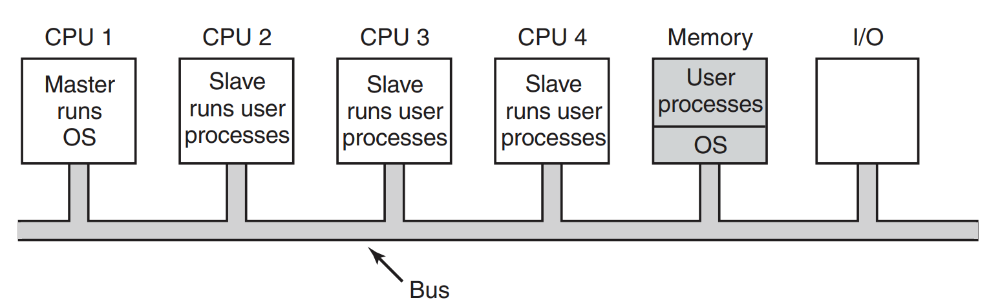


This model may seem efficient, however with the increasing number of slave CPUs, the master becomes a bottleneck, 
while trying to coordinate all the work that must be done. For small multiprocessors its fine, for larger ones not 
so much. 

The last model is **symmetric multiprocessor**, which holds only one instance of the OS in memory, however every CPU is 
able to actually run it (and also users' processes along the way). It may look great, however the problem with 
concurrent call to the *kernel* is a problem. When two CPUs try to clean the same *page table* at the same time - 
which should be first? Some kind of *mutex* is needed (this approach is called **big kernel lock**), decreasing 
performance of the CPUs in general. Of course some parallelism is possible, eg. separating each part of the system 
to be served by a different CPU, although still *critical regions* can overlap between the CPUs. Authors say, that 
despite these problems, that is the approach used today in most of the multiprocessor OSes. The main problem is 
actually splitting the OS parts, for them to avoid **deadlocks**. 


Next topic is a **multiprocessor synchronization**, although, as we've seen - the CPUs themselves rarely have to 
synchronize. Unfortunately, when this occurs on the **multiprocessor machine** things get tricky. For a single CPU 
we've discussed *TSL* instruction (when covering **critical regions** in Chapter 2). For **multipocessors** there's 
a problem with setting up a proper *mutex*. It can go wrong very easilly, as in the below picture.

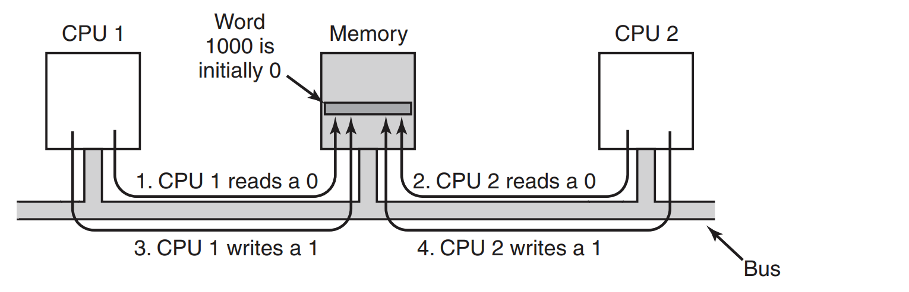


In order to avoid such situations an upgraded *TSL* must be introduced - the one that actually involves locking 
**the bus**. Quote here as the mechanism is low-level and I don't want to trivialise it:

> To prevent this problem, the TSL instruction must first lock the bus, preventing
other CPUs from accessing it, then do both memory accesses, then unlock the bus.
Typically, locking the bus is done by requesting the bus using the usual bus request
protocol, then asserting (i.e., setting to a logical 1 value) some special bus line until
both cycles have been completed. As long as this special line is being asserted, no
other CPU will be granted bus access. This instruction can only be implemented on
a bus that has the necessary lines and (hardware) protocol for using them. Modern
buses all have these facilities, but on earlier ones that did not, it was not possible to
> implement TSL correctly. This is why Peterson’s protocol was invented: to synchronize entirely in software.
> 
> If TSL is correctly implemented and used, it guarantees that mutual exclusion
can be made to work. However, this mutual exclusion method uses a spin lock because the requesting CPU just sits in a tight loop testing the lock as fast as it can.
Not only does it completely waste the time of the requesting CPU (or CPUs), but it
may also put a massive load on the bus or memory, seriously slowing down all
other CPUs trying to do their normal work.
>
> At first glance, it might appear that the presence of caching should eliminate
the problem of bus contention, but it does not. In theory, once the requesting CPU
has read the lock word, it should get a copy in its cache. As long as no other CPU
attempts to use the lock, the requesting CPU should be able to run out of its cache.
When the CPU owning the lock writes a 0 to it to release it, the cache protocol
automatically invalidates all copies of it in remote caches, requiring the correct
value to be fetched again.
> 
> The problem is that caches operate in blocks of 32 or 64 bytes. Usually, the
words surrounding the lock are needed by the CPU holding the lock. Since the TSL
instruction is a write (because it modifies the lock), it needs exclusive access to the
cache block containing the lock. Therefore every TSL invalidates the block in the
lock holder’s cache and fetches a private, exclusive copy for the requesting CPU.
As soon as the lock holder touches a word adjacent to the lock, the cache block is
moved to its machine. Consequently, the entire cache block containing the lock is
constantly being shuttled between the lock owner and the lock requester, generating even more bus traffic than individual reads on the lock word would have.
If we could get rid of all the TSL-induced writes on the requesting side, we
could reduce the cache thrashing appreciably. This goal can be accomplished by
having the requesting CPU first do a pure read to see if the lock is free. Only if the
lock appears to be free does it do a TSL to actually acquire it. The result of this
small change is that most of the polls are now reads instead of writes. If the CPU
holding the lock is only reading the variables in the same cache block, they can
each have a copy of the cache block in shared read-only mode, eliminating all the
cache-block transfers.
>
> When the lock is finally freed, the owner does a write, which requires exclusive access, thus invalidating all 
> copies in remote caches. On the next read by the
requesting CPU, the cache block will be reloaded. Note that if two or more CPUs
are contending for the same lock, it can happen that both see that it is free simultaneously, and both do a TSL simultaneously to acquire it. Only one of these will
succeed, so there is no race condition here because the real acquisition is done by
the TSL instruction, and it is atomic. Seeing that the lock is free and then trying to
grab it immediately with a TSL does not guarantee that you get it. Someone else
might win, but for the correctness of the algorithm, it does not matter who gets it.
Success on the pure read is merely a hint that this would be a good time to try to
acquire the lock, but it is not a guarantee that the acquisition will succeed

The authors describe another approach to reducing bus traffic with the solution used in the networking. Instead of 
polling every instruction a delay is inserted after every poll, being incremental stream of 1, 2, 4, 8 and so on up 
until some predefined maximum. The last solution that also can be used is depicted below - it includes that CPU 
requesting the lock, when failed to do that, locks a **private lock** and adds it to the list of awaiting CPUs for a 
'main lock'. When 'the first' CPU holding a lock finishes its job, then releases not only the original lock but also 
the private lock next CPU in line is holding.


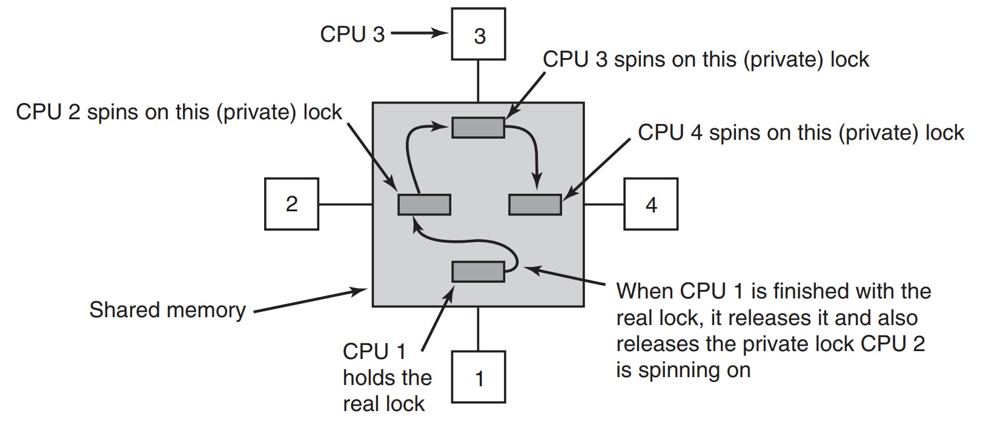

At the end of the topic of **multiprocessor synchronization**, the subject of whether to *spin* or *switch* is 
described. It results from the above - what should happen if CPU cannot poll or attach itself to the waiting list as 
the eg. waiting list is also locked? In such case it just has to wait. However, pretty often that is not the case 
and maybe a **switch** to the other thread is possible. Should the CPU do that or not? In general to sum up provided 
examples - it's best to gather the average wait time in the system, and act upon this data.

The latest topic covered in this subchapter is **multiprocessor scheduling**. The topic is related to the 
**threads**, that are parts of processes (in a way), and of course we discuss here **kernel threads**, as **user 
threads** are 'invisible' for the CPUs. With **multiprocessor systems** the problem is therefore not only which 
thread to run, but also on which CPU. In general there are two types of threads here - the ones operating completly 
separately (eg. SSH-sessions of many users to the remote server) or grouped (eg. *make* process compiling the source 
code was the example used by authors).

Let's start with independent threads. The simplest solution would be to have a list of all the threads to run. More 
detailed approach would be to have a *set of lists*, and the list ordered by the importance/priority of the threads. 
That is depicted on the left in the below picture.

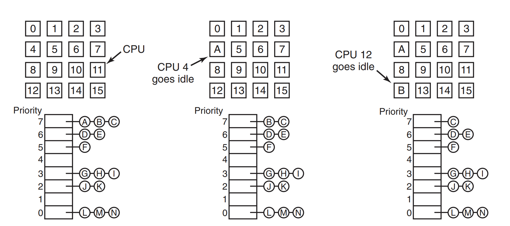


When for example the fifth CPU finishes its work (or blocks), it takes up the thread that is the first in the set, 
that has the highest priority. This situation is depicted in the middle - CPU is marked as *A* right now. On the 
right we have a next step when another CPU is available - it takes a thread marked as *B* and starts working. This 
approach is quite reasonable when we have unrelated threads, although it may suffer from the same problems like 
**NUMA** described before - the data structure mentioned is a bottleneck when the amount of CPUs grows, and the 
context switches waste CPU cycles when eg. thread waits for IO. The second problem is what happens when thread quota 
is spent, and the thread holds **spin lock**. Other CPUs that are processing threads waiting for the lock are just 
spinning, wasting CPU cycles. To avoid that **smart scheduling** is sometimes used, adding a flag to the thread 
holding the **spin lock** and therefore scheduler let it finish in peace, even when the quota has passed.

Another possibility to help scheduler do its job is to make use of the fact, that when one thread was run on the 
processor *A*, it's very likely that CPU's cache is full of data that the thread was using. Therefore, it would be 
wise to let the same thread run on the same CPU when it is scheduled to run again. That is called **affinity 
scheduling** and as authors say it has three benefits:

> First, it distributes the load roughly evenly over the available CPUs. Second, advantage is taken of cache affinity
where possible. Third, by giving each CPU its own ready list, contention for the ready lists is minimized because 
> attempts to use another CPU’s ready list are relatively infrequent.


Ok, that concludes unrelated threads. How about the ones that are connected with each other? Technique used to 
handle such situations is called **space sharing**, and the simplest approach would be to scan the amount of threads 
that the process wants to start. If there's enough of separate CPUs to handle this (every thread gets its own CPU), 
then the whole group starts. As long as there's not enough CPUs to start a group, all the threads are waiting. There 
can be also a solution based on the central server that stores information about the threads that are running and 
wants to run. In such case, a degree of paralellism is achieved, as not all the related threads are running at the 
same time, although the scheduler tries to group them, but in smaller amounts when necessary.

The above solution only applies to the machines without **multiprogramming** (so the CPUs are actually idle when 
thread/process blocks). Unfortunately, this can be very inefficient - of course, we avoid context switching - on the 
other hand CPU cycles are wasted while waiting. Therefore, an attempt was made to share not only **space** but also 
**time**  when running related threads. First let's take a look at the below picture.


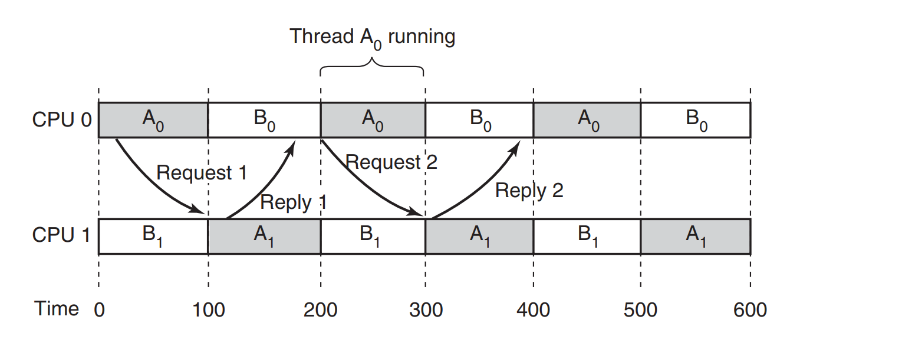


As we can see threads *A0* and *A1* are communicating with each other quite often. However, they're run on the two 
separate CPUs, and therefore blocking for some time when the response from one thread cannot reach the other as it's 
being on hold, while other thread works (like thread *B* in the CPU 0). To avoid that an algorithm called 
 **gang scheduling** was invented. Authors describe it like this:

> 1. Groups of related threads are scheduled as a unit, a gang.
> 2. All members of a gang run at once on different timeshared CPUs.
> 3. All gang members start and end their time slices together.

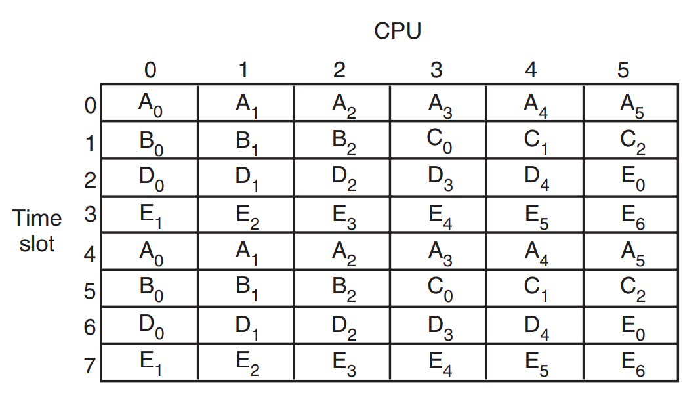


### Multicomputers

As we saw above, **multiprocessors** are not that easy to program and handle. There are situations, where there's no 
need for parallel processing as in the **multiprocessors**. In **distributed computing**, it's often way easier to 
use **multicomputers** instead. What is a **multicomputer** then? It's just a 'normal' machine, usually stripped of 
the peripheria, and connected to the other machines with network interface. It has its own CPU (although, it can 
have multiple cores inside, they are referred to as single CPU for clarity), and memory, which are not shared with 
other computers.


#### Multicomputer hardware

Usually **multicomputers** are connected in a different architectures, some of them presented below, although that 
is not that important.

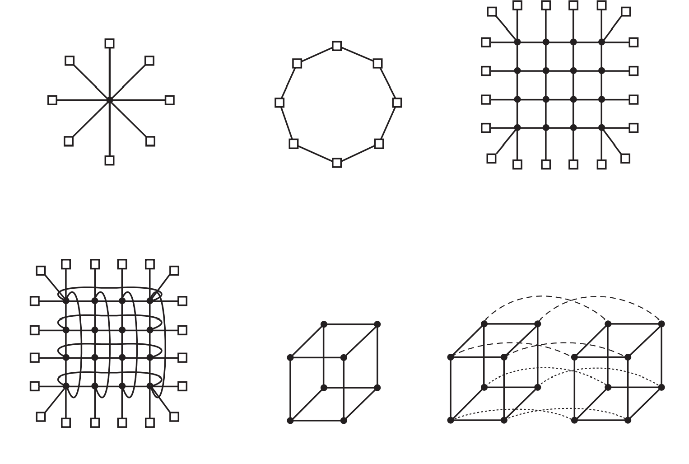


What is more important is the actual communication hapenning between the nodes. There are two types, and the first 
one is **store-and-forward packet switching**. A **packet** is a minimum viable chunk of a message, that can be 
transferred over the network. In the aforementioned type, when the **packet** is ready, it is put in the **output 
port** of the machine and send to the next one. As long as the target port is not the one that the **packet** is 
addressed to, it goes **further**. This is depicted below.

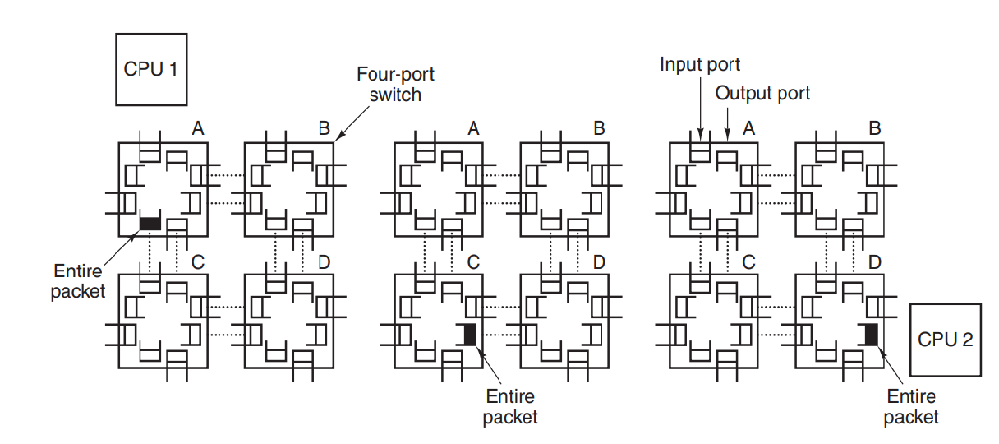

The problem with this approach is latency, which increases with the number of nodes. In order to lower it, a 
**packet** can be divided even into smaller units. The second approach is **circuit switching**. The idea here is 
for the first switch to establish a final path to the target node and then when that's done (in the **setup phase**), 
to send the whole message at once. Although the aforementioned **setup phase** is necessary here, the solution tends 
to be usually faster than the first one.

When it comes to sending messages, quite important is the **network interface**. With the need of excessive 
communications, the efficiency of the **network interface** is crucial. Therefore, they often contain separate *RAM* 
memory (where messages are copied from the main memory before they're transferred further) and even CPU (to offload 
the main CPU). 


#### Low-level communication software

Unfortunately, even the whole hardware stack does not help in case the **packet** must be copied several times along 
the way. Below picture presents that (mark numbers from *1* to *5*). 

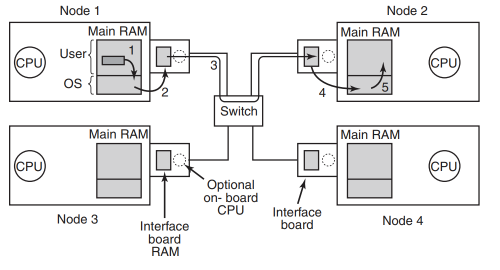


Ideas popped out in the history, to map **network interface** directly in the user space. In specific use cases, 
when there're cooperating processes/threads working on the machine, that could work. Unfortunately, usually there 
are competing processes there, so such solution could result only in a disaster. Second thing to consider is what 
should happen, when kernel itself needs access to the **network interface**? In general - the solution to this 
problem is to have two **network interfaces**, one for user space and second only for kernel's use. In the modern 
solutions also **multiqueue network interfaces** are used (with multiple buffers to use).

Last thing to mention here are **RDMAs (Remote Direct Memory Acccess)**, which authors describe shortly as a 
**direct** copying of data from one node's memory to the other's. However, they only mention that this is used 
usually in the high-frequency trading and in general is a custom-tailored solution, so not much for us here.


#### User-level communication software

There are two methods for user level processes in the **multicomputer** to send messages to other units. One is just 
direct exposure of the messaging systems via *system calls*. The second method is trying to make it more discrete, 
and therefore masking the message passing as procedure call.

First we take a simple *system calls*, which can be represented as simply as below.

```c
send(dst, &mptr) 

// or

receive(addr, &mptr)
```

Addressing here can simply contain the CPU identifier and the specific indicator in the target system, like 
port/socket/pid. Of course this kind of call is **blocking** - the process making the call has to wait until it gets 
a response (or timeouts). It is presented below.

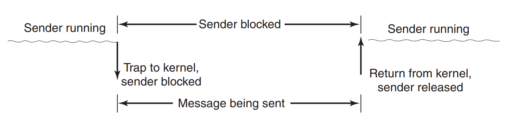

Of course, we can use **non-blocking call**, where the control returns to the caller right after the message is put 
in the buffer. Unfortunately, that does not enable the caller to reuse the buffer for some time - as long as it was not
cleared by sending the message by kernel. There are three ways to handle this, first one being depicted below.

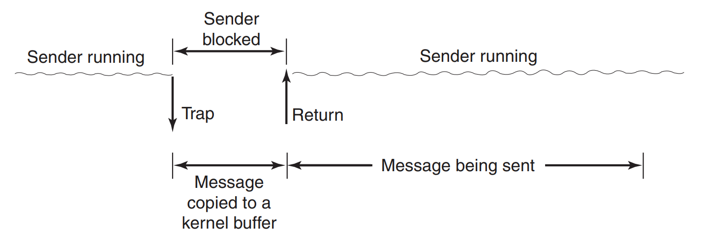


Here the message is copied to the internal kernel buffer, and after that the process can resume. The problem is the 
efficiency - excessive copying from user space to kernel space and then again - to hardware buffer - is actually a 
waste of resources. Therefore, a second approach can be used - to send *an interrupt* to the process, when the 
message was send. The problem here is as authors say:

> [...]  user-level interrupts make programming tricky, difficult, and subject to race conditions, which makes them 
> irreproducible and nearly impossible to debug.

So what's left? *Copy on write* approach. As long as there's no need to reuse the buffer again, the message will 
reside there and wait for being send. If during that wait period there's a need for a buffer to be written again, a 
copy of it is made. Unfortunately, that causes neighbouring pages to be copied too and slows down the process. From 
the both perspectives authors claim that **blocking calls** are usually simpler and in general are winning this war. 

At the end we have to mention that not only *sending* can be **blocking**, but also *receiving*. **Blocking** 
version here is simple, however **non-blocking** is more interesting. Usually it is achieved with starting a new 
thread, when the response arrives, which is called **pop-up thread**. It does it job and then quits. There's also 
additional method called **active message**, in which the **message** contains a pointer to the handler method. 
Therefore, the handling occurs directly in the interrupt handler.


#### Remote procedure call

As we saw above message passing is kind of low-level, and therefore usually hard and error-prone. The idea that two 
guys came with (**Birrell** and **Nelson**), was to wrap message passing as **remote procedure call**. From the 
client's perspective it looks like calling just a normal method/function, however, under the hood magic happens. an 
abstraction that the client uses is called **client stub**, and the target machine/server uses **server stub**. The 
whole process is pictured below.

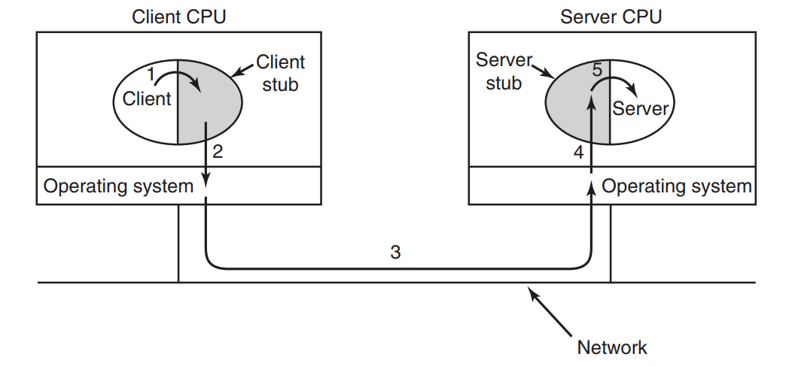


Although, it looks elegant, the devil lies in the implementation specifics. First problem are *pointers* - obviously 
two machines do not share the common memory, therefore *the pointers* as params must be translated to the specific 
values and send over. Unfortunately, that's not always possible. Second problem mentioned by authors is the unknown 
size of the params - eg. arrays. Third one is the problem of determining the type of parameters send - *printf* 
function is used as an example. The last one is *global variables*, which are not shared between client and server. 
As the authors conclude - it's not making **RPCs** useless. They just aren't the silver bullet (are there any at all?
) in the computing world.


#### Distributed shared memory

At the very beginning of the subchapter is was mentioned, that what differentiates **multiprocessor machine** from 
**multicomputers** is lack of shared memory. However, there is also an attempt to simulate shared memory in the 
**multicomputers**. The solution is named **DSM (Distributed Shared Memory)** (although, the authors mention it 
mostly due to its research capabilities). For every node of the **multicomputer**, there's some memory attached. 
What every node sees, is a big table of virtual memory pages. Of course there's no possibility that one node will 
hold all the pages, so when there's a page needed, which is not stored locally, *TRAP* is made to the kernel, and the
required page is fetched from other machine. This approach is depicted in the middle of the below screen (screen on 
the left presents 'normal' approach in the **multiprocessor system**).  


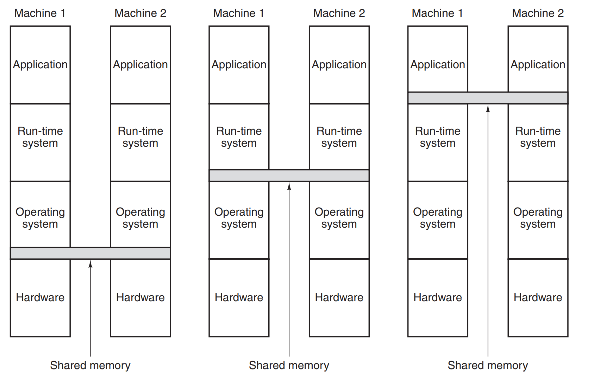


Using **DSM** has an advantage with the usage of **replication** - every page that is RO, can be safely copied to 
the different nodes and used there as a local one. Unfortunately while transferring the pages along the wire, we 
have to take latency under consideration. When establishing network connection, setup phase is usually quite 
substantial, therefore it's a waste of time and resources to transfer small packets of data. In **DSM** transferred 
data must be a multiplication of a page size, which can result in a larger amount being send in general, in order to 
use time already spend efficiently. It can result in **false sharing** which is presented below.

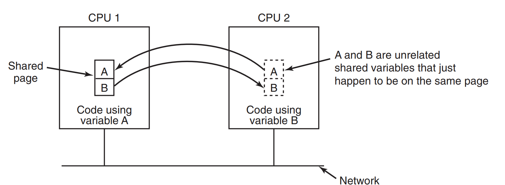


With transfers of larger pages, two unrelated variables that are residing on the same page (and used by two 
different nodes), will cause sending this page back and forth with every change that is done to them. You cna 
imagine that's not very efficient - compilers are supposed to try figuring such situations up, but sometimes it's 
just not possible (eg. usage of two different arrays elements by two separate processes).

At the end of the subchapter a concept of **sequential consistency** is mentioned. As long as the pages are *RO*, and 
are copied to other nodes everything is fine. When every page that is *RW* is kept only on one node, everything's 
also fine. The problem arises when we try to speed things up, and we start to copy *RW* pages to other nodes (even 
if only as *RO* for the time being) - when a change needs to be done, all other page instances on different nodes 
must be informed. A message is usually send to all other nodes stating that this specific page must be discarded.


#### Multicomputer scheduling and load balancing

Scheduling even on the **multiprocessor systems** is achievable, as the process list is known. In the 
**multicomputer** systems it's not that easy, as there's no way for node 1 suddenly trying to run process from node 
4 (at least not without some heavy work). However, when the process is created - the question is where to put it. 
And that's what scheduling in **multicomputers** is all about, mostly about **load balancing** new processes, so 
that all the nodes are used efficiently. Algorithms used for that are called **processor allocation algorithms**. 

First class of algorithms is **graph-theoretic deterministic algorithm**, which can be applied to the processes, 
where the usage of CPU and RAM is known in advance. The idea here is to create a graph, and the divide it into smaller 
subgraphs. What we're interested in is to minimize the number of arcs between subgraphs, as they represent 
inter-computer communication (and also to possibly meet other criteria like CPU usage, etc) - on the right we see a 
graph that is more efficient in this regard. 

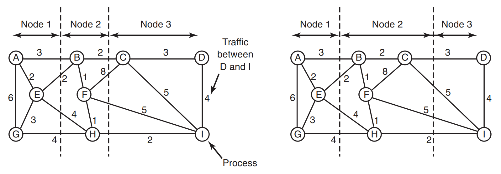


Other type of algorithm is **sender-initiated distributed heuristic algorithm**. Let's assume that process arises to 
life in node 1. However, node 1 for the time being is overloaded with work (thresholds are set when machine starts), 
and  therefore would like to send this work to someone else. So it contacts a randomly chosen node, and asks if this 
new node can handle the work (again, with specific criteria being met). If no - another node is asked. That repeats 
a couple of times up until some predefined value (in order to avoid going from node to node forever). When this 
value is reached, the node gives up and queues the process to be run on it.

Some kind of inverted version of the above algorithm is **receiver-initiated distributed heuristic algorithm**. In 
this case it's the free node (that has nothing to do, besides running *idle* process) who initiates the 'gimme work' 
process. This approach can be of course combined with the previous one.


### Distributed systems

Nowadays I assume that **distributed systems** are way more popular than when the book came out. **Microservices 
architecture** is a flavour of the month/year since quite some time, and applications using that kind of 
architecture are a perfect example of a **distributed system**.  

However, the subchapters are actually... trivial. 70% of them is describing how the actual Ethernet/Internet works 
(with a little hint of TCP/IP). Later there's files' exchanging described with **CORBA** following (which is an 
ancient history). To be honest - I did not find anything worth noting from this subchapter, and therefore I didn't ;) 


