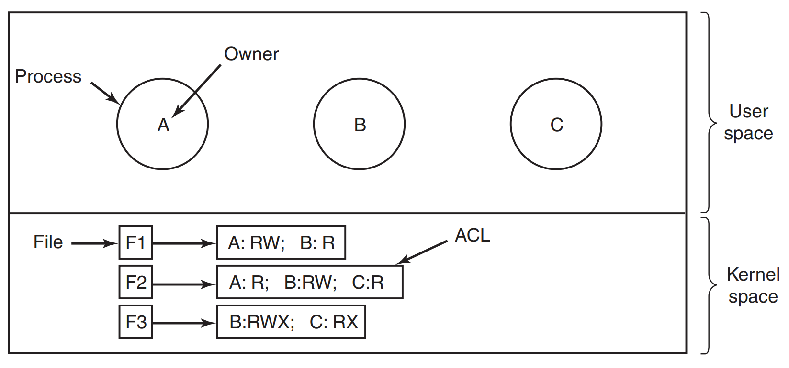
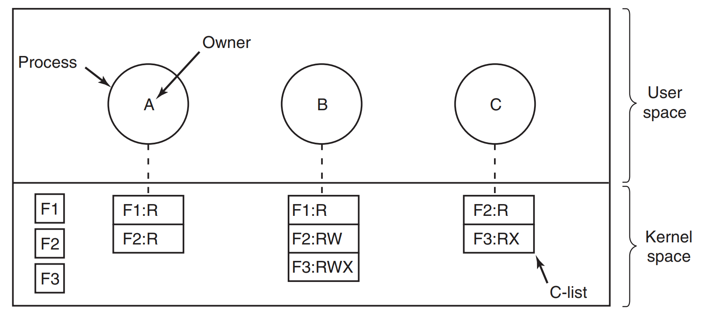
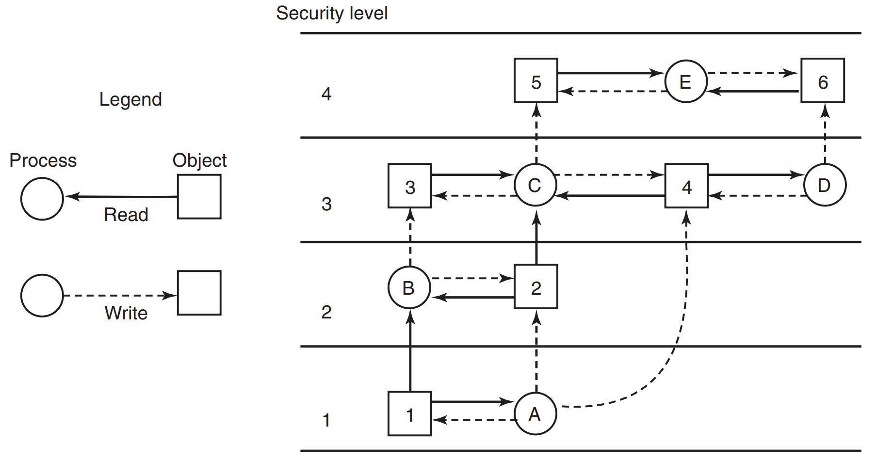
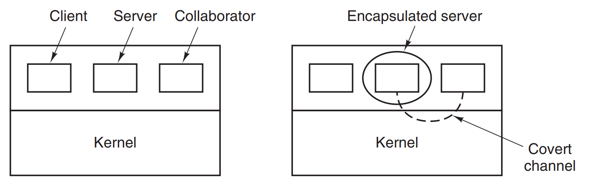
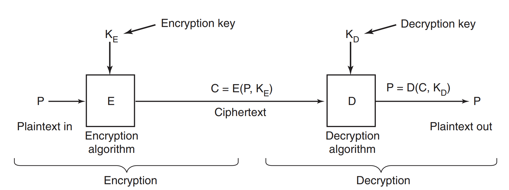
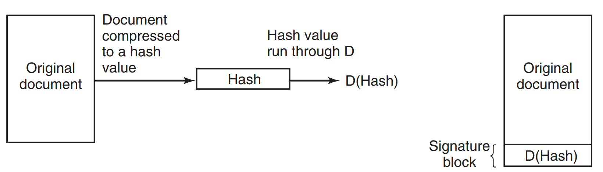
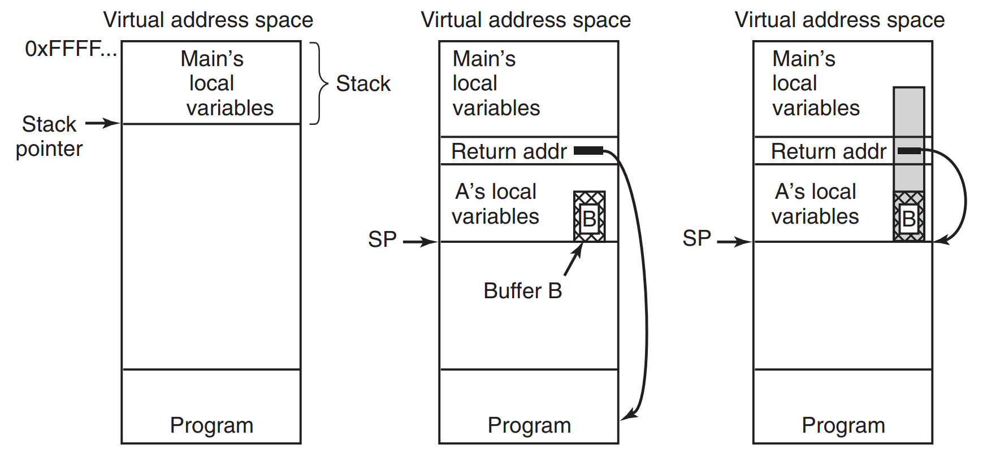
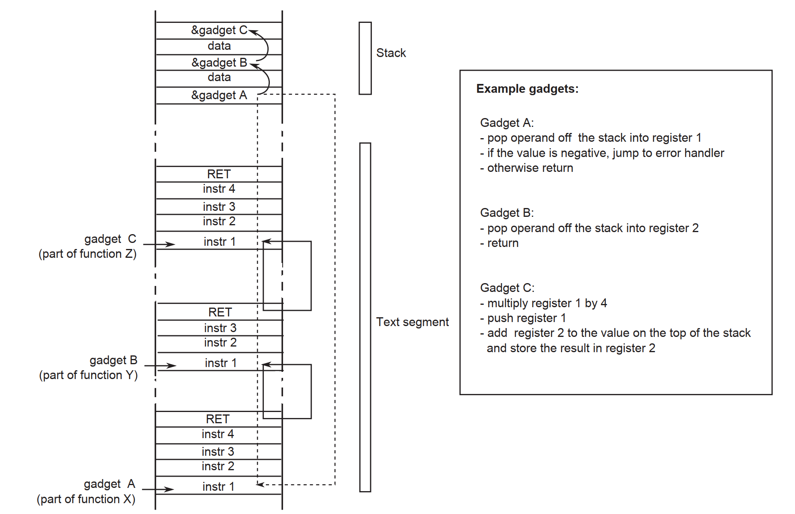
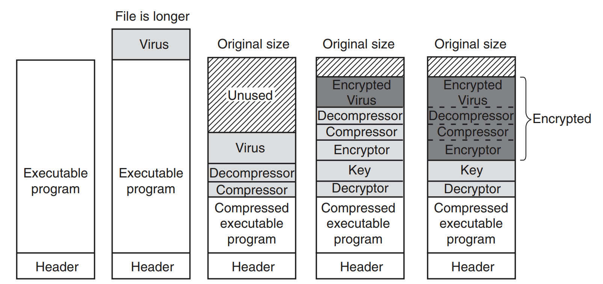
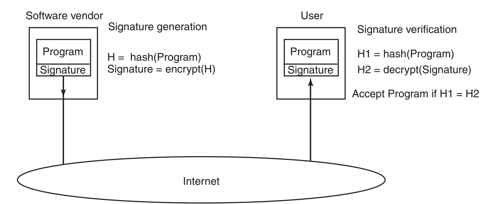

## Chapter 9 - Security

### The security environment and Operating systems security

It's an introduction chapter, and I think that person interested in OSes internals knows all that already. The same 
applies to the second subchapter. In general - there are parts of this chapter that I did not write notes for, or 
just write them but with a feeling, that I'm making notes of *2+2=4* trivia. 


### Controlling access to resources

There is a couple of approaches how to limit access to the resources in order to keep it safe. First one described 
are **protection domains**, which are pairs of mappings between *objects* and *rights*. Let's take a printer for 
example - it is an *object*, and the *rights* related to it could be *print*, *eject page*, *cancel task*, etc. 
*Rights* are in fact operations that can be performed on the *object*. Every process in the system is running within 
the scope of some **domain**, in UNIX-like systems they're being defined by *GID* and *UID*. Of course when a 
process makes *system call* then the **domain** changes, as right now some operations are done in *kernel mode*. 
That also applies when the process runs *SETGID* or *SETUID*. The usual solution for keeping the information about 
all the **domains** will be a large matrix of *rights* and *objects*. Unfortunately, that can be quite large in size,
especially that a lot of space is wasted, as usually the **domains** are fine-grained, and for a lot of *objects* 
they don't have any access. Therefore, there's a lot of empty entries in such matrix.

Other approach for access rights are **ACL (Access Control Lists)** - instead of storing all the *object&rights*, we 
store only the **actual rights** for the specific **domain**. We can keep them in two ways, first is the one that 
groups **ACLs** by *objects*. Below is an example:




Of course, it is simplified view, usually *rights* are common for all the *objects*, but there's often also specific 
ones for given type of *object*. Also, creating **ACLs** directly per user can again result in a lot of repetitions. 
Therefore, **user group ACLs** are used. Depending on which *group* a *user* is 'using' at the moment - the system 
will grant access or not. Also, other possibilities are there - we can use wildcards for *groups* or *users*, or 
effectively give a specific *user* all the *rights*, taking all the groups she belongs to (no matter the one set at 
the exact moment). 

Second type of **ACLs** are **capability lists**. We've grouped *rights* by *object* in the above approach, right 
now we're making the grouping by *process*. This is presented below.





Of course, we have to make sure that the **ACLs** are not tampered with. A couple of solutions can be used, like 
**tagged architecture** (special bit on the word modified only in kernel mode) or keeping the list in the OS layer, 
and refer to the objects only though the **capability**. However, they are mentioned only in terms of old systems. 
The solution used mosty in *distributed systems* is to keep **capabilities** in the user space, but use cryptography 
to secure them. For every call that is made to the system, in a response some encoded/encrypted function result is 
returned to the client. With every next call from the client, it must provide the same credentials/ids that were 
send the first time, and the target system checks if freshly computed value of incoming credentials matches the 
function value that came along them. If yes - we can grant access, if not, sorry, no go. 


### Formal models of secure systems

So far we've described **domains** in the rather static context. However, in reality *rights* are always changing, 
users get more of them (or less), new *objects* are created and so on. In this subchapter we'll study this 
ever-changing scene. Back in a day a guy named **Harrison** listed six basic **primitives**, that are applicable to 
all the matrixes.

* create object
* delete object
* create domain
* delete domain
* insert right
* remove right

In order to detach **primitives** from the userland, they're wrapped in **protection commands**, which are the 
functions processes can call to change the matrix. A lot of research was done to test if it's possible for the 
system to go from authorized state with the existing **commands set**. Quote.

> A question around which much theoretical research has revolved is this:
"Given an initial authorized state and a set of commands, can it be proven that the system can never reach an 
> unauthorized state?" In effect, we are asking if the available mechanism (the protection commands)
is adequate to enforce some protection policy. Giv en this policy, some initial state of the matrix, and the set of 
> commands for modifying the matrix, what we would like is a way to prove that the system is secure. Such a proof 
> turns out quite difficult to acquire; many general-purpose systems are not theoretically secure. Harrison et al. (1976) 
> proved that in the case of an arbitrary configuration for an arbitrary protection system, security is theoretically
> undecidable. However, for a specific system, it may be possible to prove whether the system can ever move from
an authorized state to an unauthorized state.


Here we reach the concept of **multilevel security** - in general it was designed for more secure-aware usages 
(military/hospitals), where more  fine-grained to the security is needed, than just plain can/can't use on the 
resource. The most widely used one is **Bell-La Padula model** - here's a quote and a picture. 

> The Bell-LaPadula model has rules about how information can flow:
> 1. **The simple security property:** A process running at security level k
   can read only objects at its level or lower. For example, a general can
   read a lieutenant’s documents but a lieutenant cannot read a general’s
   documents.
> 2. **The * property:** A process running at security level k can write only
   objects at its level or higher. For example, a lieutenant can append a
   message to a general’s mailbox telling everything he knows, but a
   general cannot append a message to a lieutenant’s mailbox telling
   ev erything he knows because the general may have seen top-secret
   documents that may not be disclosed to a lieutenant.
> 
> Roughly summarized, processes can read down and write up, but not the reverse.





Above model is great, when it comes to keeping secrets in the organisation - it works great in the military. 
Unfortunately, when it comes to data consistency and knowledge-level, we need something completely different. Here's 
a **Biba model**, which has following properties:

> 1. The simple integrity property: A process running at security level k can write only objects at its level or lower (no write up).
> 2. The integrity * property: A process running at security level k can read only objects at its level or higher (no read down).

Unfortunately, above systems still suffer from the possibility of a security breach. **Lampson** was an author of 
the following model. We start with three processes, the client, the server and third collaborator. In the example 
provided, the server counts tax and collaborator wants to actually steal client's financial data. Collaborator and 
the server in this example are usually working together and are owned by the same person. How to design the system 
where the server actually cannot leak the data given by the client? This problem is called **confinement problem**. 

Of course, we can try to limit server's *rights* to the bare minimum, although there's always a possibility to 
create **a covert channel of communication** - authors provide example of the server's process going to sleep for a 
specific amount of time to indicate *0* value, or compute some math to increase CPU usage and indicate value *1*. 
Both of the activities must be done in some predefined amount of time. The collaborator therefore can just observe 
the server, and as slow as it is, it can get some valuable data this way. 




Actually, any system mechanism that results in some predefined output can be used for this. Locking files, page 
faults, acquiring resources - everything can be used. Taking that under consideration it is obvious, that from this 
point of view making OS completely secure is just impossible.

At the end of the subchapter **steganography** is described, although it's rather widely known concept, so I won't 
be making notes here.


### Basics of cryptography

The topic of **cryptography** is wide, and here there's just a short introduction to the concept. The following 
quote will serve best as an opener:

> The purpose of cryptography is to take a message or file, called the plaintext,
and encrypt it into ciphertext in such a way that only authorized people know how
to convert it back to plaintext. For all others, the ciphertext is just an incomprehensible pile of bits. Strange as it may sound to beginners in the area, the encryption
and decryption algorithms (functions) should always be public. Trying to keep
them secret almost never works and gives the people trying to keep the secrets a
false sense of security. In the trade, this tactic is called security by obscurity and
is employed only by security amateurs. Oddly enough, the category of amateurs
also includes many huge multinational corporations that really should know better.
Instead, the secrecy depends on parameters to the algorithms called keys. If P
is the plaintext file, KE is the encryption key, C is the ciphertext, and E is the encryption algorithm (i.e., function), then C = E(P, KE). This is the definition of encryption. It says that the ciphertext is obtained by using the (known) encryption algorithm, E, with the plaintext, P, and the (secret) encryption key, KE, as parameters. The idea that the algorithms should all be public and the secrecy should reside
exclusively in the keys is called Kerckhoffs’ principle, formulated by the 19th
century Dutch cryptographer Auguste Kerckoffs. All serious cryptographers subscribe to this idea.





#### Secret key cryptography

Using **keys** to make *plaintext* unreadable has a long tradition. The simplest one is just substitution of one 
letter with the other. Below is an example.


plaintext:  A B C D E F G H I J K L M N O P Q R S T U V W X Y Z
cybertext:  Q W E R T Y U I O P A S D F G H J K L Z X C V B N M


Knowing the **key** is most crucial thing in **cryptography**, and here, when we use the same **key* to *encrypt* 
and *decrypt* the message, it is called **symmetrical key**. In order to make them secure (with the nowadays 
computing power and knowledge about algorithms), long **keys** must be used *at least starting with *256* bits).


#### Public-key cryptography

Public key concept is for sure known to the reader. Instead of using the same **key** for input and output, we use 
**two separate keys**, one for *encryption* and one for *decryption*. The first one is called **public key** (RSA), and 
can be widely distributed without any worry. Whoever uses it to *encrypt* the message, can be sure that it can be 
read only after *decrypting* using **private key** (which should be kept hidden). 

There's a small subchapter about **one-way function**, but I assume it is clear how it works and what it does.


#### Digital signature

Signing the documents became something of everyday's reality (especially during COVID). So to sum it up quickly - we 
take the document, we generate some **hash value**, using **private key** (*SHA-1* or its children being *hashing 
algorithms*) and then we send the document with the **hash** to the receiver. The receiver knows what algorithm was 
used to compute the **hash**. Doing that it can compute the **hash** on its own. Then uses **public key** to 
*decrypt* the **hash** value that came with the document (the one computed by the sender). If both values match - 
the document was not tampered with. If they differ - there's a problem. Whole process is presented below.




There's also **Public Key Infrastructure** mentioned, but just mentioned. As this topic is (in general) a little
more complicated, I suggest reading more about it online. 


#### Trusted platform module

Again - **TPM** is a little more complex to sum everything up in one page of the book. I recommend the same starting 
place as the authors - <a href="https://en.wikipedia.org/wiki/Trusted_Platform_Module">TPM Wiki page</a>.


### Authentication

Early computers usually did not bother with **authentication**, however nowadays it's hard to find an OS which does 
not support this concept (ok, embedded ones are a different topic). The usual way of **authenticating** is by 
providing username and a password. Of course, tons of materials were written about **strong** and **weak** password, 
and how You shouldn't write them on a post-it on Your monitor. Of course password strength and storing policy 
applies not only to the users - OS or application that user is login into must store the password as well, in order 
to match it against provided by the user. 

In the history passwords used to be stored on the disk unencrypted, guarded only by the file-access rules. That was 
not the best approach to the security, therefore a better concept was introduced. The passwords are not stored in 
plain text, but are encrypted using *one-way function*. In such case even if attacker has the encrypted password 
file, it's almost impossible to crack. Additional security step can be added, by using user-specific **salt**, which 
is used as an additional parameter to the encrypting function.

There're also **one-time passwords**, which are usually pre-generated and send to the user by a secure channel. For 
every login a new password must be used. The other way (not involving pre-generated list) is to use **one-way hash 
chain**, that is the method of providing security even in untrusted networks. I would need to copy the whole page to 
specify how it works, so it's better <a href="https://en.wikipedia.org/wiki/Hash_chain">to use Wikipedia for it</a>.

Other method that is similar to passwords is **challenge-response authentication**, which is a set of questions user 
usually answers when being created an account, and the answers are encrypted and stored in the system. Then for 
every login attempt a different question is being asked. A variation of this algorithm is choosing an algorithm when 
the account is setup, and then with every login attempt user must provide the computation result (eg. if algorithm 
is x2 then for *7* send by the OS, an answer of *49* must be provided).

The problem with passwords is their users (and at the same time, usually creators). People tend to reuse passwords, 
make them simple and easy to remember. Therefore, many companies that require more secure solutions started to add 
additional layer of security. They distribute **physical hardware**, that is used along every login (or even action).
Banking, corporate VPNs logins, all that stuff can be done using **hardware tokens**. Other variation of such is 
**biometrics**, where iris-scanning or fingerprint check are used.


### Exploiting software

Over the years security in the OS became more and more robust and sophisticated, although the attacks also improved 
to adapt to increased security. However, no matter the specific attack, they can be assigned to one of the types. 
This chapter describes all of them. As OSes are usually writenn in *C* or *C++* they suffer the same possibilities 
of attack, which is due to their objective low-level usage.


#### Buffer overflow attacks

Below code presents the concept - we know that *C* does not check for the array size when assigning data to it. If 
the programmer skips the validation, there's a possibility to overwrite other data in the *stack*, if provided input 
is bigger than the *B array* of size *128*. 


```c
void A( ) {
   char B[128];                   /* reserve a buffer with space for 128 bytes on the stack */
   printf("Type log message:");
   gets (B);                      /* read log message from standard input into buffer */
   writeLog (B);                  /* output the string in a pretty format to the log file */
}
```

How the *stack* looks like is presented below - with overflowing the buffer the attacker, can try to introduce 
malicious code to be executed, or just change the *stack pointer*, so that the control flow from the function will 
return not to the original caller, but will execute code that attacker wants.





For the languages that have checks for buffer sizes, a different techniques can be used - authors mention **NOP 
sleds**, which are part of **heap spraying**. If You're interested in them, I recommend <a href="https://en.wikipedia.org/wiki/Heap_spraying">wiki article 
about them</a>. 
It's possible to make a check of variable's value that was put on the *stack* just for this - security. The 
technique is called **stack canary**, and is a value that differs every time the program is run. 

> The idea is very simple. At places where the program makes a function call, the
compiler inserts code to save a random canary value on the stack, just below the return address. Upon a return from
> the function, the compiler inserts code to check the value of the canary. If the value changed, something is wrong.
> In that case, it is better to hit the panic button and crash rather than continuing.


After that an example program is given, showing how this technique can be defeated, however to be completely honest I 
do not understand how author's description actually invalidates the *canary check*. As I don't want to cause 
confusion, I recommend a link about <a href="https://ctf101.org/binary-exploitation/stack-canaries/">stack canaries 
and methods of exploitation</a>. In general - nowadays You have to really try very hard to make Yourself vulnerable 
to it. This notion is carried further with an example of **data execution prevention**, which makes by default 
*stack* data not feasible for execution. Unfortunately (as I've read online), some programs by default were using 
*stack data execution*, so introduction of **DEP** broke them. Therefore, for some apps this prevention had to be 
turned off.

Another type of attacks are **code reuse attacks** - let's assume the return address on the *stack* was overwritten. 
Unfortunately, there's no way to execute the *stack code*. There are two approaches to using that - **return to 
libc** and **return-oriented programming**. The first one is based on the fact that almost all *C* programs are 
compiled and run with *libc* library. In this library, there is a lot of code, some of it being very useful to the 
attacker. What prevents the attacker to returning to eg. *system* method, that can execute command passed to it in 
the shell? Hacker can prepare malicious code to be run, override return address and viola! 

**Return-oriented programming** is even more robust and extreme. Instead of using one function, the attacker creates 
a whole program flow from the existing parts of the binary. These parts are usually small in functionality, and end 
with *return* statement, that attacker can tamper with and direct the flow to the other useful part of the binary. 
These small parts are called **gadgets**. Below picture presents the concept.





An idea to stop these attacks is **Address Space Layout Randomization - ASLR**. It is obfuscating mechanism, that 
randomly puts parts of the program text in the memory. Therefore, it's impossible for the attacker to guess an exact 
adressess where parts of the program/stack/heap lie. **ASLR** can be bypassed, as usually the offset between 
functions is constant. More to read as usual <a href="https://en.wikipedia.org/wiki/Address_space_layout_randomization">on the proper Wiki page</a>.   

The last example of an attack is related not to the *execution flow*, but to the data. Consider an example:

```c
void A( ) {
 int authorized;
 char name [128];
 
 authorized = check credentials (...); /* the attacker is not authorized, so returns 0 */
 printf ("What is your name?\n");
 gets (name);
 
    if (authorized != 0) {
       printf ("Welcome %s, here is all our secret data\n", name)
       /* ... show secret data ... */
    } else {
       printf ("Sorry %s, but you are not authorized.\n");
    }
}
```

When performing **buffer overflow** here, an attacker is able to overwrite the value of variable *authorized*, 
resulting in secret data being shown, although he is not allowed to. 


#### Format String Attacks

These kinds of attack are coming from the laziness of the programmers, and can be done only, when **string 
formatting functions** are not properly used. Let's take that simple example: 


```c
char s[100], g[100] = "Hello ";      /* declare s and g; initialize g */
gets(s);                             /* read a string from the keyboard into s */
strcat(g, s);                        /* concatenate s onto the end of g */
printf(g);                           /* print g */
```

Have You noticed unspecified formatting string in the *printf*? In this code, value of *g* is an actual formatting 
string, not just the string to be outputted. Therefore, when providing a proper format string, it's possible to 
actually take a peek inside the stack of the program. What is more, it's possible to write to the memory, using *%n* 
format specifier, that actually stores information in the provided address. Authors claim that the specifics of the 
attack are complicated and beyond the scope od the book and suggest reading more online.


#### Dangling pointers

It's a kind of errors that are related to the repeated use of freed pointer. Below code is provided as an example.

```c
01. int *A = (int *) malloc (128);                   /* allocate space for 128 integers */
02. int year_of_birth = read_user_input();        /* read an integer from standard input */
03. if (input < 1900) {
04.     printf ("Error, year of birth should be greater than 1900 \n");
05.     free (A);
06. } else {
07.     ...
08.     /* do something interesting with array A */
09.     ...
10. }
11. ...                                               /* many more statements, containing malloc and free */
12. A[0] = year_of_birth;
```


Here, when provided value is used, for every value smaller than *1900*, we free the memory in *A* pointer. However, 
what will happen, if we want to reuse this pointer (line 12)? Well, nothing good. It's possible that the pointer 
already contains new data, and trying to write there will damage it. That is just smaller problem here, the bigger 
one is when an attacker is able to put there some data, that should not be there (eg. elevating access rights). 
Authors say that it's not trivial, but mention the technique called **heap feng shui**, that can be useful here.


#### Null pointer dereference attacks

In general the authors describe the attack, and then conclude that it's impossible on the modern machines (Linux 
kernel being used as an example). 


#### Integer overflow attacks

It's a kind of more targeted **buffer overflow attack**, here the result of mathematical operation being too big to 
be stored in the target variable.


#### Command injection attacks

Idea is simple - lack of validation and direct usage of the system calls with the input from the user.


#### Time of check to time of use attacks

This class of attacks is different than the previous ones. Let's take below code for example (we assume that the 
process is working with *SETGUID*):


```c
int fd;

if (access ("./my_document", W_OK) != 0) {
    exit (1);
}

fd = open ("./my_document", O_WRONLY)
write (fd, user_input, sizeof (user_input));
```

First, we check if the user has access rights to the document located in the current directory. When it does, the 
idea here is for the attacker to eg. create a symbolic link called *my_document*, and link it to the eg. password file.
Timing here is crucial, although the authors say that's it not that hard to achieve.


### Insider attacks


These attacks are done by the programmers themselves, usually as a revenge. The first one mentioned is **logic 
bomb**, that is part of the code that needs some kind of input to be skipped. However, when eg. programmer is fired, 
without supplying proper data, the code can make disastrous things. A variant of such attack is **backdoor**, which 
is a deliberate flaw in the control of the program. An example would be giving administrator access to the person 
logging in as 'UncleWaltDisney'. The last type mentioned is **login spoofing**, where attacker creates 
screen/program, that stubs the normal login screen (for shell or application), and unaware user trying to use the 
computer, provides his credentials. They're stored somewhere where attacker has access to - effectively stealing the 
identity of the victim.


### Malware

This subchapter describes popular **malware** examples - *trojans, viruses, worms, etc*. To be honest - there's no 
information here, that an average IT-person wouldn't know (ok, maybe typology of viruses, but that's not we can't 
live without), so I've decided to skip it.


### Defenses

In the last subchapter a defense measures are discussed. As this subchapter seems to contain more technical oriented 
knowledge, here comes the notes.

#### Firewalls

**Firewalls** are a known concept to programmers or sysadmins. There are two types of them - **hardware** and 
**software**. The first ones are usually installed in the routers or modems, making it all-in-one-box. Every 
incoming packet is being scanned and compared against set of **firewall rules**. If packet is allowed, then there's 
no problem. In the opposite case, it is being discarded. Unfortunately that kind of hardware increases the total 
cost of it. Therefore, way more popular solution for the desktop users are **software firewalls**, that are usually 
built-into the OS or are distributed as a separate application.


#### Antivirus and anti-antivirus techniques

As **firewalls** does not enable traffic to come into the machine, **antivirus software** job is to seek the one 
that somehow slipped through defenses. Manufacturers of such software are running labs, where programmers are trying 
to get as many of new viruses as possible. In order to make sure, that the virus code (spyware, worms, trojans also 
fall into this category) was properly identified, usually a **goat file** is used. This term describes the program 
that does actually nothing, however is able to be infected. 

The process of finding new viruses and identifying them is a constant race between crackers and security experts. 
Below we see different ways for a virus to hide itself in the code.




Searching for the viruses can be also done in a different way, using **integrity checking**. After the scan, an 
**antivirus** stores *checksums* of the files in a directory (or some hiding place). Every time the next scan is 
performed, the *checksums* are compared (current one, and a file value). Unfortunately, crackers knows that technique,
and can make viruses to tamper with the existing *checksums* data.

The latest way for **antivirus** to operate is **behavioral checking**. In such case the **antivirus** resides in 
memory and observes what is happenning in the system. Every suspicious activity can trigger an alarm. Of course, 
there's always a possibility for *false positives*, however usually the user is aware whether she just compiled 
something or tampers with the system, and can recognize if the **antivirus** is right or wrong.


#### Code signing

The idea here is similar to the concept we've described in the section about **public key architecture**. The same 
idea can be applied to the software, where *hash* of the application is computed, and then the same process can be 
repeated by the user who downloaded the software. Below picture shows this.




#### Jailing

It's a simple concept, where untrusted software is run inside **jailer**, that controls the behaviour of the 
suspected software. For any suspicious and unauthorized behaviour kernel is notifed.


#### Model-based intrusion detection

This is a subtype of **jailing** - the type of this defence is presented using **static model-based intrusion 
detection**. The idea is simple - for every application we can generate a graph, showing the program's flow. Usually 
it should be the author's job to generate it (using compiler of course), but then also sign it and distribute. With 
this knowledge **IDS** can catch right away any off-the-record behaviour of a program (eg. when using **buffer 
overflow**). 


#### Encapsulating mobile code and Java security

The **mobile code** that is being described here were **applets** and such other ancient technologies. In today's 
world they're not used anymore and also, the browsers usually do not allow, to execute external code. Last chapter 
is about Java security, however, authors mentions JDK 1.2 - which is even more ancient history, so I'm skipping it.


